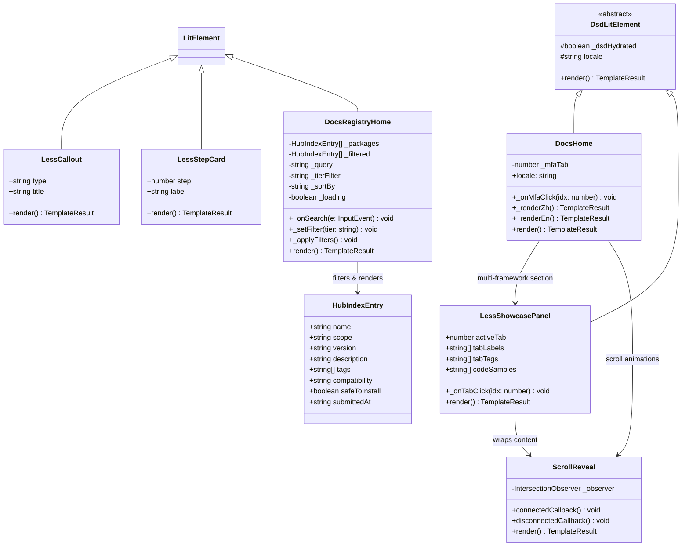
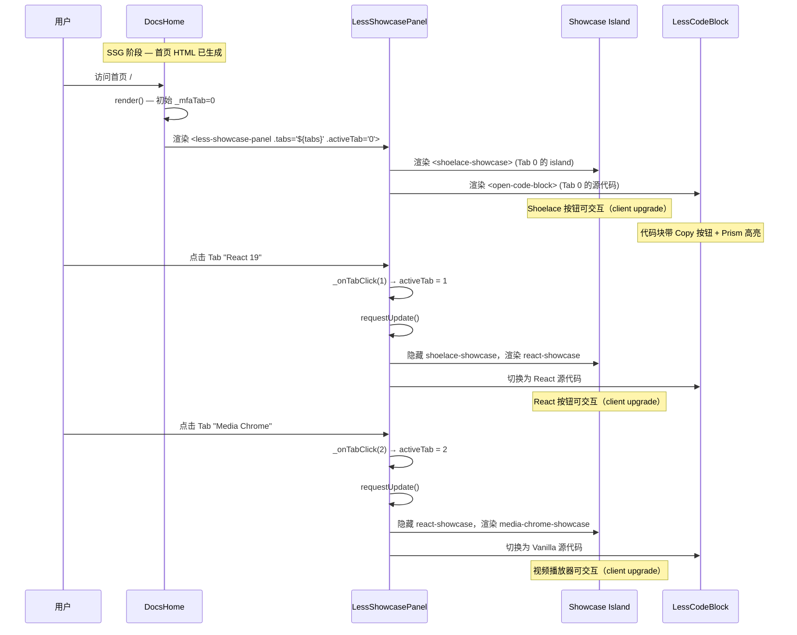
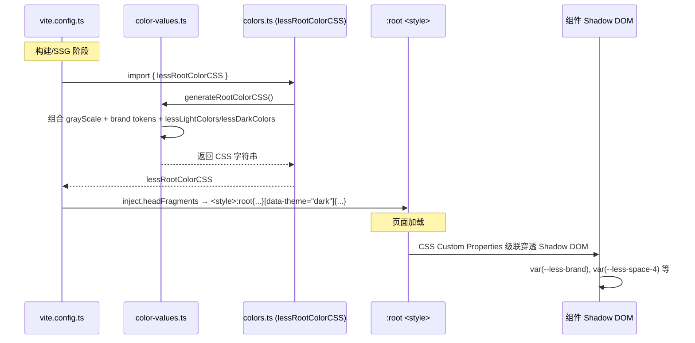
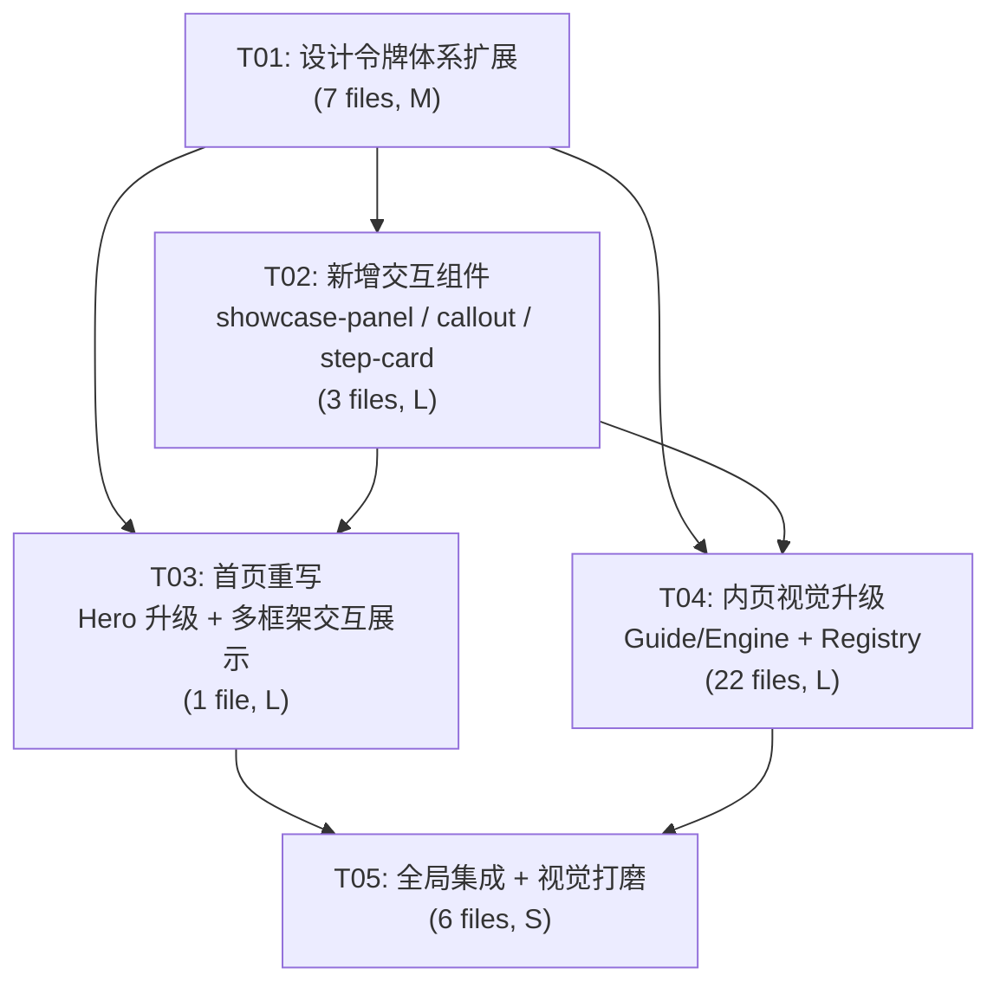

# LessJS WWW 全站重设计 — 系统架构与任务分解

> 架构师：高见远（Gao） | 版本：1.0 | 日期：2026-07-12

---

## 目录

- [Part A: 系统设计](#part-a-系统设计)
  - [1. 实现方案](#1-实现方案)
  - [2. 文件列表](#2-文件列表)
  - [3. 数据结构与接口](#3-数据结构与接口)
  - [4. 程序调用流程](#4-程序调用流程)
  - [5. 待明确事项](#5-待明确事项)
- [Part B: 任务分解](#part-b-任务分解)
  - [6. 依赖包列表](#6-依赖包列表)
  - [7. 任务列表](#7-任务列表)
  - [8. 共享知识](#8-共享知识)
  - [9. 任务依赖图](#9-任务依赖图)

---

## Part A: 系统设计

### 1. 实现方案

#### 核心技术挑战

| #  | 挑战                                                                                                                 | 难度 | 方案                                                                                                                                                                                             |
| -- | -------------------------------------------------------------------------------------------------------------------- | ---- | ------------------------------------------------------------------------------------------------------------------------------------------------------------------------------------------------ |
| C1 | **首页多框架交互展示**：3 个 showcase island（shoelace/react/media-chrome）需与源代码左右并排，且 Tab 切换需即时响应 | L    | 新建 `less-showcase-panel` 容器组件，内部管理 Tab 状态和双栏布局。左侧 slot 放 showcase island，右侧放 `less-code-block`。利用 Lit reactive property 驱动 Tab 切换                               |
| C2 | **全站设计令牌体系**：品牌色光谱/灰阶/间距/圆角/阴影需在 `@openelement/ui` tokens 层统一定义，且支持亮/暗色模式           | M    | 扩展现有 `packages/ui/src/tokens/` 体系。在 `color-values.ts` 增加 `--less-brand-*` 光谱变量，在 `spacing.ts` 增加 `--space-*` 10 级间距 token，新增 `tokens/radius.ts` 和 `tokens/animation.ts` |
| C3 | **Hero 视觉冲击力**：渐变光效增强、品牌色戏剧性使用、字号放大至 Display 级                                           | M    | 利用新增的 `--less-brand-*` 光谱 token 重写 Hero CSS。新增 `--less-font-size-display` (clamp 3-5rem) token。品牌色渐变从硬编码改为 token 引用                                                    |
| C4 | **Guide/Engine 内页视觉层次**：section label / callout 系统 / 代码块暗色主题 / 步骤卡片                              | M    | 新建 `less-callout` island 组件，新建 `less-step-card` island 组件。升级 `page-styles.ts` 引入新 token。callout 组件支持 info/warning/danger/tip 四种类型                                        |
| C5 | **Registry 卡片视觉升级**：品牌色渐变边框 / 兼容性徽章 / 搜索框发光                                                  | S    | 纯 CSS 升级，利用新品牌色 token 实现渐变边框和发光效果，无需新建组件                                                                                                                             |

#### 框架与库选型

| 用途           | 选型                                               | 理由                                    |
| -------------- | -------------------------------------------------- | --------------------------------------- |
| Web Components | Lit + DsdLitElement                                | 项目已有，零新增依赖                    |
| CSS 架构       | CSS Custom Properties (Design Tokens)              | 已有 `@openelement/ui/tokens` 体系，扩展即可 |
| 动效           | 纯 CSS animation/transition + scroll-reveal island | 零重依赖，PRD 约束                      |
| 代码高亮       | Prism.js (已有)                                    | 已集成在 less-code-block 中             |
| 图标           | 内联 SVG                                           | 零依赖，现有模式                        |

#### 架构模式

沿用项目已有模式：

- **组件层**：`@openelement/ui` — 全局共享 UI 组件（less-layout, less-code-block, etc.）
- **Island 层**：`www/app/islands/` — 页面级交互组件（SSG 零 JS，客户端升级）
- **路由层**：`www/app/routes/` — 页面组件，使用 Lit + DsdLitElement
- **Token 层**：`@openelement/ui/tokens/` — CSS Custom Properties 单一事实来源

```
:root (headFragments)
  └── CSS Custom Properties (brand/color/spacing/radius/shadow/animation)
       ├── less-layout (Shadow DOM — 继承 :root tokens)
       ├── less-code-block (Shadow DOM — 继承 :root tokens)
       ├── less-callout (Shadow DOM — 继承 :root tokens)
       ├── less-showcase-panel (Shadow DOM — 继承 :root tokens)
       └── 页面组件 (docs-home, etc.) (Shadow DOM — 继承 :root tokens)
```

---

### 2. 文件列表

#### 2.1 新增文件

```
packages/ui/src/tokens/
├── radius.ts                    ← 新增：圆角 token（6 级）
└── animation.ts                 ← 新增：动效时长 token（微交互/滚动揭示/页面过渡）

packages/ui/src/
├── less-callout.ts              ← 新增：callout 提示框组件（info/warn/danger/tip）
└── less-step-card.ts            ← 新增：步骤卡片组件（编号 + 标题 + 内容）

www/app/islands/
└── less-showcase-panel.ts       ← 新增：多框架 Tab 切换容器（island，管理展示+代码双栏）
```

#### 2.2 修改文件

```
# ── Token 体系扩展 ──
packages/ui/src/tokens/color-values.ts    ← 修改：增加 --less-brand-* 光谱变量（5 色）
packages/ui/src/tokens/spacing.ts         ← 修改：增加 --less-space-* 10 级间距 token
packages/ui/src/tokens/typography.ts      ← 修改：增加 Display 级字号 (--less-font-size-display)
packages/ui/src/tokens/effects.ts         ← 修改：增加品牌色阴影 token
packages/ui/src/design-tokens.ts          ← 修改：引入新 token 模块
packages/ui/src/index.ts                  ← 修改：导出新组件

# ── 首页重写 ──
www/app/routes/index/index.ts             ← 修改：Hero 视觉升级 + 多框架 Tab 改为交互展示

# ── 内页样式升级 ──
www/app/components/page-styles.ts         ← 修改：引入新 token，升级 callout/section-label/代码块

# ── Guide 页面 ──
www/app/routes/guide/getting-started.ts   ← 修改：使用 less-callout + less-step-card
www/app/routes/guide/routing.ts           ← 修改：使用 less-callout
www/app/routes/guide/configuration.ts     ← 修改：使用 less-callout
www/app/routes/guide/ssg.ts              ← 修改：使用 less-callout
www/app/routes/guide/api.ts              ← 修改：使用 less-callout
www/app/routes/guide/deployment.ts        ← 修改：使用 less-callout
www/app/routes/guide/error-handling.ts    ← 修改：使用 less-callout
www/app/routes/guide/security-middleware.ts ← 修改：使用 less-callout
www/app/routes/guide/rpc.ts              ← 修改：使用 less-callout
www/app/routes/guide/content-system.ts    ← 修改：使用 less-callout
www/app/routes/guide/pwa.ts              ← 修改：使用 less-callout
www/app/routes/guide/testing.ts           ← 修改：使用 less-callout
www/app/routes/guide/positioning.ts       ← 修改：使用 less-callout

# ── Engine 页面 ──
www/app/routes/engine/architecture.ts     ← 修改：使用 less-callout + less-step-card
www/app/routes/engine/dsd.ts             ← 修改：使用 less-callout
www/app/routes/engine/islands.ts         ← 修改：使用 less-callout
www/app/routes/engine/islands-deep.ts    ← 修改：使用 less-callout
www/app/routes/engine/comparison.ts      ← 修改：使用 less-callout
www/app/routes/engine/design-system.ts   ← 修改：使用 less-callout
www/app/routes/engine/package-compatibility.ts ← 修改：使用 less-callout
www/app/routes/engine/standards-registry.ts    ← 修改：使用 less-callout

# ── Registry 页面 ──
www/app/routes/registry/index.ts         ← 修改：卡片渐变边框 + 搜索框发光 + 兼容性徽章升级
www/app/routes/registry/[package].ts     ← 修改：组件详情页视觉升级
www/app/routes/registry/_renderer.ts     ← 修改：注入新组件引用

# ── 渲染器 ──
www/app/routes/guide/_renderer.ts        ← 修改：（保持不变，已注入 less-search）
www/app/routes/engine/_renderer.ts       ← 修改：（保持不变，已注入 less-search）

# ── Vite 配置 ──
www/vite.config.ts                       ← 修改：headFragments 注入新 token CSS
```

---

### 3. 数据结构与接口



#### 关键组件 API

**LessShowcasePanel** — 多框架交互展示容器

```typescript
// www/app/islands/less-showcase-panel.ts
export class LessShowcasePanel extends DsdLitElement {
  // 当前激活的 Tab 索引
  @property({ type: Number }) activeTab = 0;

  // Tab 配置（由页面传入）
  @property({ type: Array }) tabs: ShowcaseTab[] = [];

  static styles = [lessDesignTokens, css`...`];

  // Tab 点击切换
  private _onTabClick(idx: number) {
    this.activeTab = idx;
    this.requestUpdate();
  }
}

interface ShowcaseTab {
  label: string;          // Tab 标签文本，如 "Shoelace"
  tag: string;            // 框架标签，如 "Lit"
  tagColor: string;       // 标签背景色
  islandTag: string;      // showcase island 的 tagName
  code: string;           // 源代码文本
  codeLabel: string;      // 代码面板标题
}
```

**LessCallout** — 提示框组件

```typescript
// packages/ui/src\/open-callout.ts
export class LessCallout extends LitElement {
  @property({ type: String }) type: 'info' | 'warning' | 'danger' | 'tip' = 'info';
  @property({ type: String }) title = '';

  static styles = [lessDesignTokens, css`...`];
}
```

**LessStepCard** — 步骤卡片组件

```typescript
// packages/ui/src\/open-step-card.ts
export class LessStepCard extends LitElement {
  @property({ type: Number }) step = 1;
  @property({ type: String }) label = '';

  static styles = [lessDesignTokens, css`...`];
}
```

---

### 4. 程序调用流程

#### 首页多框架 Tab 切换交互流程



#### 全站 Token 初始化流程



---

### 5. 待明确事项

| # | 事项                                                              | 假设                                                                                                               | 影响范围 |
| - | ----------------------------------------------------------------- | ------------------------------------------------------------------------------------------------------------------ | -------- |
| 1 | `less-showcase-panel` 是否作为 Island (SSR) 还是纯客户端组件？    | 假设为 **Island**（SSR 渲染 Tab 标签和代码，client upgrade 交互）。showcase island 本身已有 `less.ssr: false` 配置 | 首页     |
| 2 | `less-callout` 和 `less-step-card` 是否需要 SSR？                 | 假设为 **UI 组件**（非 Island），放在 `@openelement/ui` 中，走 DSD 渲染管道                                             | 全站内页 |
| 3 | `less-toc` island 是否需要视觉升级？                              | PRD 未明确提及，假设保持现状                                                                                       | —        |
| 4 | 博客/404/changelog/roadmap/decisions 页面是否在本次重设计范围内？ | PRD 仅提及 Guide/Engine/Registry + 首页，假设博客等页面仅继承全局 token 升级，不做专门修改                         | —        |
| 5 | View Transitions API 的具体使用场景？                             | 已在 `vite.config.ts` 启用 `viewTransition: true`，假设只需确保页面间导航时 token 一致即可                         | —        |
| 6 | 暗色模式下 Hero 区域的渐变方案？                                  | 假设暗色模式 Hero 使用 `--less-brand-dark` (#3D3599) 作为渐变终点                                                  | 首页     |

---

## Part B: 任务分解

### 6. 依赖包列表

**无需新增任何 npm/deno 依赖。**

所有实现基于项目已有依赖：

- `lit` — 已有
- `@openelement/adapter-lit` (DsdLitElement) — 已有
- `@openelement/ui` (lessDesignTokens, less-layout, less-code-block) — 已有
- `@shoelace-style/shoelace` — 已有（showcase island 使用）
- `media-chrome` — 已有（showcase island 使用）
- `react` / `react-dom` — 已有（showcase island 使用）
- `prism.js` — 已有（CDN 加载）

---

### 7. 任务列表

#### T01: 项目基础设施 — 设计令牌体系扩展 + 新组件注册

**涉及文件**（7 个）：

- `packages/ui/src/tokens/color-values.ts` — 增加 `--less-brand-*` 光谱变量
- `packages/ui/src/tokens/spacing.ts` — 增加 `--less-space-*` 10 级间距 token
- `packages/ui/src/tokens/typography.ts` — 增加 Display 级字号 token
- `packages/ui/src/tokens/effects.ts` — 增加品牌色阴影 token
- `packages/ui/src/tokens/radius.ts` — **新增**：6 级圆角 token
- `packages/ui/src/tokens/animation.ts` — **新增**：动效时长 token
- `packages/ui/src/design-tokens.ts` — 引入新 token 模块
- `packages/ui/src/index.ts` — 导出新组件声明
- `www/vite.config.ts` — headFragments 注入新 token CSS（更新 lessRootColorCSS 调用）

**依赖**：无

**优先级**：P0

**复杂度**：M

**详细说明**：

1. **品牌色光谱**（`color-values.ts`）— 在 `lessLightColors` 和 `lessDarkColors` 中增加：
   ```css
   --less-brand: #534ab7; /* 已有，保持 */
   --less-brand-light: #6d5ce8; /* 新增：渐变终点、hover */
   --less-brand-pale: #8b7cf6; /* 新增：标签背景 */
   --less-brand-dark: #3d3599; /* 新增：暗色模式主色 */
   --less-brand-deep: #26215c; /* 新增：暗色区域背景 */
   --less-brand-subtle: #eeedfe; /* 已有，保持 */
   --less-brand-glow: rgba(83, 74, 183, 0.35); /* 新增：品牌色发光 */
   ```

2. **间距 10 token**（`spacing.ts`）— 增加 `--less-space-*` 系列：
   ```css
   --less-space-1: 4px;
   --less-space-2: 8px;
   --less-space-3: 12px;
   --less-space-4: 16px;
   --less-space-5: 24px;
   --less-space-6: 32px;
   --less-space-7: 40px;
   --less-space-8: 48px;
   --less-space-9: 56px;
   --less-space-16: 64px;
   ```

3. **圆角 6 级**（新增 `radius.ts`）：
   ```css
   --less-radius-xs: 2px;
   --less-radius-sm: 4px;
   --less-radius-md: 8px;
   --less-radius-lg: 12px;
   --less-radius-xl: 16px;
   --less-radius-full: 9999px;
   ```

4. **动效时长**（新增 `animation.ts`）：
   ```css
   --less-duration-micro: 150ms;
   --less-duration-fast: 200ms;
   --less-duration-reveal: 400ms;
   --less-duration-transition: 300ms;
   --less-easing-default: ease-out;
   --less-easing-spring: cubic-bezier(0.34, 1.56, 0.64, 1);
   ```

5. **Display 字号**（`typography.ts`）— 增加：
   ```css
   --less-font-size-display: clamp(3rem, 7vw, 5rem);
   --less-font-size-h1: clamp(2rem, 4vw, 2.75rem);
   ```

6. **品牌色阴影**（`effects.ts`）— 增加：
   ```css
   --less-shadow-brand-sm: 0 2px 12px rgba(83, 74, 183, 0.2);
   --less-shadow-brand-md: 0 4px 20px rgba(83, 74, 183, 0.3);
   --less-shadow-brand-lg: 0 8px 32px rgba(83, 74, 183, 0.4);
   --less-shadow-glow: 0 0 20px rgba(83, 74, 183, 0.15);
   ```

---

#### T02: 新增交互组件 — showcase-panel / callout / step-card

**涉及文件**（3 个）：

- `www/app/islands/less-showcase-panel.ts` — **新增**：多框架 Tab 切换容器 Island
- `packages/ui/src\/open-callout.ts` — **新增**：callout 提示框组件
- `packages/ui/src\/open-step-card.ts` — **新增**：步骤卡片组件

**依赖**：T01（需要设计 token）

**优先级**：P0

**复杂度**：L

**详细说明**：

1. **less-showcase-panel** — 核心 P0 交互组件
   - 继承 `DsdLitElement`
   - 属性：`activeTab: number`, `tabs: ShowcaseTab[]`
   - 布局：上方 Tab 栏（品牌色 active indicator），下方左右双栏
     - 左栏：showcase island 渲染区（根据 activeTab 切换）
     - 右栏：`less-code-block` 源代码展示
   - 响应式：760px 以下变为上下布局
   - Tab 切换使用 `requestUpdate()` 驱动
   - 每个面板使用 `scroll-reveal` 包裹实现滚动揭示

2. **less-callout** — 内页通用提示框
   - 继承 `LitElement`（非 Island，走 DSD 管道）
   - 属性：`type: 'info' | 'warning' | 'danger' | 'tip'`
   - 视觉：左侧品牌色/黄色/红色/绿色竖线 + 对应淡色背景 + 图标
   - 替代现有 `page-styles.ts` 中的 `.callout` 类

3. **less-step-card** — 步骤卡片
   - 继承 `LitElement`
   - 属性：`step: number`, `label: string`
   - 视觉：圆形步骤编号（品牌色背景）+ 标签 + slot 内容区
   - 替代现有 `page-styles.ts` 中的 `.qs-card` 类

---

#### T03: 首页重写 — Hero 升级 + 多框架交互展示

**涉及文件**（1 个）：

- `www/app/routes/index/index.ts` — 全面重写

**依赖**：T01, T02

**优先级**：P0

**复杂度**：L

**详细说明**：

1. **Hero 升级**：
   - H1 字号升级到 `--less-font-size-display`（clamp 3-5rem）
   - 渐变光效：`--less-brand` → `--less-brand-light` → `--less-brand-pale`
   - Hero 背景：`--less-brand-deep` 作为暗色基底
   - 按钮阴影：`--less-shadow-brand-md`
   - CTA 按钮 hover 发光：`--less-shadow-brand-lg`

2. **多框架区域重构**：
   - 删除现有纯代码 Tab（`.mfa-tabs` / `.mfa-panel`）
   - 引入 `<less-showcase-panel .tabs="${showcaseTabs}">`
   - `showcaseTabs` 数组定义 3 个 Tab：
     - Tab 0: Shoelace (Lit) → `<shoelace-showcase>` + CODE_LIT
     - Tab 1: React 19 → `<react-showcase>` + CODE_REACT
     - Tab 2: Media Chrome (Vanilla) → `<media-chrome-showcase>` + CODE_VANILLA

3. **其他区域微调**：
   - Bento Grid 卡片：使用 `--less-radius-lg`, `--less-shadow-brand-sm` hover
   - Benchmark 条形图：使用 `--less-brand` / `--less-brand-light` 渐变
   - Quick Start 步骤：使用 `--less-step-card` 组件
   - Footer：品牌色 border 使用 `--less-brand`
   - 全部硬编码颜色值替换为 token 引用

---

#### T04: 内页视觉升级 — Guide/Engine + Registry

**涉及文件**（22 个）：

- `www/app/components/page-styles.ts` — 升级引用新 token
- `www/app/routes/guide/getting-started.ts` — 使用 less-callout + less-step-card
- `www/app/routes/guide/routing.ts` — 使用 less-callout
- `www/app/routes/guide/configuration.ts` — 使用 less-callout
- `www/app/routes/guide/ssg.ts` — 使用 less-callout
- `www/app/routes/guide/api.ts` — 使用 less-callout
- `www/app/routes/guide/deployment.ts` — 使用 less-callout
- `www/app/routes/guide/error-handling.ts` — 使用 less-callout
- `www/app/routes/guide/security-middleware.ts` — 使用 less-callout
- `www/app/routes/guide/rpc.ts` — 使用 less-callout
- `www/app/routes/guide/content-system.ts` — 使用 less-callout
- `www/app/routes/guide/pwa.ts` — 使用 less-callout
- `www/app/routes/guide/testing.ts` — 使用 less-callout
- `www/app/routes/guide/positioning.ts` — 使用 less-callout
- `www/app/routes/engine/architecture.ts` — 使用 less-callout + less-step-card
- `www/app/routes/engine/dsd.ts` — 使用 less-callout
- `www/app/routes/engine/islands.ts` — 使用 less-callout
- `www/app/routes/engine/islands-deep.ts` — 使用 less-callout
- `www/app/routes/engine/comparison.ts` — 使用 less-callout
- `www/app/routes/engine/design-system.ts` — 使用 less-callout
- `www/app/routes/engine/package-compatibility.ts` — 使用 less-callout
- `www/app/routes/engine/standards-registry.ts` — 使用 less-callout
- `www/app/routes/registry/index.ts` — 卡片渐变边框 + 搜索框发光
- `www/app/routes/registry/[package].ts` — 组件详情页视觉升级

**依赖**：T01, T02

**优先级**：P1

**复杂度**：L

**详细说明**：

1. **page-styles.ts 升级**：
   - 引入新 token 引用替代硬编码值
   - `.callout` → `<open-callout>` 组件
   - `.section-label` 使用 `--less-brand` token
   - 代码块暗色主题使用 `--less-shadow-md` + 新圆角 token
   - 新增 `.section-divider` 使用 `--less-brand` 渐变

2. **Guide/Engine 页面改造模式**（统一模式，批量执行）：
   - 将 `<div class="callout">` → `<open-callout type="info">`
   - 将 `<div class="callout warn">` → `<open-callout type="warning">`
   - 将 `.qs-card` 步骤 → `<open-step-card step="N" label="...">`
   - 确保所有页面 import 新组件

3. **Registry 视觉升级**：
   - 卡片边框：`border-image: linear-gradient(135deg, var(--less-brand), var(--less-brand-light)) 1`
   - 兼容性徽章：使用 `--less-brand-*` token 统一颜色
   - 搜索框 focus：`box-shadow: 0 0 0 3px var(--less-brand-glow), var(--less-shadow-glow)`
   - 卡片 hover：`--less-shadow-brand-md` + 品牌色边框渐变

---

#### T05: 全局集成 + 视觉打磨

**涉及文件**（6 个）：

- `www/app/routes/registry/_renderer.ts` — 确保注入新组件
- `www/app/routes/blog/_renderer.ts` — 确保注入新组件
- `www/app/routes/404.ts` — 继承全局 token 升级
- `www/app/routes/changelog.ts` — 继承全局 token 升级
- `www/app/routes/contributing.ts` — 继承全局 token 升级
- `www/app/routes/roadmap.ts` — 继承全局 token 升级

**依赖**：T03, T04

**优先级**：P2

**复杂度**：S

**详细说明**：

1. 确保 `less-callout` 和 `less-step-card` 在所有需要的 renderer 中被引入
2. 404 / changelog / contributing / roadmap 等页面确认 token 一致性
3. 全站暗色模式验证：确认所有新 token 在 `data-theme="dark"` 下有正确值
4. 响应式验证：确认 760px / 480px 断点下所有新组件表现正常
5. `prefers-reduced-motion` 验证：确认所有动效在减少动效偏好下正确降级
6. 视觉走查：确认全站品牌色一致性，无硬编码颜色值残留

---

### 8. 共享知识

#### 命名规范

```
CSS Custom Properties:
  --less-{category}-{variant}          # 全局 token
  --less-brand-{variant}               # 品牌色光谱
  --less-space-{n}                     # 间距 10 级
  --less-radius-{size}                 # 圆角 6 级
  --less-duration-{speed}              # 动效时长
  --less-shadow-{variant}              # 阴影

组件 tagName:
  less-{name}                          # @openelement/ui 组件
  {name}-showcase                      # showcase island
  docs-{section}-{page}                # 页面组件

文件命名:
  kebab-case.ts                        # 组件文件
  _{name}.ts                           # 私有/数据文件（路由约定）
```

#### 组件注册约定

```typescript
// @openelement/ui 组件 — DSD 管道
import { DsdLitElement } from '@openelement/adapter-lit';
export class LessXxx extends DsdLitElement { ... }
// Guard: idempotent across SSR paths
if (!customElements.get('less-xxx')) customElements.define('less-xxx', LessXxx);

// Island 组件 — SSR/客户端分离
export const tagName = 'xxx-showcase';
export const less = { ssr: false }; // 或默认 ssr: true
// Guard: idempotent
try { customElements.define(tagName, XxxShowcase); } catch {}

// 页面组件 — DsdLitElement + 双语
export const tagName = 'docs-xxx';
export default class DocsXxx extends DsdLitElement {
  override render() { return this.locale === 'en' ? this._renderEn() : this._renderZh(); }
}
customElements.define('docs-xxx', DocsXxx);
```

#### CSS Custom Properties 命名约定

- **全局 token** 在 `packages/ui/src/tokens/` 中定义，通过 `lessRootColorCSS` 注入 `:root`
- **组件内部 token** 使用 `:host` 作用域，名称加组件前缀：`--less-xxx-*`
- **Shadow DOM 继承**：组件 `:host` 不重新声明全局 token，依赖 CSS Custom Properties 自然继承
- **暗色模式**：通过 `[data-theme="dark"]` 选择器在 `:root` 层切换，不使用 `prefers-color-scheme`

#### 内容渲染约定

- 代码块统一使用 `<open-code-block><pre><code>...</code></pre></open-code-block>`
- 提示框统一使用 `<open-callout type="info|warning|danger|tip">`
- 步骤卡片统一使用 `<open-step-card step="N" label="...">`
- 滚动揭示统一使用 `<scroll-reveal>...</scroll-reveal>`
- 页面使用 `pageStyles` 导入共享样式 + 组件级 `css` 覆盖

---

### 9. 任务依赖图



**关键路径**：T01 → T02 → T03 → T05（首页是最高优先级）

**并行机会**：T03 和 T04 可并行开发（都只依赖 T01 + T02）

---

## 附录：设计令牌速查表

### 品牌色光谱

| Token                 | Light 值             | Dark 值              | 用途             |
| --------------------- | -------------------- | -------------------- | ---------------- |
| `--less-brand`        | #534AB7              | #534AB7              | 主品牌色         |
| `--less-brand-light`  | #6D5CE8              | #6D5CE8              | 渐变终点、hover  |
| `--less-brand-pale`   | #8B7CF6              | #8B7CF6              | 标签背景、淡色调 |
| `--less-brand-dark`   | #3D3599              | #3D3599              | 暗色模式主色     |
| `--less-brand-deep`   | #26215C              | #26215C              | 暗色区域背景     |
| `--less-brand-subtle` | #EEEDFE              | rgba(83,74,183,0.1)  | 浅色背景         |
| `--less-brand-glow`   | rgba(83,74,183,0.35) | rgba(83,74,183,0.25) | 发光效果         |

### 间距 Token（4px 基础）

| Token             | 值   | 用途            |
| ----------------- | ---- | --------------- |
| `--less-space-1`  | 4px  | 最小间距        |
| `--less-space-2`  | 8px  | 紧凑间距        |
| `--less-space-3`  | 12px | 内边距          |
| `--less-space-4`  | 16px | 标准间距        |
| `--less-space-5`  | 24px | 元素间距        |
| `--less-space-6`  | 32px | 区块间距        |
| `--less-space-7`  | 40px | 大区块间距      |
| `--less-space-8`  | 48px | Section 间距    |
| `--less-space-9`  | 56px | 大 Section 间距 |
| `--less-space-16` | 64px | 页面级间距      |

### 圆角 Token

| Token                | 值     | 用途           |
| -------------------- | ------ | -------------- |
| `--less-radius-xs`   | 2px    | 徽章、标签     |
| `--less-radius-sm`   | 4px    | 按钮、输入框   |
| `--less-radius-md`   | 8px    | 卡片、面板     |
| `--less-radius-lg`   | 12px   | 大卡片、弹窗   |
| `--less-radius-xl`   | 16px   | 代码面板       |
| `--less-radius-full` | 9999px | 圆形头像、药丸 |

### 动效 Token

| Token                        | 值                             | 用途                 |
| ---------------------------- | ------------------------------ | -------------------- |
| `--less-duration-micro`      | 150ms                          | 按钮 hover、颜色切换 |
| `--less-duration-fast`       | 200ms                          | Tab 切换、展开折叠   |
| `--less-duration-reveal`     | 400ms                          | 滚动揭示动画         |
| `--less-duration-transition` | 300ms                          | 页面过渡             |
| `--less-easing-default`      | ease-out                       | 默认缓动             |
| `--less-easing-spring`       | cubic-bezier(0.34,1.56,0.64,1) | 弹性动效             |

### 阴影 Token

| Token                    | 值                             | 用途         |
| ------------------------ | ------------------------------ | ------------ |
| `--less-shadow-sm`       | 0 1px 2px rgba(0,0,0,0.04)     | 微阴影       |
| `--less-shadow-md`       | 0 2px 8px rgba(0,0,0,0.08)     | 卡片默认     |
| `--less-shadow-lg`       | 0 4px 16px rgba(0,0,0,0.12)    | 卡片 hover   |
| `--less-shadow-brand-sm` | 0 2px 12px rgba(83,74,183,0.2) | 品牌色微阴影 |
| `--less-shadow-brand-md` | 0 4px 20px rgba(83,74,183,0.3) | 品牌色中阴影 |
| `--less-shadow-brand-lg` | 0 8px 32px rgba(83,74,183,0.4) | 品牌色大阴影 |
| `--less-shadow-glow`     | 0 0 20px rgba(83,74,183,0.15)  | 发光效果     |
