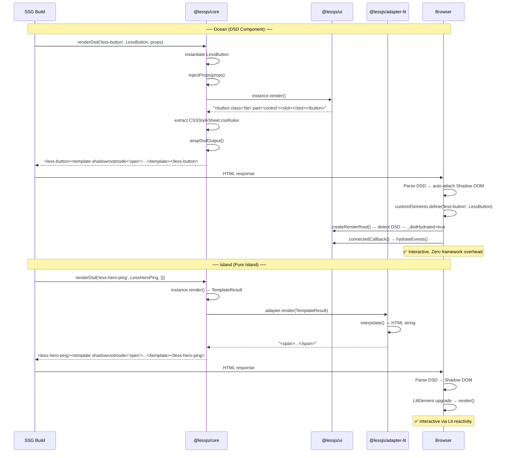

# v0.20.0 架构设计 — Ocean-Island 架构

> ⚠️ **SUPERSEDED**: This document has been merged into [ADR-0036](../adr/0036-ocean-island-architecture.md). See `docs/sop/v0.20.0/` for detailed SOPs.

---

# v0.20.0 架构设计 — Ocean-Island 架构 (ARCHIVED)

> **作者**: 高见远（Gao）· 架构师
> **日期**: 2026-05-20
> **版本**: v1.0
> **基于**: [v0.20.0 PRD](./v0.20.0-prd.md)

---

## 1. 架构概览

```
v0.19.0（当前）                           v0.20.0（目标）
─────────────────────────────           ─────────────────────────────
@lessjs/adapter-lit                      @lessjs/core
├── DsdLitElement (Lit 绑定)      →     ├── DsdElement (零框架)
├── WithDsdHydration (Mixin)             ├── renderDsd() (已有，兼容)
├── ssr.ts (Lit→HTML 插值)               ├── hydrateEvents 协议
│                                        └── CSSStyleSheet 提取器
@lessjs/ui                               @lessjs/adapter-lit
├── less-button (Lit)              →     └── 仅服务 Pure Island SSR
├── less-card (Lit)                      (保留不变，不再扩大)
├── ... (10 组件全 Lit)
└── design-tokens (Lit CSSResult)        @lessjs/ui
                                         ├── less-button (原生 DsdElement)
                                         ├── less-card (原生 DsdElement)
                                         ├── ... (9 组件原生)
                                         ├── less-hero-ping (保留 Lit)
                                         └── design-tokens (CSSStyleSheet)
```

---

## 2. DsdElement 基类设计

### 2.1 源码位置

```
packages/core/src/dsd-element.ts    # 新增
packages/core/src/index.ts          # 更新导出
```

### 2.2 API 契约

```typescript
// packages/core/src/dsd-element.ts

import type { HydrateEventDescriptor } from './types.js';

/**
 * Base class for DSD (Declarative Shadow DOM) components.
 *
 * Zero framework dependency. Pure HTMLElement subclass.
 *
 * SSR contract:
 *   render(): string  →  returns Shadow DOM HTML
 *   → renderDsd() wraps in <template shadowrootmode="open">
 *
 * Client contract:
 *   1. Browser parses DSD → Shadow DOM auto-attached
 *   2. customElements.define() upgrades element
 *   3. createRenderRoot() detects existing shadow root → _dsdHydrated = true
 *   4. connectedCallback() auto-binds hydrateEvents
 *   5. disconnectedCallback() cleanup via AbortController
 *
 * Components extend this class MUST implement:
 *   - render(): string
 *
 * Components MAY declare:
 *   - static hydrateEvents: HydrateEventDescriptor[]
 *   - static styles: CSSStyleSheet | CSSStyleSheet[]
 *   - static observedAttributes: string[]
 *   - static delegatesFocus: boolean
 *   - static formAssociated: boolean
 *
 * Design rationale:
 *   - render() returns string (not TemplateResult) → no Lit dependency
 *   - CSSStyleSheet (not CSSResult) → native platform API
 *   - hydrateEvents stays → proven pattern, works well
 *   - attributeChangedCallback → replaces Lit's updated()
 *   - :state() via ElementInternals → CSS custom states
 */
export class DsdElement extends HTMLElement {
  /** Declarative event bindings for DSD hydration */
  static hydrateEvents?: HydrateEventDescriptor[];

  /** CSSStyleSheet(s) for adoptedStyleSheets */
  static styles?: CSSStyleSheet | CSSStyleSheet[];

  /** Whether DSD has pre-populated the shadow root */
  protected _dsdHydrated = false;

  /** AbortController for event listener lifecycle */
  private _hydrateAbortController?: AbortController;

  /** ElementInternals for :state() pseudo-classes */
  protected _internals?: ElementInternals;

  // ── Shadow Root ────────────────────────────────

  /**
   * Reuse existing shadow root when DSD-pre-populated,
   * otherwise create new one.
   */
  protected createRenderRoot(): ShadowRoot {
    if (this.shadowRoot && this.shadowRoot.childElementCount > 0) {
      this._dsdHydrated = true;
      return this.shadowRoot;
    }
    const root = this.attachShadow({ mode: 'open' });
    // Apply styles
    if (this._styles) {
      root.adoptedStyleSheets = [this._styles];
    }
    return root;
  }

  // ── Styles ─────────────────────────────────────

  private get _styles(): CSSStyleSheet | undefined {
    const ctor = this.constructor as typeof DsdElement;
    if (!ctor.styles) return undefined;
    if (Array.isArray(ctor.styles)) {
      // Merge all sheets into one
      const merged = new CSSStyleSheet();
      merged.replaceSync(
        ctor.styles.map((s) => [...s.cssRules].map((r) => r.cssText).join('\n')).join('\n'),
      );
      return merged;
    }
    return ctor.styles;
  }

  // ── Lifecycle ─────────────────────────────────

  connectedCallback(): void {
    // Ensure shadow root exists (CSR fallback)
    if (!this.shadowRoot) {
      this.createRenderRoot();
    }

    // CSR-only: populate shadow DOM from render() if not DSD-hydrated
    if (!this._dsdHydrated && this.shadowRoot) {
      this.shadowRoot.innerHTML = this.render();
    }

    // DSD: bind events
    if (this._dsdHydrated) {
      this._hydrateEvents();
    }

    // Form-associated
    if ((this.constructor as typeof DsdElement).formAssociated) {
      this._internals = this.attachInternals();
    }
  }

  disconnectedCallback(): void {
    this._hydrateAbortController?.abort();
    this._hydrateAbortController = undefined;
  }

  /**
   * Called when observed attributes change.
   * Override to sync DOM after attribute changes.
   */
  attributeChangedCallback(name: string, oldValue: string | null, newValue: string | null): void {
    if (oldValue === newValue) return;
    // Subclasses override to sync DOM
  }

  // ── SSR Contract ──────────────────────────────

  /**
   * Return Shadow DOM HTML string for SSR.
   * MUST be overridden by subclasses.
   */
  render(): string {
    return '';
  }

  // ── Event Hydration ───────────────────────────

  /**
   * Bind declared events to existing shadow DOM elements.
   * Ported from WithDsdHydration._hydrateEvents() with same logic.
   */
  protected _hydrateEvents(): void {
    if (!this.shadowRoot) return;

    const ctor = this.constructor as typeof DsdElement;
    const events = ctor.hydrateEvents || [];
    if (events.length === 0) return;

    this._hydrateAbortController = new AbortController();
    const { signal } = this._hydrateAbortController;

    for (const desc of events) {
      if (desc.method.startsWith('__')) continue; // M-17: prototype pollution guard
      const elements = this.shadowRoot.querySelectorAll(desc.selector);
      for (const el of elements) {
        const handler = (this as unknown as Record<string, unknown>)[desc.method];
        if (typeof handler === 'function') {
          el.addEventListener(desc.event, (handler as EventListener).bind(this), { signal });
        }
      }
    }
  }
}
```

### 2.3 与 DsdLitElement 的差异

| 维度           | DsdLitElement                     | DsdElement                                               |
| -------------- | --------------------------------- | -------------------------------------------------------- |
| 基类           | LitElement                        | HTMLElement                                              |
| render() 返回  | TemplateResult                    | string                                                   |
| 样式           | Lit `css` tagged template         | CSSStyleSheet                                            |
| 响应式         | `static properties` + `updated()` | `static observedAttributes` + `attributeChangedCallback` |
| DSD 检测       | `createRenderRoot()` 覆盖         | 同逻辑，移植                                             |
| hydrateEvents  | ✅                                | ✅ 移植                                                  |
| 依赖           | lit (~6KB gzip)                   | 0 KB                                                     |
| delegatesFocus | Lit 内置                          | 手动 attachShadow({delegatesFocus})                      |

### 2.4 DSD 检测与 Shadow Root 复用

```
关键逻辑（移植自 WithDsdHydration.createRenderRoot）：

if (this.shadowRoot && this.shadowRoot.childElementCount > 0) {
  // DSD 已渲染：复用已有 shadow root
  this._dsdHydrated = true;
  return this.shadowRoot;
}
// CSR 场景：创建新 shadow root
const root = this.attachShadow({ mode: 'open', delegatesFocus });
root.adoptedStyleSheets = [this._styles];
return root;
```

注意：`attachShadow` 需要在 `createRenderRoot` 中决定 `delegatesFocus`、`mode` 等参数。因此 DsdElement 的构造函数不 attachShadow，而是由 `createRenderRoot()` 在 `connectedCallback` 时懒初始化。

---

## 3. SSR 管线适配

### 3.1 现状

`renderDsd()` (packages/core/src/render-dsd.ts) **已经支持 `render(): string`**：

```typescript
// 第 177-181 行：
const result = instance.render();
if (typeof result === 'string') {
  content = result; // ← DsdElement 直接走这条路
}
```

### 3.2 DsdElement 样式提取

当前样式提取依赖适配器（第 250-269 行）。对于 DsdElement，需要新增原生提取路径：

```typescript
// render-dsd.ts 新增逻辑：

// 5. Extract styles
let styleCss = '';

// 5a. Try native DsdElement styles (CSSStyleSheet)
const ctor = componentClass as unknown as { styles?: CSSStyleSheet | CSSStyleSheet[] };
if (ctor.styles) {
  const sheets = Array.isArray(ctor.styles) ? ctor.styles : [ctor.styles];
  for (const sheet of sheets) {
    try {
      for (const rule of [...sheet.cssRules]) {
        styleCss += rule.cssText + '\n';
      }
    } catch (e) {
      // Cross-origin sheet, skip
      log.debug(`Cannot read CSSStyleSheet for <${tagName}>`);
    }
  }
}

// 5b. Fallback: registered adapters (Lit, etc.)
if (!styleCss) {
  for (const adapter of getRegisteredAdapters()) {
    // ... 现有逻辑
  }
}
```

### 3.3 变更范围

| 文件                              | 变更                                      |
| --------------------------------- | ----------------------------------------- |
| `packages/core/src/render-dsd.ts` | +15 行：CSSStyleSheet 提取                |
| `packages/core/src/types.ts`      | 无需变更（HydrateEventDescriptor 已存在） |
| `packages/core/src/index.ts`      | +1 行：导出 DsdElement                    |
| `packages/adapter-lit/`           | **不变**（保留兼容 Pure Island）          |

---

## 4. 组件迁移方案

### 4.1 迁移模式

```typescript
// ─── 迁移前（Lit） ──────────────────────────
import { css, html, nothing } from 'lit';
import { DsdLitElement } from '@lessjs/adapter-lit';
import { lessDesignTokens } from './design-tokens.js';

class LessButton extends DsdLitElement {
  static override styles = [lessDesignTokens, css`...`];
  static override properties = { variant: { type: String, reflect: true } };

  override render() {
    if (this._dsdHydrated) return nothing;
    return html`<button class="btn btn--${this.variant}" ?disabled=${this.disabled}>
      <slot></slot>
    </button>`;
  }

  override updated(changed: Map<string, unknown>) {
    if (changed.has('disabled')) this._updateState();
  }
}


// ─── 迁移后（原生 DsdElement） ──────────────
import { DsdElement, type HydrateEventDescriptor } from '@lessjs/core';

const sheet = new CSSStyleSheet();
sheet.replaceSync(`
  ${tokenCSS}           // ← 内联 token（或独立 sheet）
  :host { display: inline-block; }
  .btn { /* ... */ }
  .btn--primary { /* ... */ }
`);

class LessButton extends DsdElement {
  static observedAttributes = ['variant', 'size', 'disabled'];
  static styles = sheet;
  static delegatesFocus = true;
  static formAssociated = true;
  static hydrateEvents: HydrateEventDescriptor[] = [
    { selector: 'button', event: 'click', method: '_handleClick' },
  ];

  protected _internals?: ElementInternals;

  constructor() {
    super();
    this._internals = this.attachInternals();
  }

  connectedCallback(): void {
    super.connectedCallback();
    this._syncDOM();
  }

  attributeChangedCallback(name: string, old: string | null, val: string | null) {
    if (old === val) return;
    this._syncDOM();
  }

  render(): string {
    const v = this.getAttribute('variant') || 'default';
    const s = this.getAttribute('size') || 'md';
    const d = this.hasAttribute('disabled');
    const h = this.getAttribute('href');
    if (h) {
      return `<a class="btn btn--${v} btn--${s}"
        part="control" href="${h}" ${d ? 'aria-disabled="true"' : ''}>
        <slot></slot></a>`;
    }
    return `<button class="btn btn--${v} btn--${s}"
      part="control" ${d ? 'disabled' : ''}>
      <slot></slot></button>`;
  }

  _syncDOM() {
    const btn = this.shadowRoot?.querySelector('.btn') as HTMLElement | null;
    if (!btn) return;
    const v = this.getAttribute('variant') || 'default';
    const s = this.getAttribute('size') || 'md';
    btn.className = `btn btn--${v} btn--${s}`;
    if (btn instanceof HTMLButtonElement) {
      btn.disabled = this.hasAttribute('disabled');
    }
    this._updateState();
  }

  _handleClick() {
    this.dispatchEvent(new CustomEvent('less-click', { bubbles: true, composed: true }));
  }
}
```

### 4.2 组件迁移优先级

| 优先级   | 组件                | 行数 | 复杂度  | 原因                                     |
| -------- | ------------------- | ---- | ------- | ---------------------------------------- |
| **P0-A** | `less-card`         | 96   | 🟢 低   | 纯展示，无交互，验证 DsdElement 最简路径 |
| **P0-B** | `less-callout`      | ~60  | 🟢 低   | 纯展示，验证 token 迁移                  |
| **P0-C** | `less-step-card`    | ~100 | 🟢 低   | 纯展示                                   |
| **P0-D** | `less-button`       | 251  | 🟡 中   | 属性驱动 + :state()，首个交互组件        |
| **P1-A** | `less-input`        | ~150 | 🟡 中   | 属性 + 表单关联                          |
| **P1-B** | `less-code-block`   | ~120 | 🟡 中   | 复制交互                                 |
| **P1-C** | `less-theme-toggle` | ~80  | 🟡 中   | 点击交互                                 |
| **P1-D** | `less-dialog`       | ~200 | 🟠 较高 | 显示/隐藏状态                            |
| **P1-E** | `less-layout`       | 1200 | 🔴 高   | 最复杂组件，分层迁移                     |
| **P2-A** | `less-search`       | ~500 | 🔴 高   | overlay + SPA + 搜索                     |
| **P2-B** | `less-hero-ping`    | ~80  | N/A     | 保留 Lit（纯 Island）                    |

### 4.3 less-layout 分层迁移策略

`less-layout`（1200 行）是最复杂的组件，建议分 3 步：

1. **Step 1**: 外观迁移（render() → string，样式 → CSSStyleSheet）— 不改逻辑
2. **Step 2**: 事件迁移（hydrateEvents 替代 Lit @click）— 不改结构
3. **Step 3**: 状态迁移（attributeChangedCallback 替代 updated()）— 最终收敛

---

## 5. CSS 简化栈设计

> **v1.1 修订**: 原方案（@property + CSS Custom Props + CSSStyleSheet + CSS Parts + :state()）过于复杂。简化为三层。

### 5.1 核心原则

**能用标准库就不用自己写。Open Props 是设计 token 的标准答案——几百个现成的 CSS 变量，零 JS，零构建步骤。**

### 5.2 三层架构

```
┌──────────────────────────────────────────────┐
│              简化 CSS 栈（3 层）               │
├──────────────────────────────────────────────┤
│                                               │
│  Layer 1: Open Props                          │
│  ├── 设计 token：间距/颜色/阴影/动效/字体      │
│  ├── 纯 CSS 文件，零 JS，零构建步骤            │
│  ├── CSS Custom Properties 穿透 Shadow DOM   │
│  ├── 内置 light/dark 主题                      │
│  └── 替代当前的 color-values.ts +              │
│       design-tokens.ts (~100 行 → 0 行)       │
│                                               │
│  Layer 2: CSSStyleSheet + adoptedStyleSheets  │
│  ├── 每个组件一个 sheet                        │
│  ├── 一次 parse，所有实例共享                  │
│  ├── 引用 Open Props 变量                      │
│  └── 替代 Lit css\`...\` + 内联 cssText      │
│                                               │
│  Layer 3: CSS Parts ::part()                  │
│  ├── 组件外部定制 API                          │
│  └── less-button::part(control) { ... }       │
│                                               │
│  可选（不强制，降级无害）：                     │
│  ├── @property — 变量类型安全                  │
│  └── :state()  — 自定义状态伪类                │
│                                               │
└──────────────────────────────────────────────┘
```

### 5.3 Open Props 与 DSD 的兼容性

CSS Custom Properties **天然穿透 Shadow DOM 边界**。Open Props 在 DSD 中完全可用：

```html
<template shadowrootmode="open">
  <style>
    /* SSR 时内联变量值（构建时 tree-shake） */
    --size-2: 8px;
    --gray-9: #212529;
    --radius-2: 8px;

    .btn {
      padding: var(--size-2) var(--size-4);
      color: var(--gray-9);
      border-radius: var(--radius-2);
    }
  </style>
  <button class="btn" part="control"><slot></slot></button>
</template>
```

**SSR 处理方式**：构建时从 Open Props 提取用到的变量值，内联到组件 sheet 中。Vite 的 postcss-import 或简单的手动提取脚本即可。

### 5.4 与当前方案的映射

| 当前                          | v0.20                                              | 说明               |
| ----------------------------- | -------------------------------------------------- | ------------------ |
| `color-values.ts` (~40 颜色)  | **删除**，用 Open Props `--gray-*` 系列            | 减少维护           |
| `design-tokens.ts` (~30 变量) | **删除**，用 Open Props `--size-*` `--radius-*` 等 | 同上               |
| `colors.ts` (语义映射)        | 品牌色用 `--brand` fallback `--indigo-6`           | 极简覆盖           |
| `css\`...\`` (Lit)            | CSSStyleSheet + replaceSync()                      | 语法不同，效果等价 |
| 内联 cssText                  | CSSStyleSheet                                      | **消除**           |

### 5.5 组件示例

```typescript
// less-button.ts — Open Props + DsdElement
import { DsdElement } from '@lessjs/core';

const sheet = new CSSStyleSheet();
sheet.replaceSync(`
  :host { display: inline-block; }

  .btn {
    display: inline-flex;
    align-items: center;
    gap: var(--size-2);
    font-family: var(--font-sans);
    font-weight: var(--font-weight-5);
    border: var(--border-size-1) solid var(--gray-5);
    background: transparent;
    color: var(--gray-9);
    border-radius: var(--radius-2);
    padding: var(--size-2) var(--size-4);
    transition: color var(--ease-2), background var(--ease-2);
  }

  .btn--primary {
    background: var(--brand, var(--indigo-6));
    color: var(--gray-0);
    border-color: transparent;
  }

  .btn--primary:hover { background: var(--indigo-7); }

  .btn--sm { padding: var(--size-1) var(--size-3); font-size: var(--font-size-0); }
  .btn--lg { padding: var(--size-3) var(--size-5); font-size: var(--font-size-3); }

  .btn:disabled { opacity: 0.5; cursor: not-allowed; }
`);

export class LessButton extends DsdElement {
  static styles = sheet;
  static hydrateEvents = [
    { selector: '.btn', event: 'click', method: '_handleClick' },
  ];

  render(): string {
    const v = this.getAttribute('variant') || 'default';
    const s = this.getAttribute('size') || 'md';
    const d = this.hasAttribute('disabled');
    return `<button class="btn btn--${v} btn--${s}"
      part="control" ${d ? 'disabled' : ''}>
      <slot></slot></button>`;
  }
}
```

---

## 6. 构建产物对比

| 指标            | v0.19.0 (Lit)      | v0.20.0 (原生)              | 变化           |
| --------------- | ------------------ | --------------------------- | -------------- |
| UI 包 gzip (JS) | ~12KB              | ~6KB                        | **-50%**       |
| Lit 依赖        | lit (~6KB)         | 0                           | **移除**       |
| 适配器依赖      | adapter-lit (~4KB) | 0 (DSD) + 保留 (Island)     | **DSD 路径零** |
| 首屏 JS         | 0 KB (DSD 已零)    | 0 KB                        | 不变           |
| CSS 提取        | Lit adapter 遍历   | 原生 CSSStyleSheet.cssRules | 更快           |

---

## 7. 共享知识（跨文件约定）

### 7.1 hydrateEvents 协议（不变）

```typescript
interface HydrateEventDescriptor {
  selector: string; // CSS selector within shadow root
  event: string; // DOM event name ('click', 'input', 'change')
  method: string; // instance method name (no leading __)
}
```

### 7.2 render() SSR 契约

```
render(): string
  → 返回 Shadow DOM HTML
  → 包含 <slot> 元素（透传子节点）
  → 元素上标注 part="..." 属性（外部定制 API）
  → 不使用框架特定的绑定语法（@click、.prop、?attr）
```

### 7.3 CSSStyleSheet 共享规则

- 每个组件 **一个** `static styles: CSSStyleSheet`
- Token sheet 可以独立引用（import { tokenSheet } from './design-tokens.js'）
- 组件 sheet 不包含 token（由 DsdElement 基类合并）
- 跨组件共享样式 → 提取到独立 sheet

---

## 8. 依赖包列表

| 包           | 版本 | 用途              |
| ------------ | ---- | ----------------- |
| (无新增依赖) | —    | DsdElement 零依赖 |

需从 `packages/ui/deno.json` 移除：

- `lit` (DSD 组件不再需要)
- `@lessjs/adapter-lit` (DSD 组件不再需要)

保留（仅 Island）：

- `lit` (less-hero-ping)
- `@lessjs/adapter-lit` (SSR 管线中的 Pure Island 适配)

---

## 9. 文件列表

### 新增文件

```
packages/core/src/dsd-element.ts          # DsdElement 基类 (~150 行)
packages/core/__tests__/dsd-element.test.ts # DsdElement 测试
```

### 修改文件

```
packages/core/src/index.ts                # +export { DsdElement }
packages/core/src/render-dsd.ts           # +CSSStyleSheet 提取 (~15 行)
packages/core/src/types.ts                # 确认 HydrateEventDescriptor 满足需求
packages/ui/src/design-tokens.ts          # CSSResult → CSSStyleSheet
packages/ui/src/less-card.ts              # Lit → DsdElement
packages/ui/src/less-callout.ts           # Lit → DsdElement
packages/ui/src/less-step-card.ts         # Lit → DsdElement
packages/ui/src/less-button.ts            # Lit → DsdElement
packages/ui/src/less-input.ts             # Lit → DsdElement
packages/ui/src/less-code-block.ts        # Lit → DsdElement
packages/ui/src/less-theme-toggle.ts      # Lit → DsdElement
packages/ui/src/less-dialog.ts            # Lit → DsdElement
packages/ui/src/less-layout.ts            # Lit → DsdElement (分层)
packages/ui/src/less-search.ts            # Lit → DsdElement
packages/ui/deno.json                     # 移除 lit + adapter-lit 依赖
packages/adapter-lit/README.md            # 标注"仅服务 Pure Island"
```

### 不变文件

```
packages/ui/src/less-hero-ping.ts         # 保留 Lit (纯 Island)
packages/adapter-lit/src/dsd-hydration.ts # 保留 (DsdLitElement 向后兼容)
packages/adapter-lit/src/ssr.ts           # 保留 (Island SSR)
packages/core/src/render-nested.ts        # 不变
packages/core/src/adapter-registry.ts     # 不变
```

---

## 10. 任务列表（有序，含依赖）

| #  | 任务                          | 文件                                   | 依赖       | 预计工时 |
| -- | ----------------------------- | -------------------------------------- | ---------- | -------- |
| 1  | 创建 DsdElement 基类          | `packages/core/src/dsd-element.ts`     | —          | 0.5d     |
| 2  | 更新 core 导出                | `packages/core/src/index.ts`           | 1          | 0.1d     |
| 3  | CSSStyleSheet 提取适配        | `packages/core/src/render-dsd.ts`      | 1          | 0.5d     |
| 4  | Token 迁移为 CSSStyleSheet    | `packages/ui/src/design-tokens.ts`     | 1          | 0.3d     |
| 5  | 迁移 less-card (P0-A)         | `packages/ui/src/less-card.ts`         | 1, 3, 4    | 0.3d     |
| 6  | 迁移 less-callout (P0-B)      | `packages/ui/src/less-callout.ts`      | 5          | 0.2d     |
| 7  | 迁移 less-step-card (P0-C)    | `packages/ui/src/less-step-card.ts`    | 5          | 0.2d     |
| 8  | 迁移 less-button (P0-D)       | `packages/ui/src/less-button.ts`       | 1, 3, 4    | 0.5d     |
| 9  | SSR 全链路验证                | `www/` 构建                            | 5, 6, 7, 8 | 0.5d     |
| 10 | 迁移 less-input (P1-A)        | `packages/ui/src/less-input.ts`        | 9          | 0.3d     |
| 11 | 迁移 less-code-block (P1-B)   | `packages/ui/src/less-code-block.ts`   | 9          | 0.3d     |
| 12 | 迁移 less-theme-toggle (P1-C) | `packages/ui/src/less-theme-toggle.ts` | 9          | 0.3d     |
| 13 | 迁移 less-dialog (P1-D)       | `packages/ui/src/less-dialog.ts`       | 9          | 0.5d     |
| 14 | 迁移 less-layout (P1-E)       | `packages/ui/src/less-layout.ts`       | 9          | 1.5d     |
| 15 | 迁移 less-search (P2-A)       | `packages/ui/src/less-search.ts`       | 9          | 1d       |
| 16 | 更新 deno.json 依赖           | `packages/ui/deno.json`                | 14, 15     | 0.1d     |
| 17 | 全量回归测试                  | 所有组件                               | 16         | 0.5d     |
| 18 | Bundle 体积报告               | `www/` 构建产物                        | 17         | 0.3d     |

---

## 11. 调用流程图（时序图）



---

## 12. 风险与缓解

| 风险                                | 概率 | 影响 | 缓解                                  |
| ----------------------------------- | ---- | ---- | ------------------------------------- |
| `less-layout` 迁移引入回归          | 中   | 高   | 分层迁移 + 每步 SSR 输出 diff         |
| CSSStyleSheet.cssRules 跨域读取失败 | 低   | 低   | 内联 sheet 不会有跨域问题             |
| `@property` Safari 不支持           | 中   | 低   | 降级为普通 CSS 变量                   |
| 事件绑定在 CSR 路径重复             | 低   | 中   | DsdElement 已通过 `_dsdHydrated` 区分 |
| hydrateEvents 选择器匹配失败        | 低   | 中   | 保持与当前 Lit 组件相同的 DOM 结构    |

---

## 13. 待明确事项

1. **@property 注册时机**：在 token sheet 中声明还是在独立 `<style>` 中？→ 建议在全局 `<style>` 中注册（`:root` 级别），token sheet 只定义变量值
2. **CSSStyleSheet 合并策略**：token sheet + 组件 sheet 自动合并 or 手动合并？→ DsdElement 基类自动合并
3. **`@lessjs/adapter-lit` 保留策略**：v0.20 保留兼容层，v0.21 废弃 DSD 路径（仅保留 Island SSR）→ 确认

---

## 14. 关键设计决策记录

| 决策               | 方案                                  | 原因                           |
| ------------------ | ------------------------------------- | ------------------------------ |
| DsdElement 位置    | `@lessjs/core`                        | 零依赖，与 renderDsd 同包      |
| render() 返回类型  | `string`                              | 与 renderDsd 现有路径一致      |
| 样式方案           | CSSStyleSheet (adoptedStyleSheets)    | 浏览器原生，一次解析全局共享   |
| hydrateEvents 保留 | ✅                                    | 成熟模式，无需改变             |
| :state() 支持      | ElementInternals                      | 纯标准，Lit 也在用             |
| `updated()` 替代   | attributeChangedCallback + _syncDOM() | 原生 API，样板代码可接受       |
| `less-hero-ping`   | 保留 Lit                              | 唯一纯 Island，需要 reactivity |
