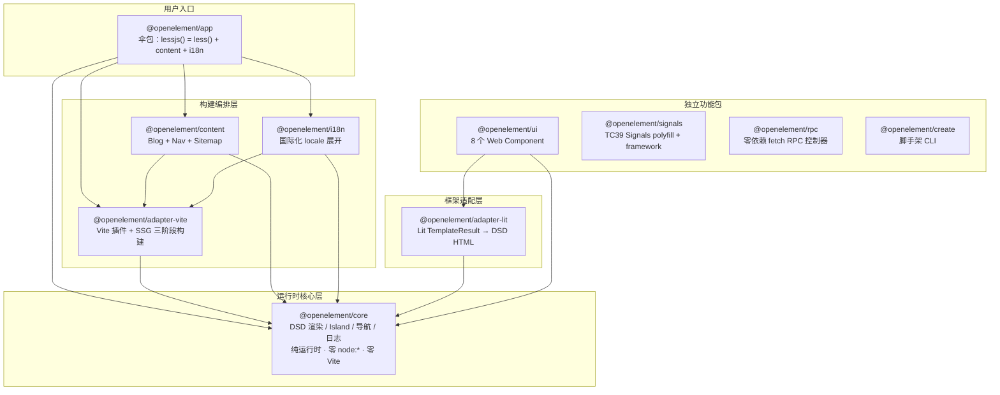
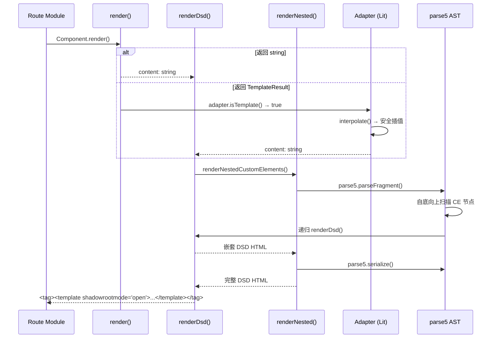
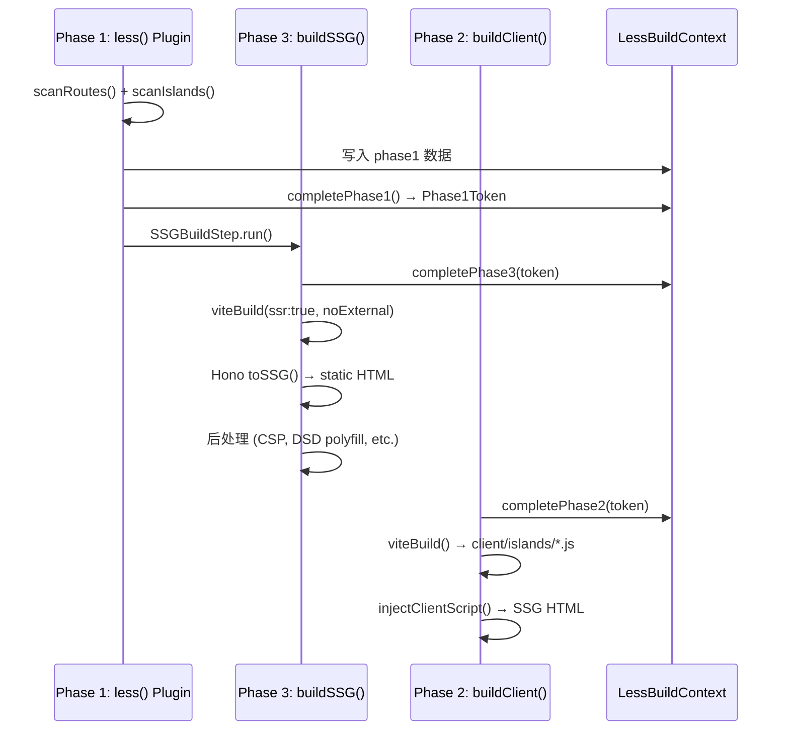

# LessJS 架构维度审核报告

**审核版本**: v0.14.0\
**审核日期**: 2026-05-13\
**审核人**: 架构师（Bob）

---

## 1. 架构概览

### 1.1 整体架构图

### 1.2 渲染管线

### 1.3 SSG 构建管线

### 1.4 整体评分

| 维度       | 评分   | 说明                                          |
| ---------- | ------ | --------------------------------------------- |
| 架构合理性 | **A-** | 职责划分清晰，core 纯运行时设计优秀           |
| 依赖关系   | **A**  | 无循环依赖，方向合理，核心包零外部依赖        |
| 设计模式   | **A**  | DSD 渲染管线、三阶段构建、Island 策略设计精良 |
| 类型系统   | **B+** | 品牌类型使用合理，但部分类型可更精确          |
| 安全性     | **B+** | HTML 转义到位，CSP 支持完善，少量改进空间     |
| 可扩展性   | **A-** | 适配器模式灵活，插件机制可扩展                |

**综合评分：A-**

---

## 2. 包间依赖关系分析

### 2.1 依赖矩阵

| 包           | core       | adapter-vite               | adapter-lit | content | i18n | app | ui | signals | rpc | create |
| ------------ | ---------- | -------------------------- | ----------- | ------- | ---- | --- | -- | ------- | --- | ------ |
| core         | -          |                            |             |         |      |     |    |         |     |        |
| adapter-vite | ✅         | -                          |             |         |      |     |    |         |     |        |
| adapter-lit  | ✅         |                            | -           |         |      |     |    |         |     |        |
| content      | ✅(logger) | ✅(build-ctx, virtual-ids) |             | -       |      |     |    |         |     |        |
| i18n         | ✅(logger) | ✅(build-ctx)              |             |         | -    |     |    |         |     |        |
| app          | ✅         | ✅                         |             | ✅      | ✅   | -   |    |         |     |        |
| ui           | ✅         |                            | ✅          |         |      |     | -  |         |     |        |
| signals      |            |                            |             |         |      |     |    | -       |     |        |
| rpc          |            |                            |             |         |      |     |    |         | -   |        |
| create       |            |                            |             |         |      |     |    |         |     | -      |

### 2.2 依赖方向分析

**正确的依赖方向**（高层 → 低层）：

1. **app → adapter-vite + content + i18n + core**：伞包组合所有子插件，符合 Facade 模式
2. **adapter-vite → core**：构建编排依赖运行时类型，单向依赖
3. **adapter-lit → core**：框架适配器依赖核心渲染接口，通过 `registerAdapter()` 扩展
4. **ui → core + adapter-lit**：UI 组件依赖核心类型和 Lit 适配器
5. **content/i18n → core(logger) + adapter-vite(build-context, virtual-ids)**：构建时插件依赖构建上下文
6. **signals/rpc**：完全独立，零依赖，可在任何框架中使用

**关键发现**：

- ✅ **无循环依赖**：所有依赖方向为单向，不存在 A→B→A 的循环
- ✅ **核心包不依赖适配器**：`@openelement/core` 仅依赖 `parse5`，零 node:*/Vite 依赖
- ✅ **signals/rpc 完全解耦**：可独立使用，不依赖任何 LessJS 包
- ✅ **依赖层级合理**：app → 构建层 → 核心层，符合分层架构

### 2.3 值得注意的依赖关系

1. **content → adapter-vite/build-context**：content 和 i18n 都需要访问 `LessBuildContext`，这是通过共享构建上下文实现的。虽然创造了 content → adapter-vite 的依赖，但这是合理的设计——content 和 i18n 是 Vite 插件，需要与 adapter-vite 协调。

2. **content → adapter-vite/virtual-ids**：虚拟模块 ID 常量集中在 adapter-vite 包中，content 和 i18n 需要引用这些常量。这是一个轻微的耦合点，但在当前规模下可接受。

---

## 3. 架构合理性详细分析

### 3.1 包职责划分

| 包               | 职责                                                  | 评价                              |
| ---------------- | ----------------------------------------------------- | --------------------------------- |
| **core**         | DSD 渲染、Island 注册、导航、日志、HTML 转义          | ✅ 纯运行时，零构建依赖，设计优秀 |
| **adapter-vite** | Vite 插件、路由扫描、Island Transform、SSG 三阶段构建 | ✅ 构建编排与运行时彻底分离       |
| **adapter-lit**  | Lit TemplateResult → DSD HTML、DSD Hydration Mixin    | ✅ 框架适配器模式，可替换         |
| **content**      | Blog + Nav + Sitemap 构建时插件                       | ✅ 零运行时，纯构建时             |
| **i18n**         | 国际化 locale 展开                                    | ✅ 独立关注点，可插拔             |
| **app**          | 伞包：lessjs() = less() + content + i18n              | ✅ Facade 模式，简化用户入口      |
| **ui**           | 8 个 Web Component + 设计令牌                         | ✅ 可独立使用的组件库             |
| **signals**      | TC39 Signals polyfill + framework layer               | ✅ 零依赖，三层架构清晰           |
| **rpc**          | 零依赖 fetch RPC 控制器                               | ✅ 最小化设计，结构化错误         |
| **create**       | 脚手架 CLI                                            | ✅ 单文件，极简                   |

**问题**：

1. **constants.ts 几乎为空**：`@openelement/core/constants.ts` 仅一行注释，无实际导出。虚拟模块 ID 已迁移到 `adapter-vite/virtual-ids`（ADR 0021），但文件仍存在。属于清理遗留。

2. **strategy-recommender.ts 未被任何代码引用**：该模块定义了 `IslandProfile` 和 `recommendStrategy()` 接口，但在整个代码库中未被任何运行时或构建时代码调用。属于未完成的功能预研或死代码。

### 3.2 Core 纯运行时设计

**核心设计原则**（实现良好）：

1. __零 node:_ 导入_*：core 包完全不使用 `node:path`、`node:fs`、`node:process` 等模块
2. **零 Vite 依赖**：core 包不含任何 Vite Plugin 类型或 API
3. **零 npm: specifiers**：仅依赖 `parse5`（通过 workspace 根 deno.json 统一管理）
4. **纯 Web Standard**：使用 `URL`、`URLPattern`、`fetch`、`import.meta.url`、`console`

**验证**：通过检查 core/src 下所有 .ts 文件，确认无任何 `node:` 或 `vite` 导入（唯一外部依赖 `parse5` 用于 AST 解析）。

### 3.3 构建与运行时分离

**ADR 0017** 的实施效果良好：

- `@openelement/core`：纯运行时，可在 Deno/Node/Bun/Edge 运行
- `@openelement/adapter-vite`：构建编排，仅构建时使用
- 虚拟模块 ID 从 core 迁移到 adapter-vite（ADR 0021）
- `LessBuildContext` 显式传递，无 globalThis 桥接

---

## 4. 设计模式评估

### 4.1 DSD 渲染管线

**设计**：`render() → string/TemplateResult → renderDsd() → parse5 AST 递归 → DSD HTML`

**优点**：

- 字符串拼接式 DSD 渲染，无 DOM shim 需求
- parse5 AST 替代正则表达式，O(n·d) 复杂度
- 三层组件模型（dsd-static / dsd-interactive / pure-island）清晰
- `DsdRenderCollector` 收集渲染指标，便于性能分析
- `maxDepth` 参数防止栈溢出

**问题**：

| #     | 问题                                | 风险  | 说明                                                                                                                                     |
| ----- | ----------------------------------- | ----- | ---------------------------------------------------------------------------------------------------------------------------------------- |
| DSD-1 | renderDsd 是 async 但同步路径不需要 | Minor | `renderDsd()` 返回 `Promise<string>`，但同步字符串拼接不需要异步。仅在调用 adapter.render() 和 renderNestedCustomElements() 时需要 await |
| DSD-2 | adapter-registry 是模块级单例       | Minor | `_adapter` 变量是模块级单例，在 SSR bundle 中可以，但如果同一进程需要多个 adapter 实例则无法支持                                         |
| DSD-3 | unwrapDsdForNestedCe 正则可能误匹配 | Minor | `ssr.ts` 中的 `unwrapDsdForNestedCe()` 使用正则替换 DSD 包装，对于极端嵌套情况可能失败                                                   |

### 4.2 SSG 三阶段构建管线

**设计**：Phase1(路由扫描) → Phase3(SSG 渲染) → Phase2(Client 构建)（ADR 0023 调整了顺序）

**优点**：

- **Phase Token 品牌类型**：`Phase1Token`、`Phase2Token`、`Phase3Token` 使用 `unique symbol` 品牌，编译时确保阶段顺序
- **显式上下文传递**：`LessBuildContext` 替代 globalThis 桥接
- **BuildStep 抽象**：`ClientBuildStep` 和 `SSGBuildStep` 实现统一接口，便于扩展
- **ADR 0023 优化**：Phase 3（SSG）先于 Phase 2（Client）执行，因为 SSG 不依赖 client chunk

**问题**：

| #     | 问题                          | 风险  | 说明                                                                                                                                      |
| ----- | ----------------------------- | ----- | ----------------------------------------------------------------------------------------------------------------------------------------- |
| SSG-1 | Phase Token 运行时校验不严格  | Minor | `completePhase2()` 检查 `this._phaseTokens[1] !== token && this._phaseTokens[3] !== token`，但 token 是引用比较，在某些边缘情况下可能失效 |
| SSG-2 | Phase 2/3 使用 dynamic import | Minor | `build.ts` 中使用 `await import('./cli/build-client.js')` 动态导入，虽然减少了初始加载，但可能导致构建时路径解析问题                      |

### 4.3 Island 加载策略

**设计**：4 策略（eager / lazy / visible / idle）+ 自动注册 + less:bind

**优点**：

- 基于标准 Web API（IntersectionObserver、requestIdleCallback）
- `island()` 包装器框架无关，不绑定 Lit
- `bindEvents()` 自动绑定 SSR props，保证客户端一致性
- `WithDsdHydration` Mixin 使用 AbortController 清理事件监听
- `data-ssr-props` JSON 序列化传递服务端数据

**问题**：

| #     | 问题                              | 风险  | 说明                                                                                                                                                              |
| ----- | --------------------------------- | ----- | ----------------------------------------------------------------------------------------------------------------------------------------------------------------- |
| ISL-1 | connectedCallback 猴子补丁        | Minor | `island()` 函数替换 `componentClass.prototype.connectedCallback`，虽然使用了 `__lessIslandWrapped` 守卫避免重复，但与 Lit 的 connectedCallback 链可能产生微妙交互 |
| ISL-2 | 策略推荐器未被集成                | Minor | `strategy-recommender.ts` 定义了完整的策略推荐逻辑，但未被任何构建时或运行时代码调用                                                                              |
| ISL-3 | islandEffect 使用 30s setInterval | Minor | `islandEffect()` 使用 `setInterval(30000)` 作为 MutationObserver 的安全网，可能在 SSR 环境中产生意外行为（虽然已检查 `host.isConnected`）                         |

### 4.4 虚拟模块设计

**设计**：`virtual:less-hono-entry`、`virtual:less-blog-data`、`virtual:less-i18n-data`、`virtual:less-nav`

**优点**：

- ADR 0018 消除了模块级状态，改用虚拟模块
- `dispatchDataPlugin()` 延迟分发到 content/i18n 注册的插件
- 每个 virtual module 都有对应的 emptyCode fallback
- HMR 支持：content 变更时自动失效虚拟模块

**问题**：

| #    | 问题                        | 风险  | 说明                                                                     |
| ---- | --------------------------- | ----- | ------------------------------------------------------------------------ |
| VM-1 | dispatchDataPlugin 类型转换 | Minor | `dispatchDataPlugin` 中使用 `(fn as any)(id)` 绕过类型检查，缺少类型安全 |

### 4.5 适配器模式

**设计**：`registerAdapter()` + `RenderAdapter` 接口

**优点**：

- 框架无关的核心设计，Lit 只是可选适配器
- `installLitAdapter()` 幂等，安全重复调用
- `uninstallLitAdapter()` 支持清理
- 适配器提供 `isTemplate()`、`render()`、`extractStyles()` 三个方法

**评价**：适配器模式设计精良，扩展新框架（如 Preact、Vue）只需实现 `RenderAdapter` 接口并调用 `registerAdapter()`。

---

## 5. 类型系统审核

### 5.1 品牌类型使用

| 类型          | 用途             | 评价                       |
| ------------- | ---------------- | -------------------------- |
| `Phase1Token` | Phase 1 完成令牌 | ✅ 防止越序调用            |
| `Phase2Token` | Phase 2 完成令牌 | ✅ 需要先完成 Phase 1 或 3 |
| `Phase3Token` | Phase 3 完成令牌 | ✅ 需要先完成 Phase 1      |
| `SafeHtml`    | 已转义的 HTML    | ✅ 区分安全/不安全 HTML    |
| `UnsafeHtml`  | 原始 HTML        | ✅ 标记不安全内容          |

**评价**：品牌类型使用合理，核心场景（Phase 编排、HTML 安全）都有类型保护。

### 5.2 类型导出

**core 包导出**（6 个子路径）：

- `.` → 主入口（类型 + 值）
- `./errors` → 错误类
- `./context` → SSR 上下文
- `./logger` → 日志
- `./navigation` → 导航
- `./constants` → 空文件（遗留）

**评价**：

- ✅ v0.13 API 收敛从 18 个导出减至 6 个
- ✅ 子路径导出避免 barrel file 问题
- ⚠️ `constants` 子路径为空，应清理或移除

### 5.3 类型质量问题

| #      | 问题                       | 风险  | 说明                                                                                                                              |
| ------ | -------------------------- | ----- | --------------------------------------------------------------------------------------------------------------------------------- |
| TYPE-1 | DsdComponent 索引签名过宽  | Minor | `[key: string]: unknown` 允许任意属性，降低了类型安全性                                                                           |
| TYPE-2 | LessMiddleware 使用 `any`  | Minor | `LessMiddleware = (c: any, next: ...) => ...`，`c` 参数为 any 以避免导入 Hono 类型。有 deno-lint-ignore 注释                      |
| TYPE-3 | DsdLitElement 类型断言复杂 | Minor | `DsdLitElement` 的类型定义使用了多层交叉类型和 `any`，是 Mixin 模式的固有复杂性                                                   |
| TYPE-4 | RPC ReactiveElement 接口   | Minor | `RpcController` 中的 `ReactiveElement` 接口重新声明了 Lit 的方法，而非导入 Lit 类型。这是有意为之（零依赖），但可能导致类型不同步 |

---

## 6. 安全性审核

### 6.1 HTML 转义

**实现位置**：`@openelement/core/html-escape.ts`

**评价**：✅ 实现完善

- `escapeHtml()`：转义 `&`、`<`、`>`、`"`、`'`
- `escapeAttr()`：转义 `&`、`"`、`'`、`<`、`>`
- `escapeAttrValue()`：类型安全的属性值转义
- `SafeHtml` / `UnsafeHtml` 品牌类型区分安全/不安全内容
- `renderDsd()` 中所有动态值都经过转义
- 错误消息使用 `escapeHtml()` 包装，防止错误信息 XSS

### 6.2 CSP 策略

**实现位置**：`@openelement/core/types.ts`（配置）、`@openelement/adapter-vite/ssg-postprocess.ts`（注入）

**评价**：✅ 实现良好

- SSG 模式支持 `<meta http-equiv="Content-Security-Policy">` 注入
- Dev 模式支持 per-request nonce（`crypto.randomUUID()`）
- `injectCspMeta()` 正确警告 nonce 在 SSG 中不可用
- CSP nonce 自动替换 `NONCE_PLACEHOLDER` 模板

**问题**：

| #     | 问题                                | 风险  | 说明                                                                                                                              |
| ----- | ----------------------------------- | ----- | --------------------------------------------------------------------------------------------------------------------------------- |
| SEC-1 | headExtras 注入无消毒               | Major | `headExtras` 和 `inject.headFragments` 以原始 HTML 注入，虽然有 `@dangerous` JSDoc 标记和运行时 `<script>` 检测警告，但不阻止注入 |
| SEC-2 | inject.stylesheets/scripts URL 验证 | Minor | `validateSafeUrl()` 只检查 `javascript:` 和 `data:` 协议，不验证 URL 的其他危险模式（如 `//evil.com`）                            |
| SEC-3 | DSD polyfill innerHTML              | Minor | DSD polyfill 中 `sr.innerHTML = tpl.innerHTML` 在 polyfill 场景下使用 innerHTML，但仅处理 shadowrootmode 模板，风险可控           |

### 6.3 RPC 控制器安全性

**评价**：✅ 安全

- `RpcController` 使用标准 `fetch` + `AbortController`
- 无内部状态暴露给外部
- `RpcError` 不泄露内部堆栈
- 重试逻辑仅对 5xx 和网络错误重试，不重试 4xx

### 6.4 SSR 注入风险

**评价**：✅ 风险可控

- `renderSsrError()` 区分 dev/prod 模式：dev 显示详细错误，prod 显示安全错误
- 虚拟模块内容（blog data、i18n data）通过 `JSON.stringify()` 序列化
- Island tag name 在 `islandTransformPlugin` 中通过 `/^[a-z0-9-]+$/` 正则验证，防止注入

### 6.5 CORS 配置

**评价**：✅ 安全

- 默认 CORS 只允许 `localhost` / `127.0.0.1`
- 生产环境必须显式配置 `corsOrigin`
- 注释明确说明 `*` 与 `credentials: true` 不兼容

---

## 7. 可扩展性评估

### 7.1 插件机制

**评价**：✅ 良好

- `@openelement/app` 伞包通过 `lessjs()` 统一入口组合所有子插件
- `LessBuildContext` 作为共享上下文，子插件通过 `ctx.plugins.*` 注册数据
- `dispatchDataPlugin()` 延迟分发机制允许 content/i18n 在 `buildStart()` 中注册
- 每个子插件可独立使用（传入 `ctx` 参数）

**限制**：

- 子插件必须依赖 `LessBuildContext`，无法完全独立
- 新插件需要在 `dispatchDataPlugin` 中手动注册新的虚拟模块条目

### 7.2 适配器模式可扩展性

**评价**：✅ 优秀

- 新框架只需实现 `RenderAdapter` 接口（`isTemplate`、`render`、`extractStyles`）
- `registerAdapter()` / `getAdapter()` API 简洁
- `isLitTemplateResultHeuristic()` 在 core 中提供 Lit 检测的启发式方法，不导入 Lit
- 未来可支持 Preact、Vue、Svelte 等适配器

### 7.3 API 稳定性

**评价**：✅ 收敛趋势

- v0.13 将 core 导出从 18 个收敛至 6 个
- 删除了 `ssr-handler.ts` 等 re-export facade
- 虚拟模块 ID 迁移到 `adapter-vite/virtual-ids`
- 仍在 0.x 版本，API 可能变化，但收敛方向正确

---

## 8. 问题清单

### 8.1 Critical 级别

无。

### 8.2 Major 级别

| ID    | 问题                                                | 位置                                     | 建议                                                                                                                                      |
| ----- | --------------------------------------------------- | ---------------------------------------- | ----------------------------------------------------------------------------------------------------------------------------------------- |
| MAJ-1 | `headExtras` 和 `inject.headFragments` 无 HTML 消毒 | `core/types.ts`、`adapter-vite/index.ts` | 虽然有 `@dangerous` 标记和运行时警告，建议提供 `sanitizeHtml()` 工具函数或在文档中强调风险。考虑添加 `allowUnsafeHtml: true` 显式确认选项 |

### 8.3 Minor 级别

| ID     | 问题                                               | 位置                               | 建议                                                              |
| ------ | -------------------------------------------------- | ---------------------------------- | ----------------------------------------------------------------- |
| MIN-1  | `constants.ts` 为空文件                            | `core/src/constants.ts`            | 删除或合并到其他模块。当前已导出为 `./constants` 子路径，需先废弃 |
| MIN-2  | `strategy-recommender.ts` 未被引用                 | `core/src/strategy-recommender.ts` | 删除或移到 experimental 目录。若计划集成，添加 TODO 注释          |
| MIN-3  | `DsdComponent` 索引签名过宽                        | `core/src/types.ts`                | 考虑使用更精确的类型或条件索引签名                                |
| MIN-4  | `LessMiddleware` 参数类型为 `any`                  | `core/src/types.ts`                | 定义最小化的 Context 接口替代 any                                 |
| MIN-5  | `dispatchDataPlugin` 使用 `(fn as any)`            | `adapter-vite/src/index.ts`        | 提取类型安全的插件分发接口                                        |
| MIN-6  | `renderDsd()` 为 async 但同步路径不需要            | `core/src/render-dsd.ts`           | 考虑提供同步版本 `renderDSDSync()`，或将 async 限制在需要的位置   |
| MIN-7  | `islandEffect` 的 30s setInterval                  | `signals/src/sugar.ts`             | 考虑使用 `requestAnimationFrame` 或在 disconnect 时清理 interval  |
| MIN-8  | `unwrapDsdForNestedCe` 正则复杂                    | `adapter-lit/src/ssr.ts`           | 考虑使用 parse5 AST 替代正则，与 core 保持一致                    |
| MIN-9  | `validateSafeUrl` 只检查 `javascript:` 和 `data:`  | `adapter-vite/src/index.ts`        | 添加 `vbscript:` 协议检查和 URL 编码规范化                        |
| MIN-10 | `installLitAdapter()` 使用模块级 `_installed` 变量 | `adapter-lit/src/ssr.ts`           | 在 SSR bundle 中安全，但如果多个 bundle 实例并存则可能失效        |

---

## 9. 改进建议（按优先级排序）

### P0 - 立即行动

1. **headExtras 安全加固**（MAJ-1）：为 `headExtras` 和 `inject.headFragments` 添加显式确认机制（如 `allowUnsafeHtml: true`），或在 API 文档中用红色警告标注。提供 `sanitizeHtml()` 工具函数供开发者使用。

### P1 - 近期改进

2. **清理死代码**（MIN-1, MIN-2）：删除空的 `constants.ts`（先废弃 `./constants` 子路径），移除或标注 `strategy-recommender.ts`。

3. **类型安全提升**（MIN-3, MIN-4, MIN-5）：
   - 收紧 `DsdComponent` 索引签名
   - 定义最小化 `LessContext` 接口替代 `any`
   - 为 `dispatchDataPlugin` 提取类型安全的插件接口

4. **validateSafeUrl 加固**（MIN-9）：添加 `vbscript:` 协议检查，对 URL 进行规范化处理（如去除空白、大小写归一化）。

### P2 - 中期优化

5. **renderDsd 同步优化**（MIN-6）：分析是否可以将 `renderDsd()` 拆分为同步/异步两个版本，减少不必要的 Promise 开销。

6. **adapter-lit AST 一致性**（MIN-8）：将 `unwrapDsdForNestedCe()` 从正则替换迁移到 parse5 AST 操作，与 core 的 render-nested.ts 保持一致的解析策略。

7. **islandEffect 清理策略**（MIN-7）：使用 `requestAnimationFrame` 替代 `setInterval`，或在 `disconnectCallback` 中确保 interval 被清理。

8. **Phase Token 运行时验证**（SSG-1）：考虑在 `completePhase*()` 方法中添加更严格的运行时检查，确保 token 值匹配而非仅引用比较。

---

## 10. 总结

LessJS 的架构设计展现了高水平的工程能力：

**核心优势**：

1. **core 纯运行时设计**是整个架构的基石——零 node:* / Vite / npm 依赖，真正实现了"HTML 先于 JavaScript 存在"的理念
2. **DSD 渲染管线**从正则表达式演进到 parse5 AST，O(n·d) 复杂度，支持递归嵌套，设计精良
3. **Phase Token 品牌类型**是编译时阶段编排的优秀实践，防止了构建阶段的越序调用
4. **适配器模式**使框架无关成为可能——core 不绑定 Lit，adapter-lit 可替换
5. **signals/rpc 的零依赖设计**展现了模块化思考——每个包都有明确的最小依赖集
6. **虚拟模块替代模块状态**（ADR 0018）消除了运行时状态共享的复杂性

**待改进领域**：

1. headExtras 安全性需要显式确认机制
2. 少量死代码和空文件需要清理
3. 类型安全在个别地方（any、过宽索引签名）可以收紧
4. adapter-lit 中的正则操作可以升级为 AST 操作

**总体评价**：LessJS 的架构设计在同类 SSG 框架中属于上游水平，特别是 core/adapter 分离、DSD 渲染管线、Island 策略设计等方面。存在的问题多为 Minor 级别，不影响框架的核心使用。
