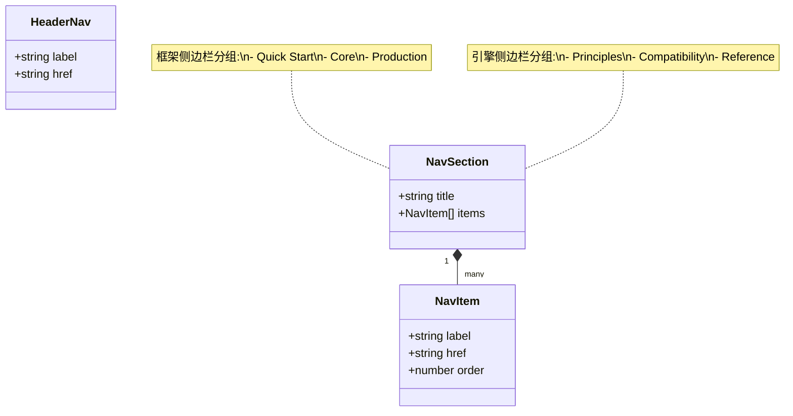
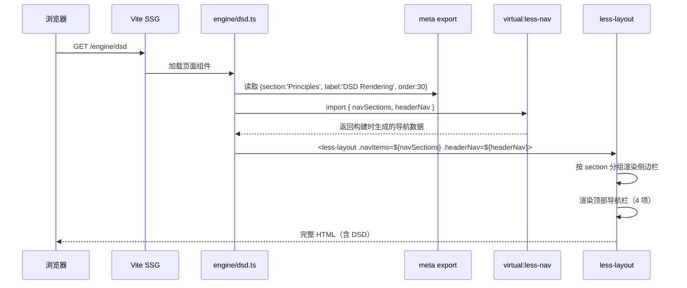
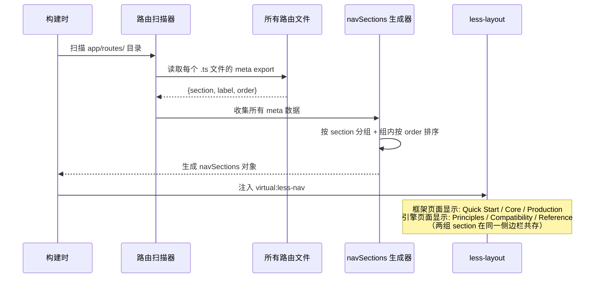
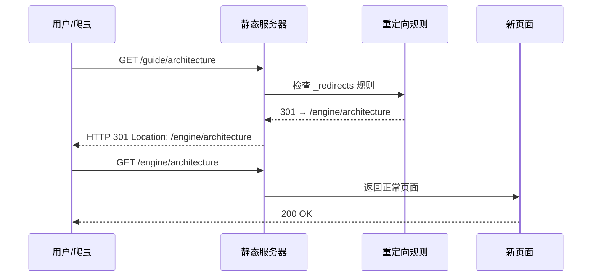
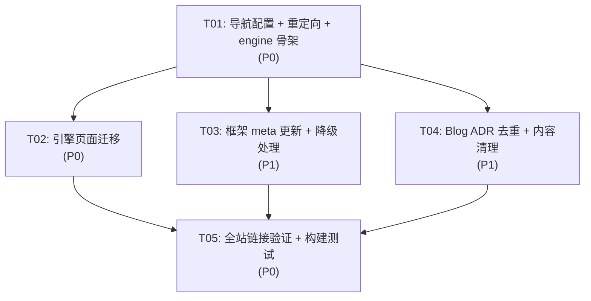

# LessJS www 目录重组 — 架构设计文档

> 架构师：高见远（Gao）
> 基于：`www-audit-prd.md` v1.0
> 日期：2026-05-17

---

## 一、实现方案

### 1.1 核心技术挑战

| # | 挑战 | 风险等级 | 应对策略 |
|---|------|---------|---------|
| 1 | **引擎页面物理迁移** — 7 个页面从 `/guide/` 移至 `/engine/`，涉及文件移动 + 所有内部链接更新 | 高 | 批量移动 + 全局搜索替换 + 重定向映射表 |
| 2 | **meta.section 重分组** — 当前 7 个 section 需精简为 6 个（3 框架 + 3 引擎），所有页面 meta 需同步更新 | 中 | 按映射表逐文件修改，编译验证 |
| 3 | **旧 URL 重定向** — 迁移后旧 URL 需 301 跳转，防止搜索引擎和外链 404 | 高 | 在 `_redirects` 或 `404.ts` 中配置重定向规则 |
| 4 | **Blog ADR 去重** — 24 篇博客 ADR 与 `/decisions` 内容重复 | 中 | 博客 ADR 文件添加 frontmatter `redirect: /decisions/xxx`，构建时自动生成 meta refresh |
| 5 | **导航配置联动** — headerNav 修改后，所有页面的 `headerNav` 引用自动更新（通过 `virtual:less-nav`） | 低 | 修改 `vite.config.ts` 一处即可，虚拟模块自动分发 |

### 1.2 框架选型

**沿用现有技术栈，不引入新框架/库。**

| 技术 | 用途 | 理由 |
|------|------|------|
| Vite SSG | 静态站点生成 | 已有，无需更换 |
| Lit | Web Component 渲染 | 已有，所有页面基于 LitElement |
| `virtual:less-nav` | 导航数据注入 | 已有机制，修改 `vite.config.ts` 即可全局生效 |
| `@lessjs/ui/less-layout` | 页面布局组件 | 已有，支持 `navItems` + `headerNav` 属性 |

### 1.3 架构模式

保持现有 **文件系统路由 + meta 驱动侧边栏** 模式：

- 文件路径 = URL 路径（`app/routes/engine/dsd.ts` → `/engine/dsd`）
- `export const meta = { section, label, order }` → 侧边栏自动分组
- `virtual:less-nav` 在构建时收集所有路由的 meta，生成 `navSections` + `headerNav`

---

## 二、文件列表

### 2.1 新建文件

| 相对路径 | 说明 |
|----------|------|
| `app/routes/engine/_renderer.ts` | 引擎分区布局渲染器（复制 guide 的，修改编辑链接基准路径） |
| `app/routes/engine/architecture.ts` | 从 `guide/architecture.ts` 迁移 |
| `app/routes/engine/dsd.ts` | 从 `guide/dsd.ts` 迁移 |
| `app/routes/engine/islands.ts` | 从 `guide/islands.ts` 迁移 |
| `app/routes/engine/islands-deep.ts` | 从 `guide/islands-deep.ts` 迁移 |
| `app/routes/engine/package-compatibility.ts` | 从 `guide/package-compatibility.ts` 迁移 |
| `app/routes/engine/standards-registry.ts` | 从 `guide/standards-registry.ts` 迁移 |
| `app/routes/engine/comparison.ts` | 从 `guide/comparison.ts` 迁移 |
| `app/routes/engine/reference/core.ts` | 从 `reference/core.ts` 迁移 |
| `app/routes/engine/design-system.ts` | 从 `ui.ts` 迁移 + 重构 |
| `app/routes/engine/_redirects.ts` | 旧 URL → 新 URL 重定向映射（可选，也可在 404.ts 处理） |

### 2.2 修改文件

| 相对路径 | 变更说明 |
|----------|---------|
| `vite.config.ts` | headerNav 从 8 项精简为 4 项；可选添加 redirects 配置 |
| `app/routes/guide/positioning.ts` | meta.section: `'Start Here'` → `'Quick Start'` |
| `app/routes/guide/getting-started.ts` | meta.section: `'Start Here'` → `'Quick Start'` |
| `app/routes/guide/routing.ts` | meta.section: `'Core Model'` → `'Core'` |
| `app/routes/guide/ssg.ts` | meta.section: `'Core Model'` → `'Core'`；label 改为 `'SSG/ISR/SSR Rendering'` |
| `app/routes/guide/api.ts` | meta.section: `'Core Model'` → `'Core'` |
| `app/routes/guide/content-system.ts` | meta.section: `'Strategy'` → `'Core'` |
| `app/routes/guide/rpc.ts` | meta.section: `'Core Model'` → `'Core'` |
| `app/routes/guide/configuration.ts` | meta.section 不变（`'Production'` 保持） |
| `app/routes/guide/deployment.ts` | meta.section 不变 |
| `app/routes/guide/security-middleware.ts` | meta.section 不变 |
| `app/routes/guide/error-handling.ts` | meta.section 不变 |
| `app/routes/guide/testing.ts` | meta.section 不变 |
| `app/routes/guide/pwa.ts` | meta.section 不变 |
| `app/routes/guide/_renderer.ts` | 无需修改（guide renderer 保持不变，继续服务于框架页面） |
| `app/routes/index/_renderer.ts` | 注入 `<less-search>` 组件（P2 优化） |
| `app/routes/404.ts` | 更新 POPULAR_LINKS 中的旧链接（`/guide/architecture` → `/engine/architecture` 等） |
| `app/routes/roadmap.ts` | 修复 3 个死链接（`/docs/` 前缀问题） |
| `app/routes/changelog.ts` | meta.section: `'History'` → 保留但从侧边栏降级（移除 meta 或 section 改为 `'Footer'`） |
| `app/routes/contributing.ts` | meta.section: `'History'` → 移除 meta 或 section 改为 `'Footer'` |
| `app/routes/community.ts` | 删除独立页面，内容合并到页脚 |
| `app/routes/decisions/index.ts` | meta.section: `'Roadmap & Decisions'` → 保留但降级 |
| `content/blog/0001-*.md` ~ `content/blog/0024-*.md` | 24 篇 ADR 博客：添加 frontmatter `redirect` 字段或 `hidden: true` |
| `content/blog/0008-implementation-plan.md` | 删除（编号冲突的废弃文档） |

### 2.3 删除文件

| 相对路径 | 原因 |
|----------|------|
| `app/routes/guide/architecture.ts` | 迁移到 `engine/` |
| `app/routes/guide/dsd.ts` | 迁移到 `engine/` |
| `app/routes/guide/islands.ts` | 迁移到 `engine/` |
| `app/routes/guide/islands-deep.ts` | 迁移到 `engine/` |
| `app/routes/guide/package-compatibility.ts` | 迁移到 `engine/` |
| `app/routes/guide/standards-registry.ts` | 迁移到 `engine/` |
| `app/routes/guide/comparison.ts` | 迁移到 `engine/` |
| `app/routes/reference/core.ts` | 迁移到 `engine/reference/` |
| `app/routes/ui.ts` | 迁移到 `engine/design-system.ts` |
| `app/routes/styling/web-awesome.ts` | 删除（内容极薄，无实际价值） |
| `app/routes/community.ts` | 删除（内容合并到页脚） |
| `app/routes/styling/` 目录 | 清空后删除目录 |
| `content/blog/0008-implementation-plan.md` | 编号冲突，废弃 |

### 2.4 迁移文件内部修改清单

每个迁移到 `engine/` 的页面需要：

1. **修改 import 路径** — `../../components/page-styles.js` → 保持不变（engine 与 guide 同级，相对路径相同）
2. **修改 `current-path`** — `/guide/xxx` → `/engine/xxx`（zh 和 en 两个版本都要改）
3. **修改内部导航链接** — 页面底部 `.nav-row` 中的链接指向
4. **修改 meta.section** — 按新映射表更新

---

## 三、数据结构和接口

### 3.1 navSections 新分组结构



### 3.2 meta.section 值映射（旧 → 新）

| 旧 section | 新 section | 所属导航 | 页面 |
|-----------|-----------|---------|------|
| `Start Here` | `Quick Start` | 框架 | positioning, getting-started |
| `Core Model` | `Core` | 框架 | routing, ssg, api, content-system, rpc |
| `Production` | `Production` | 框架 | configuration, deployment, security-middleware, error-handling, testing, pwa |
| `Start Here` | `Principles` | 引擎 | architecture, comparison |
| `Core Model` | `Principles` | 引擎 | dsd, islands, islands-deep |
| `Core Model` | `Compatibility` | 引擎 | package-compatibility |
| `Start Here` | `Compatibility` | 引擎 | standards-registry |
| `Packages` | `Reference` | 引擎 | reference/core, design-system |
| `Strategy` | `Core` | 框架 | content-system |
| `Strategy` | `Principles` | 引擎 | comparison |
| `Roadmap & Decisions` | (降级) | — | roadmap, community, decisions |
| `History` | (降级) | — | changelog, contributing, blog |
| `Packages` | (删除) | — | web-awesome |

### 3.3 headerNav 新配置

```typescript
headerNav: [
  { href: '/guide/positioning', label: 'Framework' },
  { href: '/engine/architecture', label: 'Engine' },
  { href: '/registry', label: 'RegistryHub' },
  { href: '/blog', label: 'Blog' },
]
```

### 3.4 重定向映射表

| 旧 URL | 新 URL | 状态码 |
|--------|--------|--------|
| `/guide/architecture` | `/engine/architecture` | 301 |
| `/guide/dsd` | `/engine/dsd` | 301 |
| `/guide/islands` | `/engine/islands` | 301 |
| `/guide/islands-deep` | `/engine/islands-deep` | 301 |
| `/guide/package-compatibility` | `/engine/package-compatibility` | 301 |
| `/guide/standards-registry` | `/engine/standards-registry` | 301 |
| `/guide/comparison` | `/engine/comparison` | 301 |
| `/reference/core` | `/engine/reference/core` | 301 |
| `/ui` | `/engine/design-system` | 301 |
| `/styling/web-awesome` | `/engine/design-system` | 301 |
| `/community` | `/` (首页，社区链接在页脚) | 301 |

### 3.5 引擎页面 renderer

```typescript
// app/routes/engine/_renderer.ts
// 与 guide/_renderer.ts 结构相同，但：
// 1. GITHUB_EDIT_BASE 路径指向 engine/
// 2. 搜索按钮注入逻辑相同
// 3. "Edit this page" 注入逻辑相同
```

---

## 四、程序调用流程

### 4.1 导航渲染流程（用户访问 `/engine/dsd`）



### 4.2 页面迁移后的侧边栏分组渲染



### 4.3 旧 URL 重定向流程



---

## 五、待明确事项

| # | 问题 | 当前假设 | 影响范围 |
|---|------|---------|---------|
| 1 | **侧边栏如何区分框架/引擎 section？** 当前 `navSections` 是全站统一的一维数组，所有 section 都会出现在侧边栏。迁移后，框架的 `Quick Start/Core/Production` 和引擎的 `Principles/Compatibility/Reference` 会混合在一起 | 假设 `less-layout` 组件会根据 `current-path` 自动高亮当前 section 所在的导航标签，同一页面只显示与当前路径匹配的 section 分组 | 如果 `less-layout` 不支持按路径过滤 section，需要在 renderer 中自行过滤 |
| 2 | **重定向实现方式？** SSG 产物是纯静态 HTML，没有服务端重定向能力 | 在 `404.ts` 中增加客户端重定向逻辑，或使用 Netlify/Vercel 的 `_redirects` 文件 | 如果部署平台不支持 `_redirects`，需要在 404.ts 中处理 |
| 3 | **`/guide/` 保持不变但导航标签叫 Framework** — 用户点击 "Framework" 导航到 `/guide/positioning`，URL 前缀是 `/guide/` 不是 `/framework/` | PRD Open Question 1 结论：保持 `/guide/` 避免大规模路由变更，通过 headerNav label 建立用户心智 | 可能造成用户困惑——导航标签和 URL 不一致 |
| 4 | **Blog ADR 重定向机制？** 博客系统使用 markdown frontmatter 渲染，添加 `redirect` 字段需要修改 `@lessjs/content` 的博客渲染逻辑 | 简化方案：在 24 篇 ADR 博客的 frontmatter 中添加 `hidden: true`，使其不出现在博客列表中，不修改渲染器 | 如果需要保留旧 URL 的重定向，仍需额外处理 |
| 5 | **Community 页面合并到页脚的具体方式？** 页脚模板可能在 `less-layout` Web Component 内部 | 在 `less-layout` 的 footer slot 中注入社区链接（GitHub / Discord / JSR），删除 Community 独立页面 | 需要确认 `less-layout` 是否支持 footer slot 注入 |
| 6 | **`_hub-data-full.ts` vs `_hub-data.ts` 是否需要合并？** | PRD P2 优先级，本次不处理 | 不影响本次重构 |

---

## 六、依赖包列表

**无新依赖。** 所有变更基于现有技术栈：

```
- @lessjs/app: 已有（Vite SSG 框架）
- @lessjs/ui: 已有（less-layout, less-search, less-code-block 等）
- lit: 已有（Web Component 渲染）
- vite: 已有（构建工具）
```

---

## 七、任务列表

### T01: 项目基础设施 — 导航配置 + 重定向映射 + engine 目录骨架

**源文件：**
- `www/vite.config.ts` — 修改 headerNav 为 4 项
- `www/app/routes/engine/_renderer.ts` — 新建，复制 guide 的 renderer，修改编辑链接基准
- `www/app/routes/404.ts` — 更新 POPULAR_LINKS + 添加旧 URL 客户端重定向逻辑
- `www/app/routes/index/_renderer.ts` — 注入 `<less-search>` 组件

**依赖：** 无
**优先级：** P0

**详细说明：**
1. 修改 `vite.config.ts` 中 `content.nav.headerNav` 为：
   ```typescript
   headerNav: [
     { href: '/guide/positioning', label: 'Framework' },
     { href: '/engine/architecture', label: 'Engine' },
     { href: '/registry', label: 'RegistryHub' },
     { href: '/blog', label: 'Blog' },
   ],
   ```
2. 创建 `app/routes/engine/` 目录，添加 `_renderer.ts`（与 guide 版本相同，但 `GITHUB_EDIT_BASE` 指向 `engine/`）
3. 修改 `404.ts`：更新 POPULAR_LINKS 中的旧路径；在 `wrap()` 或页面加载时添加客户端重定向（检查 `location.pathname` 是否匹配旧 URL 列表，匹配则 `location.replace(newUrl)`）
4. 修改 `index/_renderer.ts`：注入 `<less-search slot="header-actions"></less-search>`

### T02: 引擎页面迁移 — 物理移动 + meta 更新 + 内部链接修复

**源文件：**
- `www/app/routes/engine/architecture.ts` — 从 guide/ 迁移，更新 meta/current-path/链接
- `www/app/routes/engine/dsd.ts` — 同上
- `www/app/routes/engine/islands.ts` — 同上
- `www/app/routes/engine/islands-deep.ts` — 同上
- `www/app/routes/engine/package-compatibility.ts` — 同上
- `www/app/routes/engine/standards-registry.ts` — 同上
- `www/app/routes/engine/comparison.ts` — 同上，修复缺失的 meta.section
- `www/app/routes/engine/reference/core.ts` — 从 reference/ 迁移
- `www/app/routes/engine/design-system.ts` — 从 ui.ts 迁移 + 合并 web-awesome 内容
- 删除对应的 guide/ 和 reference/ 和 ui.ts 和 styling/ 源文件

**依赖：** T01
**优先级：** P0

**详细说明：**
1. 将 7 个引擎相关页面从 `guide/` 移至 `engine/`：
   - architecture, dsd, islands, islands-deep, package-compatibility, standards-registry, comparison
2. 将 `reference/core.ts` 移至 `engine/reference/core.ts`
3. 将 `ui.ts` 迁移为 `engine/design-system.ts`
4. 每个迁移文件需修改：
   - `meta.section` → 新值（Principles / Compatibility / Reference）
   - `current-path` → `/engine/xxx`（zh 和 en 两个版本）
   - 页面底部 `.nav-row` 内部链接指向更新
   - `import` 路径保持不变（engine 与 guide 同级深度）
5. `comparison.ts` 特殊处理：确认 meta.section 已有值（当前为 `'Strategy'`，改为 `'Principles'`）
6. 删除源位置的旧文件：guide/architecture.ts, guide/dsd.ts 等，以及 ui.ts, reference/core.ts
7. 删除 `styling/web-awesome.ts` 和 `styling/` 目录

### T03: 框架页面 meta 更新 + 降级页面处理

**源文件：**
- `www/app/routes/guide/positioning.ts` — meta.section: Start Here → Quick Start
- `www/app/routes/guide/getting-started.ts` — 同上
- `www/app/routes/guide/routing.ts` — meta.section: Core Model → Core
- `www/app/routes/guide/ssg.ts` — 同上 + label 改为 SSG/ISR/SSR Rendering
- `www/app/routes/guide/api.ts` — 同上
- `www/app/routes/guide/content-system.ts` — meta.section: Strategy → Core
- `www/app/routes/guide/rpc.ts` — meta.section: Core Model → Core
- `www/app/routes/roadmap.ts` — 修复 3 个死链接 + 降级（可选移除 meta）
- `www/app/routes/changelog.ts` — 降级（可选移除 meta）
- `www/app/routes/contributing.ts` — 降级
- `www/app/routes/community.ts` — 删除（内容合并到页脚）
- `www/app/routes/decisions/index.ts` — 降级
- `www/app/routes/blog/index.ts` — 确认 meta 是否需要调整

**依赖：** T01
**优先级：** P1

**详细说明：**
1. 修改框架页面的 meta.section 值（Start Here → Quick Start, Core Model → Core, Strategy → Core）
2. Roadmap 死链接修复：
   - `/docs/decisions/adr-0006-version-roadmap` → `/decisions/adr-0006-version-roadmap`
   - `/docs/decisions/adr-0007-npm-publishing-strategy` → `/decisions/adr-0007-npm-publishing-strategy`
   - `/docs/architecture` → `/engine/architecture`
3. 降级处理：Roadmap/Changelog/Contributing/Decisions 的 meta.section 移除或改为空字符串，使其不出现在侧边栏
4. Community 页面删除：将其 4 个外链（GitHub / Discord / JSR / npm）合并到 less-layout 的 footer 区域

### T04: Blog ADR 去重 + 内容清理

**源文件：**
- `www/content/blog/0001-keep-hono-vite-dev-server.md` ~ `0024-standards-first-wc-renderer-roadmap.md` — 24 篇 ADR 博客添加 `hidden: true` 或 `redirect` frontmatter
- `www/content/blog/0008-implementation-plan.md` — 删除
- `www/content/blog/adr-0008-0009-*.md` — 归档（添加 `archived: true`）
- `www/content/blog/adr-0009-*.md` — 归档
- `www/content/blog/core-architecture-simplification-report.md` — 归档

**依赖：** T01
**优先级：** P1

**详细说明：**
1. 24 篇 ADR 编号博客（0001-0024）：在 frontmatter 中添加 `hidden: true`，使其不出现在博客列表
2. 删除 `0008-implementation-plan.md`（与 `0008-eliminate-createserver-globalthis-bridges.md` 编号冲突）
3. 3 篇过程文档（adr-0008-0009-*.md, adr-0009-*.md, core-architecture-simplification-report.md）：添加 `archived: true` frontmatter
4. 保留所有版本发布日志、部署指南、设计文档

### T05: 全站链接验证 + 构建测试

**源文件：**
- `www/app/routes/guide/_renderer.ts` — 确认 guide renderer 继续正常工作
- `www/app/routes/engine/_renderer.ts` — 确认 engine renderer 正常工作
- `www/app/routes/registry/_renderer.ts` — 确认不受影响
- `www/app/routes/guide/positioning.ts` — 确认底部导航链接指向正确
- `www/app/routes/engine/architecture.ts` — 确认底部导航链接指向正确
- 所有包含 `.nav-row` 的页面 — 验证链接
- `dist/` 构建产物 — 全站链接检查

**依赖：** T02, T03, T04
**优先级：** P0

**详细说明：**
1. 运行 `deno task build`，确认构建无错误
2. 检查 `dist/` 目录：确认 `/engine/` 页面已正确生成
3. 检查旧 URL 是否触发重定向（`/guide/architecture` → `/engine/architecture`）
4. 搜索全站硬编码链接：`grep -r "/guide/architecture" app/` 等等，确认所有引用已更新
5. 验证侧边栏分组：框架页面应显示 Quick Start / Core / Production；引擎页面应显示 Principles / Compatibility / Reference
6. 验证搜索索引不包含已删除的页面

---

## 八、共享知识（跨文件约定）

```
1. 路由命名规范：
   - 框架页面：/guide/{slug}（保持不变）
   - 引擎页面：/engine/{slug}（新建）
   - Registry：/registry（保持不变）
   - Blog：/blog（保持不变）

2. meta.section 值规范（新）：
   - 框架侧边栏：Quick Start | Core | Production
   - 引擎侧边栏：Principles | Compatibility | Reference
   - 降级页面：不设置 meta 或 section 设为空字符串

3. meta.order 规范：
   - 各 section 内 order 从 10 开始，步进 10
   - 框架 Quick Start: positioning(10), getting-started(20)
   - 框架 Core: routing(10), ssg(20), api(30), content-system(40), rpc(50)
   - 框架 Production: configuration(10), security-middleware(20), error-handling(30), testing(40), deployment(50), pwa(60)
   - 引擎 Principles: architecture(10), comparison(20), dsd(30), islands(40), islands-deep(50)
   - 引擎 Compatibility: package-compatibility(10), standards-registry(20)
   - 引擎 Reference: reference/core(5), design-system(10)

4. current-path 规范：
   - 中文页面：/engine/{slug}
   - 英文页面：/en/engine/{slug}

5. 重定向规范：
   - 所有旧 URL 使用 301 重定向到新 URL
   - 重定向逻辑优先使用部署平台的 _redirects 文件
   - 回退方案：404.ts 中的客户端重定向

6. 页面组件 import 路径：
   - engine/ 页面引用 page-styles：../../components/page-styles.js（与 guide/ 同级深度，路径不变）
   - engine/reference/ 页面引用 page-styles：../../../components/page-styles.js

7. 所有 API 响应格式：不适用（纯静态站点）
```

---

## 九、任务依赖图



**说明：**
- T01 是基础任务，必须先完成（导航配置和 engine 目录骨架）
- T02/T03/T04 可并行执行，但都依赖 T01
- T05 是最终验证任务，依赖所有实施任务完成
