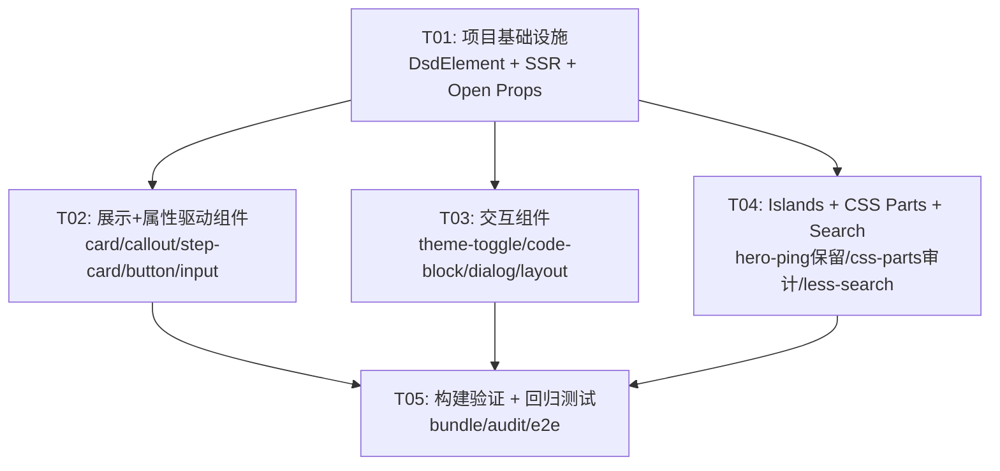

# Ocean-Island 架构迁移 — 系统设计与任务分解

> **作者**: 高见远（架构师）
> **日期**: 2026-05-19
> **版本**: v0.20.0-alpha
> **状态**: 待确认

---

## Part A: 系统设计

### 1. 实现方案

#### 1.1 核心技术挑战

| 挑战                       | 描述                                                             | 方案                                                              |
| -------------------------- | ---------------------------------------------------------------- | ----------------------------------------------------------------- |
| **Lit 解耦**               | 当前所有 10 个 UI 组件依赖 LitElement/DsdLitElement              | 新建 `DsdElement extends HTMLElement` 基类，直接使用 Web 标准 API |
| **样式系统迁移**           | Lit `css\`\` → CSSResult`需替换为原生`CSSStyleSheet`             | `static styles: CSSStyleSheet` + `adoptedStyleSheets` 自动合并    |
| **属性响应**               | Lit `@property()` 装饰器 + `static properties` 需替换            | `static observedAttributes` + `attributeChangedCallback`          |
| **事件绑定**               | Lit `@click` 模板绑定在 SSR 下失效                               | `hydrateEvents()` 模式从 `WithDsdHydration` Mixin 移植到基类      |
| **SSR CSSStyleSheet 提取** | `render-dsd.ts` 当前通过适配器提取样式，需直接支持 CSSStyleSheet | 在适配器循环前插入原生 CSSStyleSheet 序列化逻辑                   |
| **Open Props tokens**      | `design-tokens.ts` 依赖 Lit `css` 标签                           | 改为纯 `CSSStyleSheet`，内联 Open Props 灰度值                    |

#### 1.2 架构模式

```
┌─────────────────────────────────────────────────────────┐
│                    @openelement/core                          │
│  ┌──────────────┐  ┌──────────────┐  ┌──────────────┐  │
│  │  DsdElement   │  │ render-dsd.ts │  │   types.ts   │  │
│  │  (NEW 基类)   │  │(EDIT 样式提取) │  │(已有类型复用) │  │
│  └──────┬───────┘  └──────────────┘  └──────────────┘  │
│         │                                               │
├─────────┼───────────────────────────────────────────────┤
│         │              @openelement/ui                       │
│         │  ┌──────────────────────────────────────┐     │
│         ├──│  less-button, less-input, less-card, │     │
│         │  │  less-callout, less-step-card,       │     │
│         │  │  less-code-block, less-dialog,       │     │
│         │  │  less-layout, less-theme-toggle      │     │
│         │  └──────────────────────────────────────┘     │
│         │                                               │
│         │  ┌──────────────────────────────────────┐     │
│         └──│  open-props-tokens.ts (CSSStyleSheet) │     │
│            └──────────────────────────────────────┘     │
│                                                         │
│  ┌──────────────────────────────────────────────────┐   │
│  │  less-hero-ping (保留 Lit, Island)                │   │
│  └──────────────────────────────────────────────────┘   │
└─────────────────────────────────────────────────────────┘

www/app/islands/
  └── less-search.ts (迁移到 DsdElement)
```

**关键设计决策**:

- **DsdElement** 直接 `extends HTMLElement`（非 LitElement），零框架依赖
- **render(): string** — render-dsd.ts 已在 line 177-181 原生支持字符串返回
- **static styles: CSSStyleSheet** — 基类在 `connectedCallback` 中通过 `adoptedStyleSheets` 自动合并
- **hydrateEvents** — 从 `WithDsdHydration._hydrateEvents()` 移植到 DsdElement 基类
- **less-hero-ping 保留 Lit** — 作为 Island 架构参考实现，仅添加 `part="..."` 属性

### 2. 框架选型

| 层级         | 技术                                        | 理由                             |
| ------------ | ------------------------------------------- | -------------------------------- |
| **基类**     | `DsdElement extends HTMLElement`            | 零依赖，Web 标准 API             |
| **样式**     | `CSSStyleSheet` (Constructable Stylesheets) | 浏览器原生，无构建时依赖         |
| **模板**     | 模板字面量 → `render(): string`             | SSR 兼容，render-dsd.ts 原生支持 |
| **设计令牌** | Open Props CSS 变量（内联灰度值）           | 消除 ~100 行 Lit 胶水代码        |
| **保留 Lit** | `less-hero-ping` (仅此一个)                 | Island 参考实现，不参与迁移      |
| **运行时**   | Deno 2.x + Vite 8.x + TypeScript 5.9        | 现有技术栈不变                   |
| **测试**     | Deno test + Playwright                      | 现有测试基础设施                 |

### 3. 文件列表

```
packages/core/
├── src/
│   ├── dsd-element.ts          (NEW)  DsdElement 基类 ~150 行
│   ├── index.ts                (EDIT) +export { DsdElement }
│   ├── render-dsd.ts           (EDIT) +CSSStyleSheet 提取 ~15 行
│   └── types.ts                (EDIT) 可能新增 DsdElementConfig 类型
├── __tests__/
│   └── dsd-element.test.ts     (NEW)  DsdElement 单元测试

packages/ui/
├── src/
│   ├── open-props-tokens.ts    (NEW)  纯 CSSStyleSheet 令牌 ~80 行
│   ├── less-card.ts            (EDIT) Lit→DsdElement ~96 行
│   ├── less-callout.ts         (EDIT) Lit→DsdElement ~60 行
│   ├── less-step-card.ts       (EDIT) Lit→DsdElement ~100 行
│   ├── less-button.ts          (EDIT) Lit→DsdElement ~251 行
│   ├── less-input.ts           (EDIT) Lit→DsdElement ~254 行
│   ├── less-theme-toggle.ts    (EDIT) Lit→DsdElement ~259 行
│   ├── less-code-block.ts      (EDIT) Lit→DsdElement ~394 行
│   ├── less-dialog.ts          (EDIT) Lit→DsdElement ~317 行
│   ├── less-layout.ts          (EDIT) Lit→DsdElement ~1202 行
│   ├── less-hero-ping.ts       (EDIT) 仅添加 CSS Parts
│   ├── index.ts                (EDIT) 更新导出 + open-props-tokens
│   ├── manifest.ts             (EDIT) 更新适配器声明
│   └── tokens/
│       ├── color-values.ts     (DELETE)
│       └── colors.ts           (DELETE)
├── deno.json                   (EDIT) 移除 Lit 依赖，更新导出
└── __tests__/
    └── components.test.ts      (EDIT) 更新测试以适配 DsdElement

www/app/islands/
└── less-search.ts              (EDIT) Lit→DsdElement ~317 行

根目录:
├── deno.json                   (EDIT) 更新 imports
└── docs/
    └── adr/
        └── 0036-ocean-island-architecture.md (NEW, 如有)
```

### 4. 数据结构与接口

#### 4.1 DsdElement API 契约

````typescript
/**
 * DsdElement — LessJS 零依赖 Web Component 基类。
 *
 * 替代 LitElement/DsdLitElement，直接使用 Web 标准 API：
 * - HTMLElement 生命周期
 * - Constructable Stylesheets (CSSStyleSheet)
 * - Custom Elements observedAttributes
 * - Declarative Shadow DOM 兼容
 *
 * @example
 * ```ts
 * class MyButton extends DsdElement {
 *   static styles = myButtonStyles; // CSSStyleSheet
 *   static observedAttributes = ['variant', 'disabled'];
 *
 *   variant: string = 'default';
 *   disabled: boolean = false;
 *
 *   render(): string {
 *     return `<button class="btn btn--${this.variant}" ${this.disabled ? 'disabled' : ''}>
 *       <slot></slot></button>`;
 *   }
 * }
 * ```
 */
````

#### 4.2 类图

参见独立文件 `docs/class-diagram.mermaid`

#### 4.3 HydrateEventDescriptor（复用已有类型，不变）

```typescript
// 已在 packages/core/src/types.ts 中定义，无需修改
interface HydrateEventDescriptor {
  selector: string; // CSS 选择器（shadow root 内）
  event: string; // DOM 事件名 ('click', 'input', 'keydown')
  method: string; // 组件方法名
}
```

#### 4.4 Open Props TokenSheet 接口

```typescript
// packages/ui/src/open-props-tokens.ts
export const openPropsTokenSheet: CSSStyleSheet;
// 包含：spacing, typography, colors, effects, radius, animation
// 所有颜色值内联（不再通过 CDN 加载 var(--gray-N)）
```

### 5. 程序调用流

#### 5.1 SSR 渲染流程

参见独立文件 `docs/sequence-diagram.mermaid`

---

## Part B: 任务分解

### 6. 依赖包列表

```
# 生产依赖（无新增！移除了 lit 依赖）
- typescript@^5.9.0          : 类型系统（已有）
- hono@^4.12.18              : SSR 中间件框架（已有，不变）
- parse5@7.0.0               : HTML 解析（已有，不变）

# 移除的依赖
- lit (npm:lit@^3.2.0)       : 不再作为 @openelement/ui 的直接依赖
- @openelement/adapter-lit         : 不再作为 @openelement/ui 的依赖
- @lit/reactive-element       : 不再需要
- lit-element                 : 不再需要
- lit-html                    : 不再需要

# less-hero-ping 保留的依赖（仅此组件）
- lit (npm:lit@^3.2.0)       : 仅 less-hero-ping 使用

# 开发依赖（不变）
- @playwright/test@1.59.1    : E2E 测试
- vite@8.0.10                : 构建工具
```

### 7. 任务列表

#### T01: 项目基础设施 — DsdElement 基类 + SSR CSSStyleSheet + Open Props

| 属性          | 值                                                                           |
| ------------- | ---------------------------------------------------------------------------- |
| **Task ID**   | T01                                                                          |
| **Task Name** | 项目基础设施：DsdElement 基类 + SSR CSSStyleSheet 提取 + Open Props 令牌迁移 |
| **优先级**    | P0                                                                           |
| **依赖**      | 无                                                                           |

**源文件**：

| 操作   | 文件路径                                      | 说明                                                                                                                                                                                                                  |
| ------ | --------------------------------------------- | --------------------------------------------------------------------------------------------------------------------------------------------------------------------------------------------------------------------- |
| NEW    | `packages/core/src/dsd-element.ts`            | DsdElement 基类 (~150行)，实现：createRenderRoot DSD 检测、adoptedStyleSheets 合并、hydrateEvents、observedAttributes→attributeChangedCallback、_dsdHydrated 标记                                                     |
| EDIT   | `packages/core/src/index.ts`                  | 新增 `export { DsdElement }` 及关联类型导出                                                                                                                                                                           |
| NEW    | `packages/core/__tests__/dsd-element.test.ts` | DsdElement 单元测试：shadow root 复用、样式合并、属性变更回调、事件绑定                                                                                                                                               |
| EDIT   | `packages/core/src/render-dsd.ts`             | 在 line 247（适配器样式提取循环之前）插入 ~15 行：检测 `componentClass.styles` 是否为 CSSStyleSheet，若是则直接序列化 CSS 规则                                                                                        |
| EDIT   | `packages/core/src/types.ts`                  | 按需新增 `DsdElementConfig` 类型（如需要暴露 `delegatesFocus`/`formAssociated` 等静态配置）                                                                                                                           |
| DELETE | `packages/ui/src/tokens/color-values.ts`      | 删除（迁移到 open-props-tokens.ts）                                                                                                                                                                                   |
| DELETE | `packages/ui/src/tokens/colors.ts`            | 删除（迁移到 open-props-tokens.ts）                                                                                                                                                                                   |
| NEW    | `packages/ui/src/open-props-tokens.ts`        | 重写 design-tokens.ts 为纯 CSSStyleSheet：内联所有 Open Props 灰度值（gray-0~gray-12 的 light + dark），所有 spacing/typography/effects/radius/animation 令牌用 `CSSStyleSheet` 的 `replaceSync` 或 `insertRule` 构建 |
| EDIT   | `packages/ui/deno.json`                       | 移除 `lit`/`@openelement/adapter-lit` imports，移除 `./tokens/color-values`/`./tokens/colors` 导出，新增 `./open-props-tokens` 导出                                                                                   |
| EDIT   | `packages/ui/src/index.ts`                    | 新增 `export { openPropsTokenSheet } from './open-props-tokens.js'`，移除 tokens/colors 相关导出                                                                                                                      |
| EDIT   | `deno.json`（根目录）                         | 按需更新 `@openelement/ui/tokens/*` imports 映射                                                                                                                                                                      |
| EDIT   | `packages/adapter-lit/src/index.ts`           | 标记 `DsdLitElement`/`WithDsdHydration` 为 `@deprecated`（less-hero-ping 过渡用）                                                                                                                                     |

**说明**：

- DsdElement 基类从 `WithDsdHydration` Mixin 移植以下逻辑：
  - `createRenderRoot()`: 检测 `this.shadowRoot?.childElementCount > 0` → 复用 DSD shadow root
  - `_hydrateEvents()`: 从 `static hydrateEvents` 绑定事件到 shadow DOM
  - `connectedCallback()`: DSD 场景自动调用 `_hydrateEvents()`
  - `disconnectedCallback()`: AbortController 清理
- 新增逻辑：
  - `static styles: CSSStyleSheet | CSSStyleSheet[]` → `adoptedStyleSheets` 自动合并
  - `static observedAttributes: string[]` → `attributeChangedCallback` 自动触发 `render()` 或自定义回调
  - `render(): string` 抽象方法
- Open Props 令牌迁移策略：将所有 `var(--gray-N)` 引用内联为具体 hex 值，消除 CDN 依赖，确保首帧无闪烁

---

#### T02: 展示组件 + 属性驱动组件迁移

| 属性          | 值                                                           |
| ------------- | ------------------------------------------------------------ |
| **Task ID**   | T02                                                          |
| **Task Name** | 展示 + 属性驱动组件迁移：card/callout/step-card/button/input |
| **优先级**    | P0                                                           |
| **依赖**      | T01                                                          |

**源文件**：

| 操作 | 文件路径                                   | 说明                                                                                                                                                                                                                               |
| ---- | ------------------------------------------ | ---------------------------------------------------------------------------------------------------------------------------------------------------------------------------------------------------------------------------------- |
| EDIT | `packages/ui/src/less-card.ts`             | ~96行，迁移模式：`import { DsdLitElement } from '@openelement/adapter-lit'` → `import { DsdElement } from '@openelement/core'`，`css\`\``→`CSSStyleSheet`，`html\`\``→ 模板字面量字符串，添加`part="container/header/body/footer"` |
| EDIT | `packages/ui/src/less-callout.ts`          | ~60行，同上迁移模式，纯展示组件无交互                                                                                                                                                                                              |
| EDIT | `packages/ui/src/less-step-card.ts`        | ~100行，同上，添加 `part="step/indicator/content"`                                                                                                                                                                                 |
| EDIT | `packages/ui/src/less-button.ts`           | ~251行，属性驱动：`static observedAttributes = ['variant','size','disabled','href','target','type']`，`attributeChangedCallback` 触发 DOM 同步，`hydrateEvents` 声明 click 事件，保留 `delegatesFocus`/`formAssociated` 静态属性   |
| EDIT | `packages/ui/src/less-input.ts`            | ~254行，属性驱动 + 事件：`observedAttributes` 声明 label/value/type/error/placeholder，`attributeChangedCallback` → `_syncDOM()` 更新内部 input 元素，`hydrateEvents` 声明 input/focus/blur 事件                                   |
| EDIT | `packages/ui/src/manifest.ts`              | 更新这 5 个组件的声明：`less.adapter` 从 `'lit'` 改为 `'vanilla'`，`superclassName` 从 `'LitElement'` 改为 `'DsdElement'`                                                                                                          |
| EDIT | `packages/ui/__tests__/components.test.ts` | 适配新的 DsdElement API                                                                                                                                                                                                            |

**迁移模式示例**（less-card）：

```typescript
// BEFORE (Lit)
import { css, html } from 'lit';
import { DsdLitElement } from '@openelement/adapter-lit';
class LessCard extends DsdLitElement {
  static styles = css`.card { ... }`;
  render() { return html`<div class="card"><slot></slot></div>`; }
}

// AFTER (DsdElement)
import { DsdElement } from '@openelement/core';
const styles = new CSSStyleSheet();
styles.replaceSync(`:host { display: block; } .card { ... }`);
class LessCard extends DsdElement {
  static styles = styles;
  render() { return `<div class="card" part="container"><slot></slot></div>`; }
}
```

---

#### T03: 交互组件迁移

| 属性          | 值                                                  |
| ------------- | --------------------------------------------------- |
| **Task ID**   | T03                                                 |
| **Task Name** | 交互组件迁移：theme-toggle/code-block/dialog/layout |
| **优先级**    | P0                                                  |
| **依赖**      | T01（不依赖 T02，可并行）                           |

**源文件**：

| 操作 | 文件路径                                   | 说明                                                                                                                                                        |
| ---- | ------------------------------------------ | ----------------------------------------------------------------------------------------------------------------------------------------------------------- |
| EDIT | `packages/ui/src/less-theme-toggle.ts`     | ~259行：localStorage 主题持久化 + 图标切换。`hydrateEvents` 声明 toggle click，`observedAttributes` 声明 theme。迁移 SVG 图标到字符串模板                   |
| EDIT | `packages/ui/src/less-code-block.ts`       | ~394行：clipboard API + `:state(copied)` CSS 自定义状态。`hydrateEvents` 声明 copy button click。`ElementInternals.states` 管理 copied 状态                 |
| EDIT | `packages/ui/src/less-dialog.ts`           | ~317行：overlay + focus trap + ESC 关闭。`hydrateEvents` 声明 close/backdrop click/keydown。`observedAttributes` 声明 open/label                            |
| EDIT | `packages/ui/src/less-layout.ts`           | ~1202行（最大组件）：分 3 步迁移 — (1)styles→CSSStyleSheet (2)events→hydrateEvents (3)state→observedAttributes。涉及 header/sidebar/footer/nav 多 slot 布局 |
| EDIT | `packages/ui/src/manifest.ts`              | 更新这 4 个组件的声明（同 T02 模式）                                                                                                                        |
| EDIT | `packages/ui/__tests__/components.test.ts` | 适配交互组件的 DsdElement API                                                                                                                               |

**关键交互模式**：

| 组件         | 交互模式                     | DsdElement 实现                                                                                  |
| ------------ | ---------------------------- | ------------------------------------------------------------------------------------------------ |
| theme-toggle | localStorage + 图标切换      | `hydrateEvents: [{ selector: 'button', event: 'click', method: '_toggle' }]`                     |
| code-block   | Clipboard API + CSS :state() | `ElementInternals.states.add('copied')` / `delete('copied')`                                     |
| dialog       | Overlay + Focus trap + ESC   | `_handleKeydown` 通过 `hydrateEvents` 绑定，`open` 属性驱动                                      |
| layout       | SPA 导航 + 移动端菜单        | `hydrateEvents` 绑定 nav click / menu toggle，`observedAttributes` 声明 `navSections`/`navLinks` |

---

#### T04: Islands + CSS Parts 全覆盖 + less-search 迁移

| 属性          | 值                                                 |
| ------------- | -------------------------------------------------- |
| **Task ID**   | T04                                                |
| **Task Name** | Islands 保留 + CSS Parts 全覆盖 + less-search 迁移 |
| **优先级**    | P1                                                 |
| **依赖**      | T01（不依赖 T02/T03，可并行）                      |

**源文件**：

| 操作 | 文件路径                               | 说明                                                                                                                                          |
| ---- | -------------------------------------- | --------------------------------------------------------------------------------------------------------------------------------------------- |
| EDIT | `packages/ui/src/less-hero-ping.ts`    | **保留 Lit/DsdLitElement**，仅添加 `part="ping-ring/ping-dot"` CSS Parts 属性                                                                 |
| EDIT | `packages/ui/src/less-card.ts`         | CSS Parts 审核：确保 `part="container/header/body/footer"` 存在                                                                               |
| EDIT | `packages/ui/src/less-callout.ts`      | CSS Parts 审核：确保 `part="container/icon/content"` 存在                                                                                     |
| EDIT | `packages/ui/src/less-step-card.ts`    | CSS Parts 审核：确保 `part="step/indicator/content"` 存在                                                                                     |
| EDIT | `packages/ui/src/less-button.ts`       | CSS Parts 审核：确保 `part="button"` 存在                                                                                                     |
| EDIT | `packages/ui/src/less-input.ts`        | CSS Parts 审核：确保 `part="input/label/error"` 存在                                                                                          |
| EDIT | `packages/ui/src/less-theme-toggle.ts` | CSS Parts 审核：确保 `part="toggle/icon-sun/icon-moon"` 存在                                                                                  |
| EDIT | `packages/ui/src/less-code-block.ts`   | CSS Parts 审核：确保 `part="code/copy-button"` 存在                                                                                           |
| EDIT | `packages/ui/src/less-dialog.ts`       | CSS Parts 审核：确保 `part="overlay/panel/close/heading/content"` 存在                                                                        |
| EDIT | `packages/ui/src/less-layout.ts`       | CSS Parts 审核：确保 `part="header/sidebar/main/footer/nav"` 存在                                                                             |
| EDIT | `www/app/islands/less-search.ts`       | ~317行，Lit→DsdElement 迁移：document.body overlay + keyboard nav (↑↓Enter ESC) + SPA 导航重置。`hydrateEvents` 声明 input/keydown/click 事件 |
| EDIT | `packages/ui/src/manifest.ts`          | less-hero-ping 保持 `less.adapter: 'lit'`，添加 `cssParts` 声明；less-search 注册为新声明                                                     |

**CSS Parts 命名规范**：

| 组件              | Parts                                             |
| ----------------- | ------------------------------------------------- |
| less-card         | `container`, `header`, `body`, `footer`           |
| less-callout      | `container`, `icon`, `content`                    |
| less-step-card    | `step`, `indicator`, `content`                    |
| less-button       | `button`                                          |
| less-input        | `input`, `label`, `error`                         |
| less-theme-toggle | `toggle`, `icon-sun`, `icon-moon`                 |
| less-code-block   | `code`, `copy-button`                             |
| less-dialog       | `overlay`, `panel`, `close`, `heading`, `content` |
| less-layout       | `header`, `sidebar`, `main`, `footer`, `nav`      |
| less-hero-ping    | `ping-ring`, `ping-dot`                           |

---

#### T05: 构建验证 + 回归测试

| 属性          | 值                    |
| ------------- | --------------------- |
| **Task ID**   | T05                   |
| **Task Name** | 构建验证 + 回归测试   |
| **优先级**    | P0                    |
| **依赖**      | T01 + T02 + T03 + T04 |

**源文件**：

| 操作     | 文件路径                                      | 说明                                                                                            |
| -------- | --------------------------------------------- | ----------------------------------------------------------------------------------------------- |
| EDIT     | `packages/ui/__tests__/components.test.ts`    | 完整回归测试：所有 10 组件渲染输出验证、属性变更响应、事件触发                                  |
| EDIT     | `packages/ui/__tests__/smoke.test.ts`         | 冒烟测试更新                                                                                    |
| EDIT     | `packages/core/__tests__/dsd-element.test.ts` | 补充交互组件集成测试                                                                            |
| NEW/EDIT | `www/e2e/*.spec.ts`                           | Playwright E2E 视觉回归测试：截图对比迁移前后 UI                                                |
| -        | CLI 命令                                      | `deno task build` — SSG 构建验证：bundle size ≤6KB gzip, zero Lit imports audit, DSD 输出正确性 |

**验证检查清单**：

- [ ] `deno task typecheck` — 零类型错误
- [ ] `deno task lint` — 零 lint 错误
- [ ] `deno task test` — 所有单元测试通过
- [ ] `deno task build` — SSG 构建成功
- [ ] Bundle size audit — gzip ≤ 6KB（不含 less-hero-ping 的 Lit）
- [ ] Lit imports audit — `grep -r "from 'lit'" packages/ui/src/` 仅匹配 less-hero-ping.ts
- [ ] `deno task test:e2e` — 视觉回归测试通过
- [ ] SSR 输出验证 — 所有组件 `<template shadowrootmode="open">` 正确生成
- [ ] CSS Parts 验证 — `::part()` 外部样式可穿透

### 8. 共享知识

```
## 命名规范
- 文件名: kebab-case (less-button.ts)
- 类名: PascalCase (LessButton)
- 标签名: kebab-case with less- prefix (less-button)
- CSS Parts: kebab-case, 按语义命名 (container, header, body)
- CSS 变量: --less-{category}-{variant} (--less-bg-base)

## 组件模板规范
- render() 返回纯字符串，不包含任何框架模板语法
- 使用模板字面量拼接 HTML: `<div class="foo">${this.bar}</div>`
- 条件渲染: `${this.disabled ? 'disabled' : ''}`
- 列表渲染: `${items.map(i => `<li>${escapeHtml(i)}</li>`).join('')}`
- IMPORTANT: 所有用户数据必须经过 escapeHtml() 转义防止 XSS

## CSSStyleSheet 规范
- 使用 new CSSStyleSheet() + replaceSync() 定义样式
- :host 选择器定义 Shadow DOM 宿主样式
- ::slotted() 选择器定义 slot 内容样式
- 所有 CSS 变量通过 var() 引用，继承自 :root

## 属性同步规范
- observedAttributes 声明所有需要响应式更新的属性名
- attributeChangedCallback 调用 _syncDOM() 更新内部 DOM
- Boolean 属性: 存在即为 true，不存在即为 false
- 属性名使用 HTML 规范（全小写），property 名使用 camelCase

## 事件绑定规范
- 所有交互通过 hydrateEvents 声明式绑定
- 事件处理器方法名约定: _handle{Event} (如 _handleClick)
- 使用 AbortController + signal 实现自动清理
- M-17: 跳过 __ 开头的方法（原型污染防护）

## SSR 规范
- render() 必须是纯函数（无副作用，无 DOM 操作）
- connectedCallback 在 SSR 中不被调用（render-dsd.ts line 173）
- CSSStyleSheet 在 SSR 中自动序列化为 <style> 标签

## 迁移检查清单（每个组件）
- [ ] import 从 lit/@openelement/adapter-lit 改为 @openelement/core
- [ ] extends 从 DsdLitElement 改为 DsdElement
- [ ] css`` 改为 new CSSStyleSheet() + replaceSync()
- [ ] html`` 改为 模板字面量字符串
- [ ] static properties → static observedAttributes + attributeChangedCallback
- [ ] @click/@input → hydrateEvents 数组
- [ ] _dsdHydrated → nothing 逻辑移除（DsdElement 自动处理）
- [ ] 所有可样式化元素添加 part="..." 属性
- [ ] 用户数据显示用 escapeHtml() 包裹
```

### 9. 任务依赖图



---

## 待明确事项

| # | 问题                                                                                                                                 | 影响范围      | 建议                                                                            |
| - | ------------------------------------------------------------------------------------------------------------------------------------ | ------------- | ------------------------------------------------------------------------------- |
| 1 | **less-search 归属** — `less-search.ts` 当前在 `www/app/islands/` 而非 `packages/ui/src/`，迁移后是否需要移入 `@openelement/ui` 包？ | T04 文件路径  | 建议保留在 app 层作为 Islands，保持与 less-hero-ping 一致的 Island 模式         |
| 2 | **@openelement/adapter-lit 包保留策略** — DsdLitElement 标记 deprecated 后，adapter-lit 包是否继续发布？                             | T01, 发布流程 | 建议保留但标记 deprecated，less-hero-ping 仍需使用                              |
| 3 | **deno.json lit 依赖** — 根 `deno.json` 中 lit 映射是否保留？less-hero-ping 仍需 lit                                                 | T01, 构建     | 保留 `"lit": "npm:lit@^3.2.0"` 映射，仅从 `packages/ui/deno.json` 移除          |
| 4 | **bundle size 基线** — 当前 bundle 的 gzip 大小基线是多少？目标 ≤6KB 是否可达成？                                                    | T05           | 需在 T05 执行前测量基线                                                         |
| 5 | **ADR-0036 文件** — 当前 `docs/adr/` 中无 0036 文件，是否需要创建？                                                                  | 文档          | 建议由 PM 在确认本设计后创建                                                    |
| 6 | **manifest.ts 中 less-search 声明** — `less-search` 不在 `packages/ui/src/` 中，是否需要在 manifest 中注册？                         | T04           | 建议在 `www/` 的独立 manifest 中声明，或在 `packages/ui/src/manifest.ts` 中添加 |

---

> **下一步**: 请 PM（许清楚）和 Team Lead 审阅本任务分解，确认后工程师（宋代码）即可按 T01→T02/T03/T04→T05 顺序实施。
