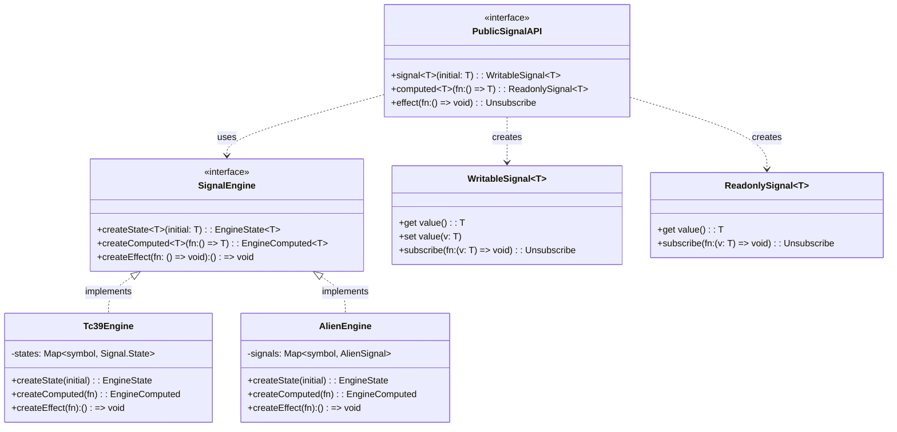
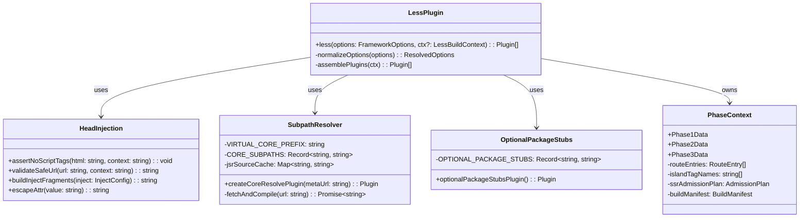
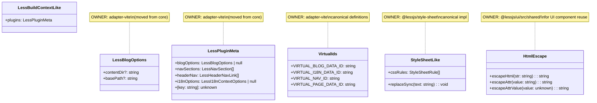
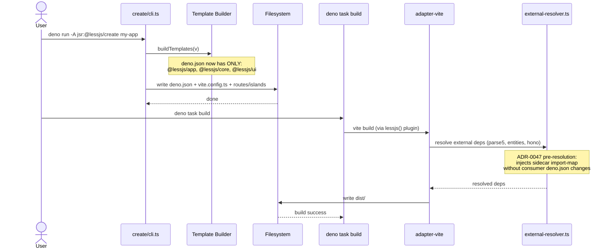
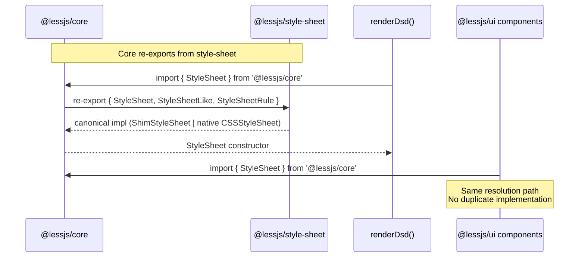
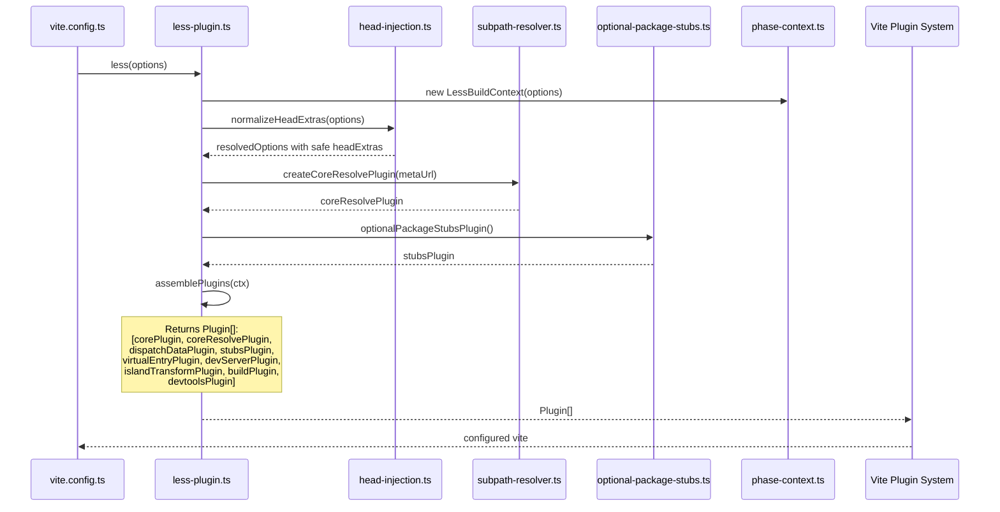
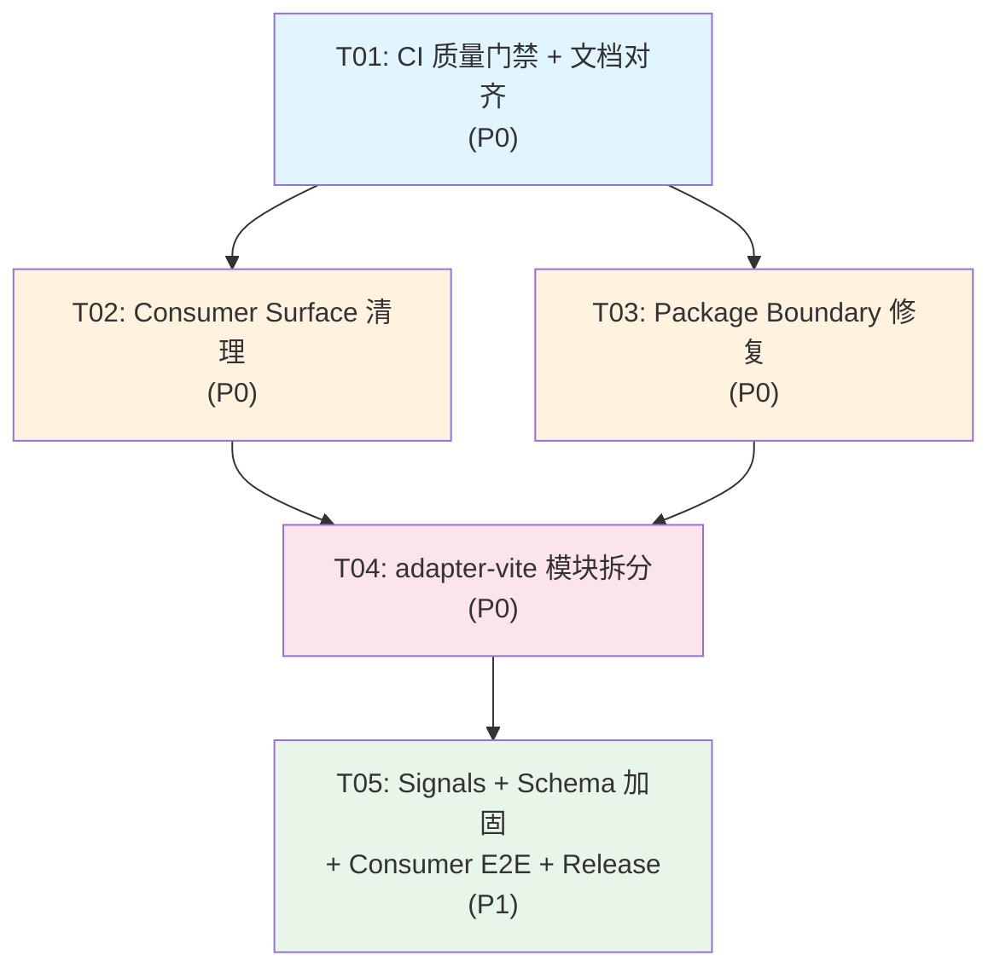

# System Design: v0.22 Architecture Integrity

> Architect: 高见远 (Bob)\
> Version: v0.22.0\
> Based on: ADR-0049, SOP-001 ~ SOP-005\
> Date: 2026-05-26

---

## Part A: System Design

### 1. Implementation Approach

#### 1.1 Core Technical Challenges

| #  | Challenge                                                          | Approach                                                                                                     |
| -- | ------------------------------------------------------------------ | ------------------------------------------------------------------------------------------------------------ |
| C1 | Consumer `deno.json` exposes 18 framework internals                | Slim to 3 public imports; `adapter-vite` pre-resolution injects sidecar import-map                           |
| C2 | `@lessjs/core` owns build-only types causing circular deps         | Move `build-types.ts` + `virtual-ids.ts` ownership to `adapter-vite` (G10 was a tactical fix, now strategic) |
| C3 | `style-sheet` is byte-identical in core and style-sheet packages   | Make `@lessjs/style-sheet` canonical; core re-exports                                                        |
| C4 | UI components duplicate `_esc`/`_escAttr` 5 times                  | Extract shared `html-escape.ts` into `@lessjs/ui/src/shared/`                                                |
| C5 | `adapter-vite/src/index.ts` is 843 lines of mixed concerns         | Split into 5 focused modules with explicit responsibilities                                                  |
| C6 | Signals engine swap risk (TC39 polyfill → alien-signals)           | Facade pattern: define public contract, engine adapter behind it, feature-flag gated                         |
| C7 | CI coverage artifacts exist but aren't persisted                   | Upload coverage as artifact; add Playwright `trace: 'retain-on-failure'`                                     |
| C8 | `lint.yml` and `sop-gate.yml` overlap (fmt:check + lint run twice) | Consolidate: `sop-gate.yml` references `lint.yml` via `workflow_call` or merge into one                      |

#### 1.2 Architecture Patterns

- **Facade Pattern**: `@lessjs/signals` public API (`signal`/`computed`/`effect`/`.value`/`subscribe`) remains stable regardless of engine (TC39 polyfill ↔ alien-signals)
- **Module Extraction**: `adapter-vite/src/index.ts` becomes orchestration-only; implementation lives in focused modules
- **Canonical Ownership**: One implementation per concept; other packages re-export or depend
- **Pre-resolution Bridge**: `adapter-vite` owns external dependency resolution; consumers never see `parse5`/`entities`/`hono` in their import map

#### 1.3 Framework and Library Selections

| Concern                    | Choice                                     | Justification                                                                     |
| -------------------------- | ------------------------------------------ | --------------------------------------------------------------------------------- |
| Signal engine (experiment) | `alien-signals`                            | Smaller bundle, faster; evaluated behind facade, not user-facing                  |
| Validation (experiment)    | Valibot (evaluate only)                    | Type-safe schema validation; evaluated as internal impl tool, not user-facing API |
| CSS rule parsing           | Existing `parseRules()` in style-sheet     | Already correct, handles nested `@media`/`@keyframes`; no need to replace         |
| HTML escaping              | Existing `escapeHtml`/`escapeAttr` in core | Already correct, single-pass, branded types; UI just needs shared access          |

---

### 2. File List

#### 2.1 Files Modified (existing)

```
# SOP-001: Consumer Surface Cleanup
packages/create/cli.ts                          # Template deno.json: 18→3 imports
packages/create/__tests__/cli.test.ts           # Update expected deno.json assertions
packages/app/src/index.ts                       # Orchestration options for import-map sidecar
packages/adapter-vite/src/external-resolver.ts  # Pre-resolution bridge for parse5/entities/hono

# SOP-002: Package Boundary Repair
packages/core/src/build-types.ts                # MOVED → adapter-vite
packages/core/src/virtual-ids.ts                # Ownership review; keep or move
packages/core/src/style-sheet.ts                # Re-export from @lessjs/style-sheet
packages/core/src/index.ts                      # Update exports (remove build-types, update style-sheet)
packages/adapter-vite/src/virtual-ids.ts        # Own canonical definitions (not re-export)
packages/adapter-vite/src/build-context.ts      # Import build-types from local, not core
packages/style-sheet/src/style-sheet.ts         # Stay canonical (already identical to core)
packages/style-sheet/src/index.ts               # Ensure clean public exports
packages/ui/src/less-button.ts                  # Remove private _escAttr; use shared helper
packages/ui/src/less-callout.ts                 # Remove private _esc; use shared helper
packages/ui/src/less-dialog.ts                  # Remove private _esc/_escAttr; use shared helper
packages/ui/src/less-input.ts                   # Remove private _esc/_escAttr; use shared helper
packages/ui/src/less-layout.ts                  # Remove private _esc/_escAttr; use shared helper
packages/ui/src/less-step-card.ts               # Remove private _esc; use shared helper
packages/hub/src/scanner.ts                     # Replace records.push(null!) with typed accumulation
packages/content/src/*.ts                       # Update imports (build-types from adapter-vite)
packages/i18n/src/*.ts                          # Update imports (build-types from adapter-vite)

# SOP-003: adapter-vite Decomposition
packages/adapter-vite/src/index.ts              # Reduce to orchestration (~100 lines)
packages/adapter-vite/__tests__/                # Add focused tests for each new module

# SOP-004: Signals + Schema Hardening
packages/signals/src/index.ts                   # Document facade contract boundary
packages/signals/src/types.ts                   # Add PublicSignalAPI type
packages/signals/src/framework.ts               # Add engine adapter interface
packages/core/src/dsd-element.ts                # Subscription simplification audit

# SOP-005: Quality Gates
.github/workflows/test.yml                      # +coverage artifact upload, +Playwright trace
.github/workflows/lint.yml                      # Deduplicate with sop-gate (or merge)
.github/workflows/sop-gate.yml                  # Rename to v0.22.x, update gate summary
.github/workflows/jsr-consumer-monitor.yml      # +browser smoke test step
docs/roadmap/ROADMAP.md                         # v0.22 = Architecture Integrity
docs/status/STATUS.md                           # sync with ADR-0049
docs/changelog/v0.22.0.md                       # New: release notes
README.md                                       # sync v0.22 description
README.en.md                                    # sync v0.22 description
```

#### 2.2 Files Created (new)

```
# SOP-002: UI shared helpers
packages/ui/src/shared/html-escape.ts           # Canonical _esc() / _escAttr() for UI components

# SOP-003: adapter-vite modules  
packages/adapter-vite/src/less-plugin.ts        # Public less() orchestration + plugin assembly
packages/adapter-vite/src/head-injection.ts     # Head fragment validation, inject pipeline, CSP
packages/adapter-vite/src/subpath-resolver.ts   # JSR core subpath resolution (createCoreResolvePlugin)
packages/adapter-vite/src/optional-package-stubs.ts  # OPTIONAL_PACKAGE_STUBS + stub plugin
packages/adapter-vite/src/phase-context.ts      # Phase 1/2/3 data contracts and handoff types

# SOP-004: Signals experiment
packages/signals/src/alien-engine.ts            # alien-signals adapter behind facade (feature-flagged)
```

---

### 3. Data Structures and Interfaces

#### 3.1 Signals Facade Contract



#### 3.2 adapter-vite Module Boundaries



#### 3.3 Package Boundary Types



---

### 4. Program Call Flow

#### 4.1 Consumer Surface Cleanup — Generated Project Build



#### 4.2 Package Boundary Repair — StyleSheet Resolution



#### 4.3 adapter-vite Decomposition — Plugin Assembly



#### 4.4 Signals Facade — Engine Swap

```mermaid
sequenceDiagram
    participant User as user code
    participant Facade as @lessjs/signals
    participant Engine as SignalEngine
    participant TC39 as Tc39Engine
    participant Alien as AlienEngine (exp.)

    User->>Facade: signal(0)
    Facade->>Engine: createState(0)
    
    alt Default: TC39 polyfill
        Engine->>TC39: new Signal.State(0)
        TC39-->>Engine: state
    else Experiment: alien-signals flag
        Engine->>Alien: alienSignal(0)
        Alien-->>Engine: state
    end
    
    Engine-->>Facade: WritableSignal { .value, .subscribe }
    Facade-->>User: signal instance
    
    User->>Facade: computed(() => signal.value * 2)
    Note over Facade,Engine: Same flow; engine transparent
```

---

### 5. Anything UNCLEAR

| #  | Question                                                                                                                                                | Assumption                                                                                                                                                                                                                                                                                            |
| -- | ------------------------------------------------------------------------------------------------------------------------------------------------------- | ----------------------------------------------------------------------------------------------------------------------------------------------------------------------------------------------------------------------------------------------------------------------------------------------------- |
| Q1 | `build-types.ts` / `virtual-ids.ts` were moved _to_ core in G10 to break circular deps. Moving back to adapter-vite reintroduces the circular dep risk. | The circular dep was `content → adapter-vite/build-context`. If content/i18n import `LessBlogOptions` etc. from `adapter-vite/build-types` (not `build-context`), there's no Vite Plugin import = no circular dep. Validate this.                                                                     |
| Q2 | `@lessjs/signals/framework` import path must be preserved per SOP-004. Does `alien-signals` experiment expose its own `framework` subpath?              | No. Alien engine is an internal adapter. The `framework` subpath continues to export `signal`/`computed`/`effect` regardless of which engine is active underneath.                                                                                                                                    |
| Q3 | Should `lint.yml` be merged into `sop-gate.yml` or should `sop-gate.yml` call `lint.yml` via `workflow_call`?                                           | Prefer `workflow_call` — keeps `lint.yml` independently triggerable for quick PR feedback, while `sop-gate.yml` is the comprehensive release gate.                                                                                                                                                    |
| Q4 | Does `virtual-ids.ts` stay in core or move to adapter-vite?                                                                                             | The constants are consumed by content, i18n, and adapter-vite. Moving to adapter-vite means content/i18n import from adapter-vite. If this creates a circular dep risk, keep in core but add a comment marking them as "shared build constants owned by adapter-vite, hosted in core for dep safety." |
| Q5 | How deep should the alien-signals experiment go? Full engine replacement or proof-of-concept?                                                           | POC only: build a branch-local adapter, run existing signal tests against it, measure size/perf. Do NOT merge to main unless all tests pass and performance is measurably better.                                                                                                                     |

---

## Part B: Task Decomposition

### 6. Required Packages

```
# No new third-party packages required for the core refactoring.
# alien-signals is evaluated as an experiment (SOP-004), not a hard dependency.

- alien-signals@latest: Signal engine experiment (SOP-004 Step 2, branch-local only)
- valibot@latest: Schema validation experiment (SOP-004 Step 4, evaluate only)
```

### 7. Task List (ordered by dependency)

---

#### T01: CI 质量门禁 + 文档体系对齐

- **Task ID**: T01
- **Priority**: P0
- **Dependencies**: 无
- **Source Files**:
  - `.github/workflows/test.yml` — add coverage artifact upload, Playwright trace on retry, cache restore keys
  - `.github/workflows/lint.yml` — add `workflow_call` trigger for sop-gate reuse
  - `.github/workflows/sop-gate.yml` — call lint.yml via `workflow_call`, rename to v0.22.x, update gate summary text
  - `.github/workflows/jsr-consumer-monitor.yml` — add `restore-keys` to cache
  - `docs/roadmap/ROADMAP.md` — v0.22 = Architecture Integrity, Edge Full-Stack → v0.23
  - `docs/status/STATUS.md` — explain v0.22 architecture cleanup line
  - `docs/changelog/v0.22.0.md` — initialize release notes skeleton
  - `README.md` — sync v0.22 description
  - `README.en.md` — sync English description

**Description**:

1. **test.yml 改造**: Each `--coverage` job adds `deno coverage` → `lcov` → `actions/upload-artifact@v4`. Add `playwright` config `trace: 'retain-on-failure'` for e2e jobs. Add `restore-keys: \|` to all `actions/cache@v4` steps.
2. **lint.yml + sop-gate.yml 去重**: Add `workflow_call:` to lint.yml. In sop-gate.yml, replace duplicate `fmt-check` + `lint` jobs with a single `uses: ./.github/workflows/lint.yml` call.
3. **sop-gate.yml 改名**: Update name to "SOP Gate (v0.22.x)", update gate-summary text from "v0.22.0 Edge Full-Stack" → "v0.22.0 Architecture Integrity".
4. **jsr-consumer-monitor 增强**: Add `restore-keys` for cache fallback.
5. **文档对齐**: ROADMAP.md moves Edge Full-Stack to v0.23.x. STATUS.md describes v0.22 as Architecture Integrity. Initialize v0.22.0 changelog with cleanup scope. Update README dual-language.

---

#### T02: Consumer Surface 清理

- **Task ID**: T02
- **Priority**: P0
- **Dependencies**: T01
- **Source Files**:
  - `packages/create/cli.ts` — template `deno.json`: 18 imports → 3 imports (`@lessjs/app`, `@lessjs/core`, `@lessjs/ui`)
  - `packages/create/__tests__/cli.test.ts` — update assertions for new deno.json shape
  - `packages/app/src/index.ts` — add orchestration options so adapter-vite can inject sidecar import-map
  - `packages/adapter-vite/src/external-resolver.ts` — pre-resolution bridge: resolve parse5/entities/hono without consumer deno.json entries
  - `docs/adr/ADR-0047-deno-pre-resolution-external-deps.md` — update with consumer-surface implications

**Description**:

1. **Inventory current imports** in `create/cli.ts` `buildTemplates()`. Classify each as: direct-user, framework-public, framework-internal, build-tool, transitive-SSR.
2. **Remove from template** `deno.json`: `vite`, `@deno/vite-plugin`, `hono`, `parse5`, `entities`, `entities/`, `@lessjs/adapter-lit`, `@lessjs/adapter-vite`, `@lessjs/content`, `@lessjs/core/navigation`, `@lessjs/i18n`, `@lessjs/signals`, `@lessjs/signals/framework`, `@lessjs/ui/open-props-tokens`, `@lessjs/ui/`.
3. **Keep only**: `@lessjs/app`, `@lessjs/core`, `@lessjs/ui`.
4. **Bridge in adapter-vite**: The `external-resolver.ts` must supply parse5/entities/hono resolution via ADR-0047 pre-resolution. `@lessjs/app` exposes orchestration options so adapter-vite can inject sidecar import-map data without requiring consumer to write it.
5. **Update tests**: `cli.test.ts` must verify generated `deno.json` has exactly 3 user-facing imports.
6. **Verification**: Generate project → `deno task build` → `deno task dev` → Playwright smoke test.

---

#### T03: Package Boundary 修复

- **Task ID**: T03
- **Priority**: P0
- **Dependencies**: T01
- **Source Files**:
  - `packages/core/src/build-types.ts` — **MOVE** to `packages/adapter-vite/src/build-types.ts`
  - `packages/core/src/virtual-ids.ts` — ownership review; keep in core with note or move
  - `packages/adapter-vite/src/virtual-ids.ts` — own canonical definitions if moved
  - `packages/adapter-vite/src/build-context.ts` — update imports to local `./build-types.js`
  - `packages/content/src/*.ts` — update imports from `@lessjs/core/build-types` → `@lessjs/adapter-vite/build-types`
  - `packages/i18n/src/*.ts` — same import update
  - `packages/core/src/index.ts` — remove `build-types` from public exports
  - `packages/core/src/style-sheet.ts` — replace with re-export from `@lessjs/style-sheet`
  - `packages/style-sheet/src/style-sheet.ts` — stay canonical (already identical)
  - `packages/style-sheet/src/index.ts` — ensure clean public API
  - `packages/ui/src/shared/html-escape.ts` — **NEW**: shared `_esc()` / `_escAttr()` functions
  - `packages/ui/src/less-button.ts` — remove private `_escAttr`, import from shared
  - `packages/ui/src/less-callout.ts` — remove private `_esc`, import from shared
  - `packages/ui/src/less-dialog.ts` — remove private `_esc`/`_escAttr`, import from shared
  - `packages/ui/src/less-input.ts` — remove private `_esc`/`_escAttr`, import from shared
  - `packages/ui/src/less-layout.ts` — remove private `_esc`/`_escAttr`, import from shared
  - `packages/ui/src/less-step-card.ts` — remove private `_esc`, import from shared
  - `packages/hub/src/scanner.ts` — replace `records.push(null!)` with typed `{ pkgIndex, ... }` partial object

**Description**:

1. **Move build-types.ts to adapter-vite**: Copy file, update all imports in content/i18n. Verify no circular dep via `deno info`. If circular dep risk exists, keep in core but add `@deprecated` comment marking adapter-vite as owner.
2. **virtual-ids.ts ownership**: Constants are consumed by content, i18n, adapter-vite. If moving to adapter-vite creates circular dep with content/i18n, keep in core with clear ownership note.
3. **StyleSheet canonical**: `@lessjs/style-sheet` is the canonical implementation. Core's `style-sheet.ts` becomes a re-export. Verify `DsdElement` and `renderDsd()` still typecheck.
4. **UI _esc helpers**: Extract to `packages/ui/src/shared/html-escape.ts`. All 6 UI components import from shared. Functions: `escHtml(text: string): string` and `escAttr(text: string): string` (thin wrappers around `@lessjs/core` `escapeHtml`/`escapeAttr`).
5. **Hub scanner null! fix**: Replace `records.push(null!)` with typed partial object construction, then fill in the remaining fields. Avoid type assertions.

---

#### T04: adapter-vite 模块拆分

- **Task ID**: T04
- **Priority**: P0
- **Dependencies**: T01, T03
- **Source Files**:
  - `packages/adapter-vite/src/index.ts` — **REDUCE** to ~100 lines of orchestration only
  - `packages/adapter-vite/src/less-plugin.ts` — **NEW**: `less()` public export + plugin assembly
  - `packages/adapter-vite/src/head-injection.ts` — **NEW**: `assertNoScriptTags()`, `validateSafeUrl()`, `buildInjectFragments()`
  - `packages/adapter-vite/src/subpath-resolver.ts` — **NEW**: `createCoreResolvePlugin()`, `CORE_SUBPATHS`, JSR fetch+compile+cache
  - `packages/adapter-vite/src/optional-package-stubs.ts` — **NEW**: `OPTIONAL_PACKAGE_STUBS`, `optionalPackageStubsPlugin()`
  - `packages/adapter-vite/src/phase-context.ts` — **NEW**: Phase 1/2/3 data interfaces + handoff contracts
  - `packages/adapter-vite/__tests__/less-plugin.test.ts` — **NEW**: plugin order by identity, not array length
  - `packages/adapter-vite/__tests__/head-injection.test.ts` — **NEW**: safety boundary tests
  - `packages/adapter-vite/__tests__/subpath-resolver.test.ts` — **NEW**: JSR resolution tests
  - `packages/adapter-vite/__tests__/optional-package-stubs.test.ts` — **NEW**: stub generation tests

**Description**:

1. **Lock current behavior**: Add focused tests for plugin identity order, head injection safety, subpath resolution, optional stubs BEFORE extraction.
2. **Extract optional-package-stubs.ts first** (highest risk — generated project infrastructure): Move `OPTIONAL_PACKAGE_STUBS`, `optionalPackageStubsPlugin()`, `LESSJS_PACKAGE_SRC_BASE_RE`, `getLessPackageSrcBase()`.
3. **Extract head-injection.ts**: Move `assertNoScriptTags()`, `validateSafeUrl()`, `escapeHtmlAttr` usage, head fragment assembly, inject pipeline.
4. **Extract subpath-resolver.ts**: Move `VIRTUAL_CORE_PREFIX`, `CORE_SUBPATHS`, `JSR_CACHE_MAX`, `jsrSourceCache`, `cacheGet`, `cacheSet`, `createCoreResolvePlugin()`.
5. **Extract phase-context.ts**: Shared build context wiring types (Phase 1/2/3 data interfaces).
6. **Keep index.ts as less-plugin.ts**: Rename conceptually; `index.ts` re-exports from `less-plugin.ts`. The public `less()` export stays stable.
7. **After each extraction**: Run targeted adapter tests. No unrelated feature work.

---

#### T05: Signals + Schema 加固 + Consumer E2E 深化 + Release 收尾

- **Task ID**: T05
- **Priority**: P1
- **Dependencies**: T01, T03, T04
- **Source Files**:
  - `packages/signals/src/types.ts` — add `SignalEngine` interface, `PublicSignalAPI` type
  - `packages/signals/src/index.ts` — document facade/engine boundary, mark `batch()` deprecation
  - `packages/signals/src/framework.ts` — add engine adapter interface, feature-flag gating
  - `packages/signals/src/alien-engine.ts` — **NEW**: alien-signals adapter (behind feature flag, branch-local)
  - `packages/signals/__tests__/alien-engine.test.ts` — **NEW**: run existing suite against alien engine
  - `packages/core/src/dsd-element.ts` — subscription simplification audit
  - `packages/hub/src/schema.ts` — canonical diagnostic output definition
  - `packages/core/src/validate-manifest.ts` — schema unification (Valibot evaluate only)
  - `.github/workflows/jsr-consumer-monitor.yml` — add browser smoke test with Playwright
  - `www/e2e/` — deepen consumer E2E tests (build + browser smoke)
  - `docs/changelog/v0.22.0.md` — finalize: record cleanup scope, deferrals, gate results
  - `docs/adr/ADR-0049-architecture-debt-first-roadmap-reset.md` — update with v0.22 outcomes

**Description**:

1. **Signals Facade Contract**: Define `SignalEngine` interface in types.ts. `Tc39Engine` and `AlienEngine` both implement it. Add `USE_ALIEN_SIGNALS` feature flag (env var or build-time constant, default `false`). `batch()` marked with `@deprecated` JSDoc.
2. **Alien Engine Experiment** (branch-local): Build `alien-engine.ts` adapter. Run all 8 signal test files against it. Measure bundle size delta. Keep escape path to TC39 engine.
3. **DsdElement Audit**: Identify manual signal subscription code. Replace only parts tests prove equivalent. Preserve runtime binding, event binding, property binding, disconnect cleanup.
4. **Validation Schema**: Define canonical diagnostic output format in hub/schema.ts. Evaluate Valibot as internal impl tool (no user-facing API changes). Preserve strict Hub gates.
5. **Consumer E2E Deepening**: Add `npx playwright test` step to `jsr-consumer-monitor.yml` for browser smoke. Add at least one browser-based assertion (page title, element presence).
6. **Release Closure**: Run SOP-005 release gate sequence. Record all gate results in changelog. Update ADR-0049 with v0.22 outcomes.

---

### 8. Shared Knowledge

```
# Cross-cutting Rules for Engineer (齐活林)

## Import Rules
- @lessjs/core public API: runtime-only (DsdElement, renderDsd, escapeHtml, StyleSheet re-export)
- @lessjs/adapter-vite: build-only, never imported by runtime code
- @lessjs/signals public paths: "@lessjs/signals" and "@lessjs/signals/framework" — MUST NOT be removed
- parse5, entities, hono: NEVER appear in consumer deno.json

## StyleSheet Canonical
- @lessjs/style-sheet OWNS the StyleSheet implementation
- @lessjs/core RE-EXPORTS StyleSheet from style-sheet
- No package may have its own copy of the StyleSheet code

## CI Artifacts
- Coverage: deno coverage --lcov → upload-artifact@v4 (name: coverage-{job})
- Playwright: trace: 'retain-on-failure' in playwright.config.ts
- Cache: ALL actions/cache@v4 steps must have restore-keys

## Version Policy
- v0.22.0 is "Architecture Integrity" — NOT "Edge Full-Stack"
- Edge Full-Stack is deferred to v0.23.x
- No public import path removed without @deprecated JSDoc

## Testing
- Plugin order tests: assert by plugin.name identity, NOT by array length
- Head injection tests: cover <script> rejection, unsafe URL rejection, malformed %XX
- Subpath resolver tests: cover JSR fetch success, HTTP error, compilation error, cache eviction
```

### 9. Task Dependency Graph



---

## 不做 (Out of Scope)

| Item                                             | Reason                                                   |
| ------------------------------------------------ | -------------------------------------------------------- |
| Edge ISR/KV production handler                   | Deferred to v0.23.x per ADR-0049                         |
| KV adapters, self-hosting proof                  | Deferred to v0.23.x                                      |
| Hub growth, trust policy, discovery improvements | Deferred to v0.24.x                                      |
| Full alien-signals migration                     | Experiment only; merge only if all tests pass + perf win |
| Full Valibot migration                           | Evaluate only; no user-facing API change                 |
| New component development                        | This is a cleanup release — no new features              |
| Public docs "Edge Full-Stack" claims             | Must NOT appear in v0.22; reserved for v0.23             |
