# LessJS 框架架构审计报告

**审计人：高见远（Gao）· 架构师**
**审计范围：6 个包的全部源码、配置文件**
**框架版本：v0.6.2（core/adapter-lit/ui）、v0.6.1（signals/rpc/create）**

---

## 一、架构总览（Mermaid）

```mermaid
graph TB
    subgraph "用户项目"
        ROUTES["app/routes/*.ts<br/>页面+API路由"]
        ISLANDS["app/islands/*.ts<br/>Island组件"]
        VITE_CONFIG["vite.config.ts<br/>less() 插件配置"]
    end

    subgraph "@lessjs/core"
        INDEX["index.ts<br/>less() 主入口"]
        RENDER_DSD["render-dsd.ts<br/>DSD渲染引擎"]
        RUNTIME_SHIM["runtime-shim.ts<br/>运行时代码生成器"]
        ISLAND["island.ts<br/>Island注册/策略"]
        ISLAND_TRANSFORM["island-transform.ts<br/>构建时Island标记"]
        BUILD["build.ts<br/>Phase 1 元数据"]
        HONO_ENTRY["hono-entry.ts<br/>虚拟Hono入口"]
        ENTRY_DESC["entry-descriptor.ts<br/>结构化描述符"]
        ENTRY_RENDER["entry-renderer.ts<br/>代码渲染器"]
        ENTRY_GEN["entry-generators.ts<br/>客户端入口生成"]
        ROUTE_SCANNER["route-scanner.ts<br/>路由扫描"]
        SSG_POST["ssg-postprocess.ts<br/>SSG后处理"]
        SSR_HANDLER["ssr-handler.ts<br/>SSR错误处理"]
        NAV["navigation.ts<br/>Navigation API"]
        CONTEXT["context.ts<br/>请求上下文"]
        ERRORS["errors.ts<br/>错误体系"]
        BUILD_CTX["build-context.ts<br/>构建上下文"]
        BUILD_MANIFEST["build-manifest.ts<br/>构建产物观察"]
        LESS_RUNTIME["less-runtime.ts<br/>轻量运行时导出"]
        CLI_BUILD["cli/build.ts<br/>三阶段构建CLI"]
        CLI_CLIENT["cli/build-client.ts<br/>Phase 2"]
        CLI_SSG["cli/build-ssg.ts<br/>Phase 3"]
    end

    subgraph "@lessjs/adapter-lit"
        SSR["ssr.ts<br/>TemplateResult→HTML"]
        DSD_HYD["dsd-hydration.ts<br/>WithDsdHydration Mixin"]
    end

    subgraph "@lessjs/ui"
        UI_INDEX["index.ts<br/>组件库入口+islands元数据"]
        THEME_TOGGLE["less-theme-toggle.ts<br/>DsdLitElement"]
        LAYOUT["less-layout.ts<br/>DsdLitElement"]
        BUTTON["less-button.ts<br/>LitElement（手写DSD检测）"]
        DESIGN_TOKENS["design-tokens.ts<br/>CSS token聚合"]
        COLOR_VALUES["tokens/color-values.ts<br/>纯数据颜色token"]
        SSG_INJECT["ssg-inject.ts<br/>SSG样式注入"]
        UI_PLUGIN["less-ui-plugin.ts<br/>Web Awesome CDN"]
    end

    subgraph "@lessjs/signal"
        SIGNAL_ENGINE["TC39 Signal Polyfill<br/>State/Computed/Watcher"]
        SIGNAL_API["signal()/computed()/effect()<br/>islandEffect()/channel()"]
        THEME_SIGNAL["themeSignal<br/>全局主题信号"]
    end

    subgraph "@lessjs/rpc"
        RPC_CTRL["RpcController<br/>ReactiveController模式"]
        RPC_ERROR["RpcError<br/>错误体系"]
    end

    subgraph "@lessjs/create"
        CREATE_CLI["cli.ts<br/>脚手架"]
    end

    VITE_CONFIG --> INDEX
    INDEX --> RENDER_DSD
    INDEX --> RUNTIME_SHIM
    INDEX --> ISLAND
    INDEX --> ISLAND_TRANSFORM
    INDEX --> BUILD
    INDEX --> HONO_ENTRY
    INDEX --> ROUTE_SCANNER

    HONO_ENTRY --> ENTRY_DESC
    HONO_ENTRY --> ENTRY_RENDER

    SSR -->|"registerAdapter()"| RENDER_DSD
    DSD_HYD -->|"extends LitElement"| SSR
    UI_INDEX -->|"PackageIslandMeta"| INDEX
    THEME_TOGGLE --> DSD_HYD
    LAYOUT --> DSD_HYD
    BUTTON -->|"手写_dsdHydrated"| RENDER_DSD

    CLI_BUILD --> CLI_CLIENT
    CLI_BUILD --> CLI_SSG
    CLI_SSG -->|"server.ssrLoadModule()"| SSR

    style RENDER_DSD fill:#f9f,stroke:#333,stroke-width:2px
    style SSR fill:#bbf,stroke:#333,stroke-width:2px
    style DSD_HYD fill:#bbf,stroke:#333,stroke-width:2px
```



---

## 二、包结构审计（评分：8/10）

### 2.1 包职责划分

| 包 | 职责 | 评价 |
|---|---|---|
| @lessjs/core | Vite插件、DSD渲染、SSG构建、路由、Island注册 | ✅ 职责清晰 |
| @lessjs/adapter-lit | Lit TemplateResult→HTML桥接、DSD水合Mixin | ✅ 职责单一，core零Lit依赖 |
| @lessjs/ui | Lit Web Components + 设计token + 包Island元数据 | ⚠️ 承担了"组件库"+"设计系统"+"包发现"三重角色 |
| @lessjs/signal | TC39 signal polyfill + 响应式API | ✅ 独立完整 |
| @lessjs/rpc | 类型安全RPC控制器 | ✅ 零框架依赖 |
| @lessjs/create | 脚手架CLI | ✅ 极简单文件 |

**发现1：@lessjs/ui 职责过多**
- 文件 `packages/ui/src/index.ts:56-92` 同时导出组件、设计token、Vite插件（lessUI）和PackageIslandMeta元数据
- `less-ui-plugin.ts` 是 Web Awesome CDN 注入的便利插件，与UI组件库无关
- `ssg-inject.ts` 是SSG后处理工具，更应属于core或独立工具包

**发现2：core 严格执行零Lit依赖原则** ✅
- `render-dsd.ts` 仅使用 `isLitTemplateResultHeuristic()` 做启发式检测（:403-406），不导入Lit
- `registerAdapter()` 是显式注入点，adapter-lit通过此协议桥接
- `less-runtime.ts` 仅重导出 renderDSD/registerAdapter/Hono，无Lit痕迹

**发现3：@lessjs/signal 版本不同步**
- signals包版本为0.6.1（`packages/signals/deno.json:3`），core/ui/adapter-lit为0.6.2
- rpc/create也是0.6.1
- 版本不同步可能导致JSR解析时依赖版本不一致

### 2.2 依赖关系分析

```
core → hono, vite, @hono/vite-dev-server
adapter-lit → @lessjs/core/render-dsd, @lessjs/core/less-runtime, lit
ui → @lessjs/core, lit, @lessjs/adapter-lit（隐式，通过DsdLitElement）
signals → 无外部依赖（内联polyfill）
rpc → 无外部依赖
create → 无外部依赖
```

**发现4：adapter-lit 依赖core的subpath exports而非主入口** ✅
- `packages/adapter-lit/src/ssr.ts:117-121` 精确导入 `@lessjs/core/render-dsd` 和 `@lessjs/core/less-runtime`
- 避免了拉入core的整个依赖图（Hono、Vite等）

**发现5：ui对adapter-lit的依赖是隐式的**
- `packages/ui/src/less-theme-toggle.ts:39` 和 `less-layout.ts:44` 导入 `@lessjs/adapter-lit`
- 但 `packages/ui/deno.json` 的 imports 中没有声明 `@lessjs/adapter-lit`
- 运行时依赖workspace根deno.json的lit声明，这依赖于Deno workspace解析

**发现6：无循环依赖** ✅
- 依赖方向清晰：core ← adapter-lit ← ui
- signals/rpc/create 无被依赖关系

### 2.3 应拆分/合并的包

**建议1：将 less-ui-plugin.ts 从 @lessjs/ui 移出**
- 它是一个独立的Vite插件，与UI组件无关
- 可以移入一个 `@lessjs/plugin-webawesome` 包，或直接留在用户项目中

**建议2：将 ssg-inject.ts 从 @lessjs/ui 移入 @lessjs/core**
- 它的操作对象是SSG输出HTML文件，与UI组件无关
- `packages/ui/src/ssg-inject.ts:49` 的功能（注入布局CSS）更像是构建管线的一部分

---

## 三、模块划分审计（评分：7/10）

### 3.1 单一职责执行度

**core包内部分析：**

| 模块 | 行数 | 职责 | 评价 |
|---|---|---|---|
| render-dsd.ts | 771 | DSD渲染 + 嵌套CE递归 + HTML转义 + 适配器协议 | ⚠️ 职责过多 |
| runtime-shim.ts | 413 | 手写代码生成器 | ⚠️ 与render-dsd.ts必须手动同步 |
| index.ts | 289 | less()主入口 + Vite插件编排 | ✅ |
| island.ts | 322 | Island注册 + 策略实现 | ✅ |
| entry-renderer.ts | 402 | 代码字符串生成 | ⚠️ CodeBuilder过于原始 |

**发现7：render-dsd.ts 是最大的单一文件（771行），承担过多职责**
- L1 Safe/Unsafe HTML合约
- 三层组件模型定义
- 适配器协议
- DSD渲染主函数
- 嵌套CE递归渲染（`renderNestedCustomElements`，:660-770）
- HTML属性解析（`parseElementAttrs`，:456-475）
- 标签匹配算法（`findMatchingCloseTag`，:486-524）
- Shadow DOM范围检测（`findTemplateShadowRanges`，:535-569）

建议将嵌套DSD渲染、HTML解析、范围检测拆分为独立模块。

### 3.2 runtime-shim.ts 与 render-dsd.ts 的同步性

**发现8：这是架构中最严重的技术债**（严重程度：🔴 严重）

`runtime-shim.ts:1-27` 的维护警告明确指出：

> ⚠️ MAINTENANCE WARNING ⚠️ This file is a HAND-MAINTAINED code generator that mirrors the logic in `render-dsd.ts`. When you modify render-dsd.ts, you MUST also update this file to keep them in sync.

需要手动同步的8个区域：
1. escapeHtml / escapeAttr
2. serializeAttributes
3. findTemplateShadowRanges regex
4. alreadyHasDSD regex
5. renderNestedCustomElements algorithm
6. renderDSD main function
7. buildDsdTemplateAttrs / inferDsdOptions
8. DsdOptions / ComponentLayer

**具体差异发现：**

`runtime-shim.ts:60-68` 中的 `serializeAttributes` 缺少 `escapeAttrValue` 调用：
```javascript
// runtime-shim 版本 — 直接用 escapeAttr
else if (typeof val === 'object') parts.push(`${key}="${escapeAttr(JSON.stringify(val))}"`);
else parts.push(`${key}="${escapeAttr(val)}"`);

// render-dsd.ts 版本 — 用 escapeAttrValue
else if (typeof val === 'object') {
  parts.push(`${key}="${escapeAttrValue(JSON.stringify(val))}"`);
} else {
  parts.push(`${key}="${escapeAttrValue(val)}"`);
}
```

虽然 `escapeAttrValue` 内部调用 `escapeAttr`，但两者不是完全等价——`escapeAttrValue` 有 null/undefined 处理逻辑（:70-73）。这是实际的同步差异。

**发现9：runtime-shim 中 wrapInDocument 的 CSP nonce 属性生成不一致**
- `runtime-shim.ts:384` 使用模板字符串 `nonce="${cspNonce}"`
- `ssr-handler.ts:91` 使用 `nonce="${cspNonce}"`
- 两者行为一致，但代码是独立维护的

### 3.3 公开API表面积

**发现10：core的公开API设计合理，但存在泄漏** ⚠️

`packages/core/src/index.ts` 的导出列表（:31-77）是精心设计的，按功能分组。但以下内部实现细节也暴露了：

- `buildIslandChunkMap`, `injectClientScript`, `injectCspMeta`, `injectDsdPolyfill` 从 `ssg-postprocess.ts` 导出——这些是SSG管线内部使用的，不应作为公共API
- `printBuildManifest`, `scanClientBuild`, `scanSSGOutput` 是CLI工具函数，不应作为公共API

### 3.4 subpath exports 设计

**发现11：core的subpath exports设计精良** ✅

`packages/core/deno.json:4-12` 提供了4个subpath：
- `.` → 主入口（Vite插件+公开API）
- `/render-dsd` → 纯DSD渲染（adapter和SSR使用，避免拉入Vite/Hono）
- `/less-runtime` → 轻量运行时（renderDSD + registerAdapter + wrapInDocument）
- `/cli/build*` → CLI入口

adapter-lit精确使用了 `/render-dsd` 和 `/less-runtime`，避免了依赖爆炸。

---

## 四、DSD渲染管线审计（评分：7/10）

### 4.1 renderDSD → renderNestedCustomElements 算法正确性

**发现12：renderNestedCustomElements 使用迭代式"最深优先"策略** ✅

`render-dsd.ts:660-770` 的算法：
1. 每次迭代找到最深（最右）的未处理自定义元素
2. 渲染该元素的DSD
3. 替换原始HTML中的对应部分
4. 重复直到没有更多CE需要处理

这个策略解决了v0.6之前"两遍扫描+批量替换"的重叠替换bug（:636-646 的注释详细描述了根因）。

**发现13：maxIterations=50 的安全限制可能不够** ⚠️

`render-dsd.ts:667` 设置了 `maxIterations = 50`。理论上一个页面可以有超过50个自定义元素嵌套。虽然实际中很少超过10个，但这是一个硬性限制，没有可配置性。

**发现14：findMatchingCloseTag 使用平衡计数法** ✅

`render-dsd.ts:486-524` 正确处理了同名嵌套元素：
```
<x-foo>...<x-foo>...</x-foo>...</x-foo>
```

**发现15：parseElementAttrs 的正则可能有边界问题** ⚠️

`render-dsd.ts:459` 的 `attrRegex` 匹配：
```javascript
/(\w[\w-]*)(?:="((?:[^"\\]|\\.)*)"|='((?:[^'\\]|\\.)*)')?/g
```
- 不处理无引号属性值（如 `attr=value`）
- 不处理包含 `>` 的属性值（理论上不合法，但某些模板可能生成）
- 对于JSON编码的 `data-ssr-props` 属性值，正则的贪婪匹配可能截断

### 4.2 runtime-shim 与 render-dsd 的算法同步性

**发现16：运行时代码是render-dsd.ts的"编译产物"，但没有自动化验证** 🔴

`runtime-shim.ts` 将 `render-dsd.ts` 的TypeScript代码手写为JavaScript字符串模板。这是架构中最大的维护风险——两个文件必须永远保持同步，但没有自动化测试验证它们的行为等价性。

adapter-lit有 `__tests__/escape-consistency.test.ts` 测试文件，但我不确定它是否覆盖了完整的DSD渲染管线一致性。

### 4.3 DSD template 属性生成的规范对齐

**发现17：DSD属性完全对齐WHATWG HTML Living Standard** ✅

`render-dsd.ts:386-396` 的 `buildDsdTemplateAttrs` 和 `DsdOptions` 接口实现了：
- `shadowrootdelegatesfocus` ✅
- `shadowrootserializable` ✅
- `shadowrootslotassignment="manual"` ✅
- `shadowrootcustomelementregistry` ✅

### 4.4 字符串操作的安全性和性能

**发现18：escapeHtml/escapeAttr 实现正确** ✅

`render-dsd.ts:47-57` 的转义顺序正确：先转义 `&`，避免二次转义。

**发现19：大量字符串拼接和正则匹配，性能可能成为瓶颈** ⚠️

`renderNestedCustomElements` 每次迭代都：
1. 对整个HTML执行正则扫描找CE（:673）
2. 对整个HTML执行正则扫描找shadow ranges（:670）
3. 字符串slice拼接替换（:737, :765）

这是O(n²)操作（n为CE数量×HTML长度）。对于大型页面（>100KB HTML），这可能是性能瓶颈。

---

## 五、SSG构建管线审计（评分：8/10）

### 5.1 三阶段构建流程

```
Phase 1 (vite build) → SSR bundle + .less/build-metadata.json
Phase 2 (build-client) → dist/client/islands/*.js + manifest
Phase 3 (build-ssg) → dist/*.html + post-process
```

**发现20：Phase 分离设计合理** ✅

`packages/core/src/cli/build.ts:36-49` 将三个阶段作为独立函数顺序执行，每阶段有清晰的输入/输出。Phase 1 写元数据文件，Phase 2/3 读取元数据——这是一个干净的"文件桥接"模式。

**发现21：build-ssg.ts 中 CJS polyfill 有全局污染风险** ⚠️

`packages/core/src/cli/build-ssg.ts:179-181`：
```typescript
if (typeof (globalThis as Record<string, unknown>).module === 'undefined') {
  (globalThis as Record<string, unknown>).module = { exports: {} };
  (globalThis as Record<string, unknown>).exports = {};
}
```

虽然在 `:463-464` 清理了：
```typescript
delete (globalThis as Record<string, unknown>).module;
delete (globalThis as Record<string, unknown>).exports;
```

但如果在 `try` 块中抛出异常，清理代码在 `finally` 块中（:455-469），所以实际上是安全的。✅

**发现22：build-ssg.ts 的 Vite SSR server 创建依赖隐式约定** ⚠️

`build-ssg.ts:149-159` 硬编码了一组 `noExternal` 模式：
```typescript
const defaultNoExternal = [
  /^lit/, /^@lit/, /^@lessjs\/ui/, /^@lessjs\/adapter-lit/,
  'node-fetch', 'fetch-blob', ...
];
```

如果用户使用了其他需要 `noExternal` 的包（如 Lit 的第三方组件库），需要手动在 `ssr.noExternal` 中添加。这个默认列表无法覆盖所有场景。

**发现23：build-ssg.ts 使用 server.ssrLoadModule() 加载adapter** ✅

`build-ssg.ts:213-221` 使用 Vite SSR 模块加载器加载 adapter-lit，确保 `registerAdapter()` 和 `renderDSD()` 共享同一模块作用域。这避免了 `globalThis` 桥接的需求。

### 5.2 构建产物组织

**发现24：输出结构清晰** ✅

```
dist/
├── index.html              # SSG页面
├── about/index.html        # Clean URL
├── 404.html                # GitHub Pages兼容
├── client/
│   └── islands/
│       ├── client.js       # Island升级运行时
│       ├── island-*.js     # Island代码分块
│       └── .vite/
│           └── manifest.json
├── manifest.json           # PWA
└── sw.js                   # PWA Service Worker
```

### 5.3 Hono entry 代码生成策略

**发现25：EntryDescriptor + renderEntry 的两阶段分离设计精良** ✅

- `entry-descriptor.ts` 是纯数据变换（路由→结构化描述）
- `entry-renderer.ts` 是纯字符串渲染（描述→代码）
- 两者独立可测试

---

## 六、Island架构审计（评分：8/10）

### 6.1 island() 的注册机制

**发现26：island() 的连接回调包装使用Mixin模式** ✅

`packages/core/src/island.ts:267-280` 使用"保存原始方法+包装调用"模式替代prototype monkey-patch：

```typescript
const origConnected = componentClass.prototype.connectedCallback;
if (!componentClass.prototype.__lessIslandWrapped) {
  componentClass.prototype.__lessIslandWrapped = true;
  componentClass.prototype.connectedCallback = function(this: HTMLElement) {
    if (typeof origConnected === 'function') { origConnected.call(this); }
    if (this.hasAttribute('data-ssr-props')) {
      Promise.resolve().then(() => lessBind(this));
    }
  };
}
```

这比直接修改prototype更安全，不会干扰Lit的connectedCallback链。

**发现27：lessBind 使用 Promise.resolve().then() 延迟执行** ⚠️

`island.ts:277` 使用 `Promise.resolve().then(() => lessBind(this))` 延迟属性绑定。这确保了在connectedCallback之后执行，但如果组件在connectedCallback中立即读取属性值，可能拿到旧值。

### 6.2 lessBind() 数据流

**发现28：lessBind 是框架无关的属性绑定** ✅

`island.ts:109-120` 直接设置属性值，不依赖Lit的requestUpdate或任何框架API。这是一个正确的设计——框架特定的更新触发由adapter处理。

### 6.3 三层模型

**发现29：三层模型设计合理** ✅

| 层 | 名称 | DSD | 水合 | 使用场景 |
|---|---|---|---|---|
| L1 | dsd-static | ✅ | 无 | 纯展示内容 |
| L2 | dsd-interactive | ✅ | 事件绑定 | 交互组件 |
| L3 | pure-island | ❌ | 框架完全拥有 | 高度交互组件 |

**发现30：L2组件的render()必须检查_dsdHydrated并返回nothing** ⚠️

`packages/adapter-lit/src/dsd-hydration.ts:88` 的文档要求：
> Components using this Mixin MUST: Check `if (this._dsdHydrated) return nothing` at the top of render()

这是硬性约定，编译器无法检查。如果忘记检查，会导致DSD内容被Lit重新渲染覆盖（"空白盒子"bug）。

**发现31：less-button 没有使用 DsdLitElement，而是手写了 DSD 检测** ⚠️

`packages/ui/src/less-button.ts:46-54`：
```typescript
private _dsdHydrated = false;
override createRenderRoot(): HTMLElement | DocumentFragment {
  if (this.shadowRoot && this.shadowRoot.childElementCount > 0) {
    this._dsdHydrated = true;
    return this.shadowRoot;
  }
  return this.attachShadow({ mode: 'open' });
}
```

这与 `DsdLitElement` 的逻辑完全重复。less-button 应该直接继承 `DsdLitElement`，或者如果不需要事件水合（L1组件），应该使用更简单的基类。

### 6.4 WithDsdHydration Mixin

**发现32：Mixin设计标准、清理机制完善** ✅

`dsd-hydration.ts:90-188`：
- 使用 `AbortController` 管理事件监听器生命周期
- `disconnectedCallback` 自动清理
- `createRenderRoot` 检测预填充shadow root
- 支持类层级中 `hydrateEvents` 的收集

---

## 七、信号系统审计（评分：6/10）

### 7.1 TC39 signal-polyfill 二开的风险评估

**发现33：polyfill完全内联，约470行代码** 🔴

`packages/signals/src/index.ts:28-473` 将整个TC39 signal-polyfill的实现内联到框架中。

风险：
1. **维护成本**：TC39 Signal提案仍在演进，API可能变化。内联代码无法通过npm版本升级
2. **正确性验证**：没有与官方polyfill的等价性测试
3. **体积影响**：即使用户不需要信号系统，也会被tree-shaking限制影响（如果islandEffect/themeSignal在入口处被引用）

**发现34：signal包的JSR deno.json没有声明任何依赖** ⚠️

`packages/signals/deno.json` 只有name/version/exports，没有imports字段。polyfill完全自包含，但这也意味着无法利用原生Signal API。

**发现35：native Signal自动切换的声明未实现** ⚠️

`signals/src/index.ts:8` 注释声明：
> When browser natively supports Signal, engine auto-switches to native.

但 `:57` 的代码直接使用polyfill：
```typescript
const _engine: SignalEngineNamespace = _createPolyfill();
```

没有检测 `globalThis.Signal` 的逻辑。这是一个文档与实现不一致的问题。

### 7.2 islandEffect() 与 Island 生命周期的绑定

**发现36：islandEffect 使用 MutationObserver 检测断开连接** ⚠️

`signals/src/index.ts:605-609`：
```typescript
const mo = new MutationObserver(() => {
  if (!host.isConnected) { dispose(); mo.disconnect(); }
});
if (host.parentNode) { mo.observe(host.parentNode, { childList: true }); }
```

问题：
1. `host.parentNode` 在Shadow DOM内可能为null
2. MutationObserver监听的是parentNode的childList变化，但元素可能因为祖先被移除而断开连接（此时parentNode的childList不变）
3. 作为fallback使用了5秒间隔轮询（:626），这是一个设计妥协

### 7.3 signal → computed → effect 的响应式图

**发现37：effect() 使用 Watcher + Computed + queueMicrotask 的组合** ✅

`signals/src/index.ts:554-592` 实现了一个基于TC39规范的effect系统：
- Computed负责依赖追踪和值缓存
- Watcher负责脏检查和通知
- queueMicrotask批量处理更新

**发现38：batch() 实际上什么都不做** ⚠️

`signals/src/index.ts:639-645`：
```typescript
export function batch<T>(fn: () => T): T {
  return fn();
}
```

注释说"Watcher-based effect already batches via microtask"，但这只是语义别名，没有实际批处理逻辑。多个 `signal.value = x` 在同一个同步tick中确实会合并到一个microtask，但用户可能期望更严格的批处理保证。

---

## 八、架构扩展性审计（评分：7/10）

### 8.1 添加新adapter的难度

**发现39：adapter协议简洁，添加新adapter容易** ✅

`render-dsd.ts:131-138` 的 `RenderAdapter` 接口只有3个方法：
```typescript
interface RenderAdapter {
  isTemplate?: (value: unknown) => boolean;
  render?: (value: unknown, tagName: string) => Promise<string>;
  extractStyles?: (componentClass: CustomElementConstructor) => string | undefined;
}
```

一个Vue adapter只需：
1. 检测Vue VNode（isTemplate）
2. 将VNode渲染为HTML字符串（render）
3. 提取scoped CSS（extractStyles）

**发现40：但adapter必须与renderDSD在同一模块作用域** ⚠️

`render-dsd.ts:140-146` 的 `_globalAdapter` 是模块级变量。如果adapter通过 `import()` 动态加载（而非Vite SSR），会创建不同的模块实例，导致adapter不生效。

build-ssg.ts 使用 `server.ssrLoadModule()` 解决了这个问题（:213-217），但这依赖于Vite的SSR模块系统，在非Vite环境中不可用。

### 8.2 添加新UI库的难度

**发现41：UI库通过 packageIslands 机制自动发现** ✅

`packages/core/src/route-scanner.ts:251-298` 的 `scanPackageIslands` 实现了：
1. 动态import包
2. 读取 `mod.islands` 数组
3. 验证每个island的tagName和modulePath

新UI库只需在主入口导出 `islands` 数组即可集成。

### 8.3 新渲染策略的扩展路径

**发现42：当前只有SSG，没有SSR/ISR** ⚠️

`packages/core/src/types.ts:5-8` 明确声明：
> SSG is always on (no ssr.preRender option), No CSR/SPA mode

架构上：
- 添加SSR需要一个持续运行的Hono服务器（当前Hono entry已经生成，但只在dev模式使用）
- 添加ISR需要增量构建和缓存失效机制
- 当前三阶段构建管线是批量式的，不支持增量

**发现43：SsrContext 已经预留了per-request状态** ✅

`packages/core/src/context.ts:18-35` 的 `SsrContext` 接口有 `status`、`data`、`requestId` 等字段，为SSR扩展预留了接口。

---

## 九、架构债务（评分：5/10）

### 9.1 技术债清单

| ID | 严重程度 | 描述 | 位置 |
|---|---|---|---|
| TD-1 | 🔴 严重 | runtime-shim.ts 与 render-dsd.ts 手动同步 | runtime-shim.ts:1-27 |
| TD-2 | 🔴 严重 | signal polyfill完全内联，无原生Signal切换 | signals/src/index.ts:57 |
| TD-3 | 🟡 中等 | render-dsd.ts 771行，职责过多 | render-dsd.ts |
| TD-4 | 🟡 中等 | islandEffect 断开检测依赖5秒轮询 | signals/src/index.ts:626 |
| TD-5 | 🟡 中等 | less-button 手写DSD检测，未复用DsdLitElement | ui/src/less-button.ts:46-54 |
| TD-6 | 🟡 中等 | build-ssg.ts 硬编码noExternal列表 | core/src/cli/build-ssg.ts:149-159 |
| TD-7 | 🟡 中等 | 版本号不同步（0.6.1 vs 0.6.2） | signals/rpc/create的deno.json |
| TD-8 | 🟢 低 | batch() 函数无实际逻辑 | signals/src/index.ts:639-645 |
| TD-9 | 🟢 低 | headExtras 无XSS防护 | types.ts:40-46 |
| TD-10 | 🟢 低 | PWA service worker 内嵌在 build-ssg.ts 中 | core/src/cli/build-ssg.ts:397-434 |

### 9.2 架构腐化风险点

1. **runtime-shim同步风险**：随着DSD功能增长（如新DSD属性），手动同步的遗漏概率增加
2. **signal polyfill锁定**：TC39 Signal规范变化时，内联代码无法自动跟进
3. **组件DSD水合约定不可强制**：`if (this._dsdHydrated) return nothing` 是软性约束，遗漏会导致运行时bug

### 9.3 性能瓶颈

1. **renderNestedCustomElements 的O(n²)**：对大型页面（50+嵌套CE），构建时间可能显著增加
2. **CSS token重复注入**：每个Lit组件都内联了完整的 `lessDesignTokens` CSS，导致SSG HTML膨胀
3. **SSG全量渲染**：没有任何增量构建能力，每次构建都重新渲染所有页面

---

## 十、改进建议

### 短期（1-2周）

1. **[TD-1] 引入AST代码生成替代手动runtime-shim**
   - 从 render-dsd.ts 自动生成 runtime-shim 代码
   - 或使用运行时import替代代码生成（需要评估Vite兼容性）
   - 添加 escape-consistency 测试覆盖全部DSD函数

2. **[TD-7] 统一所有包版本号为 0.6.2**

3. **[TD-5] 让 less-button 继承 DsdLitElement**

4. **[TD-9] headExtras 添加安全警告文档**（已部分完成，types.ts:40-46有@dangerous JSDoc）

### 中期（1-3月）

5. **[TD-2] 将signal polyfill替换为npm依赖 + 原生Signal检测**
   ```typescript
   const _engine = typeof Signal !== 'undefined' ? Signal : await import('signal-polyfill');
   ```

6. **[TD-3] 拆分render-dsd.ts**
   - `render-dsd-core.ts` — 主渲染逻辑
   - `nested-dsd.ts` — 嵌套CE渲染算法
   - `html-escape.ts` — HTML转义工具
   - `dsd-options.ts` — DSD选项+适配器协议

7. **[TD-4] 改进islandEffect断开检测**
   - 使用 `disconnectedCallback` 而非 MutationObserver
   - 或使用 `CustomElementRegistry` 的 `whenDefined` + 元素观察

8. **[TD-6] 将noExternal列表提取为配置**
   - 在 `FrameworkOptions` 中添加 `ssr.defaultNoExternal` 覆盖选项

### 长期（3-6月）

9. **增量SSG构建**
   - 基于文件hash的缓存
   - 只重新渲染变化的页面

10. **SSR模式支持**
    - 利用现有的Hono entry，添加持久化服务器模式
    - 支持per-request渲染（SSR + DSD）

11. **组件DSD水合编译器检查**
    - Vite插件在构建时检查 `render()` 中是否正确处理 `_dsdHydrated`
    - 或使用TypeScript compiler API分析

---

## 十一、各维度评分汇总

| 审计维度 | 评分 | 关键发现 |
|---|---|---|
| 包结构 | 8/10 | core零Lit依赖严格执行；ui职责略多；无循环依赖 |
| 模块划分 | 7/10 | EntryDescriptor分离精良；render-dsd.ts职责过多；runtime-shim同步债 |
| DSD渲染管线 | 7/10 | 算法正确；规范对齐；runtime-shim同步风险；性能O(n²) |
| SSG构建管线 | 8/10 | 三阶段分离合理；文件桥接模式；CSP nonce处理；PWA支持 |
| Island架构 | 8/10 | 三层模型设计优秀；WithDsdHydration Mixin完善；约定不可强制 |
| 信号系统 | 6/10 | polyfill内联风险最大；native未实现；islandEffect检测粗糙 |
| 架构扩展性 | 7/10 | adapter协议简洁；packageIslands自动发现；无SSR/ISR |
| 架构债务 | 5/10 | runtime-shim同步债是最大风险；CSS重复注入；全量构建 |

**综合架构评分：7/10**

LessJS的整体架构设计方向正确——DSD+SSG+Islands的组合是前沿且合理的。核心架构决策（纯字符串DSD渲染、adapter注入协议、三层组件模型、文件桥接的三阶段构建）都是深思熟虑的结果。主要风险集中在runtime-shim的维护债和signal polyfill的锁定问题。


