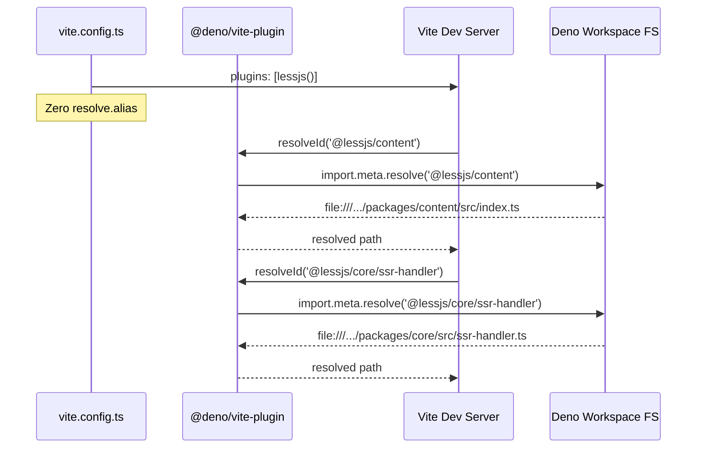
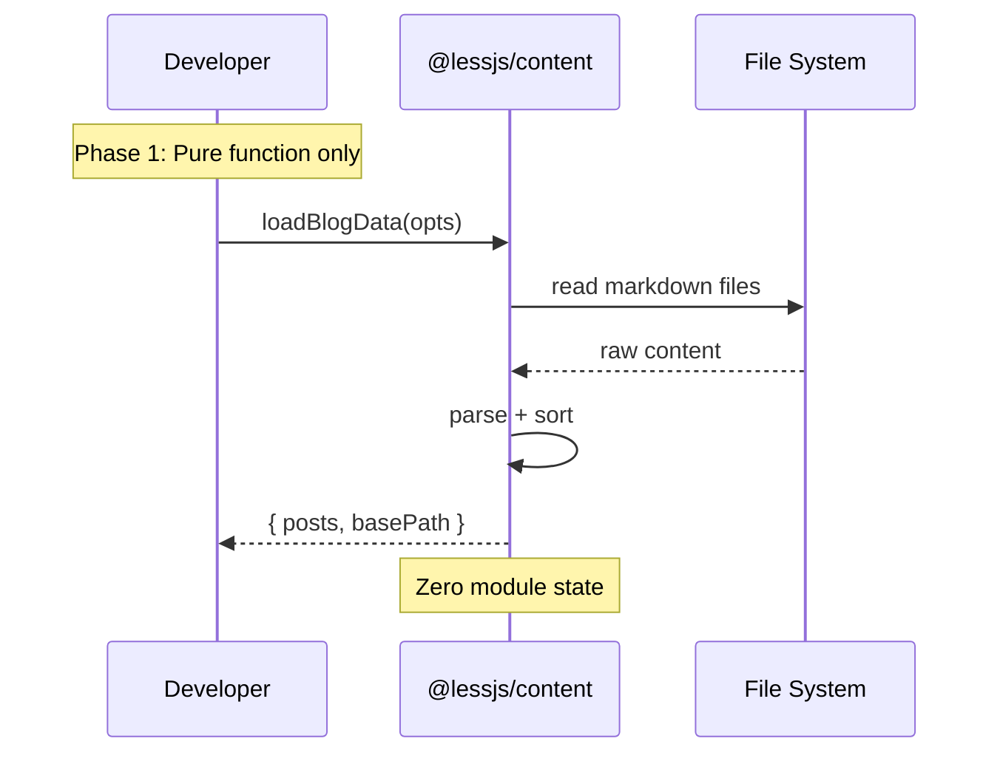
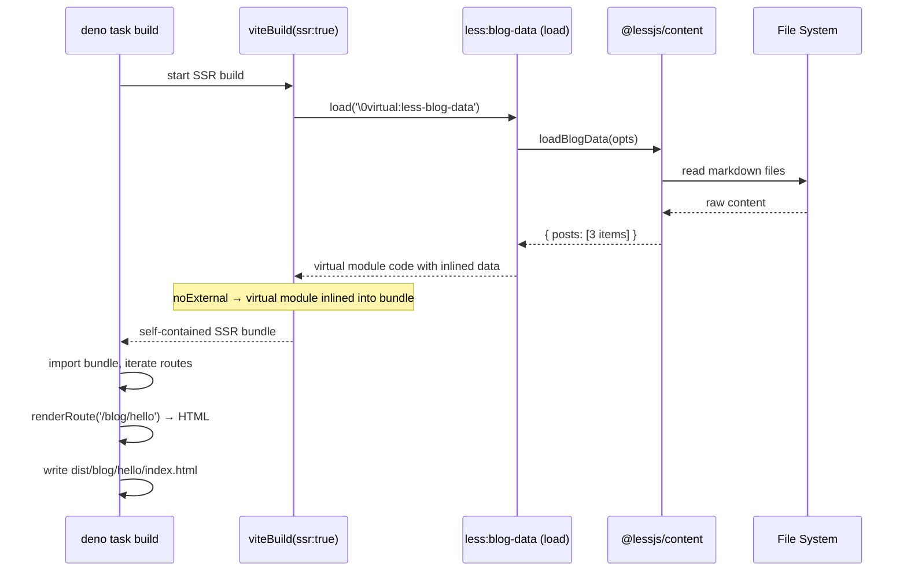
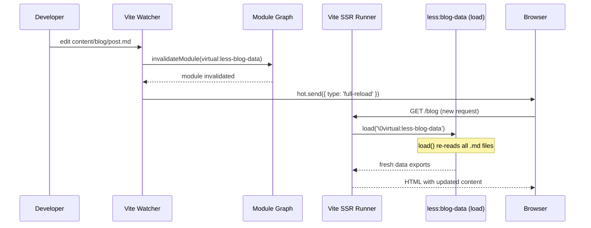

## Status

**ACCEPTED** — v0.12.0 架构改进

## Context

### 问题本质

LessJS 的 `@lessjs/content` 和 `@lessjs/i18n` 使用**模块级状态**存储数据：

```
content/blog-data.ts:    let _posts: BlogPost[] = [];    // 模块级变量
i18n/i18n-data.ts:       let _options: LessI18nOptions;  // 模块级变量
```

插件在 `buildStart()` 中调用 `initBlogData()` / `initI18nData()` 填充状态。路由组件调用 `getPosts()` / `getI18nLocales()` 读取状态。

**Build 模式**正常：`viteBuild(ssr:true, noExternal)` 产出自包含 bundle，所有代码在同一个模块实例。

**Dev 模式**崩溃：Vite 插件进程和 SSR runner 是隔离的 JavaScript 领域。`initBlogData()` 在插件进程运行，`getPosts()` 在 SSR runner 运行——它们看到的是**不同的 `_posts`**。结果是 `_posts = []`，博客数据为空。

### 当前 ad-hoc 修复及其问题

在虚拟入口代码中注入 `initBlogData()` 调用（`entry-renderer.ts` 第 306-313 行），让初始化代码在 SSR runner 模块空间中执行。

问题：

1. `EntryDescriptor.blog` 字段——每个插件都要加字段，`EntryDescriptor` 侵入性增长
2. `entry-renderer.ts` 承载业务逻辑——不再是纯函数
3. `@lessjs/adapter-vite` 对 content 包的硬依赖知识——需要知道导出名、参数格式
4. `@lessjs/i18n` 还没修——同样的问题，还没加 ad-hoc 修复
5. 内容 HMR 不工作——`_posts` 变量停留在首次加载时的状态

### 根因不是"需要桥"，而是"不该有状态"

模块级 `_posts` 变量是 bug source。如果有状态，就需要桥；如果没状态，就不需要桥。

**正确思路：砍掉模块级状态，用虚拟模块的数据导出替代。**

### CYBER::BLOG 暴露的完整问题清单

| # | 问题 | 根因 | 优先级 |
|---|------|------|--------|
| 1 | Dev 模式 blog 数据空 | 模块级状态 + Vite 模块隔离 | P0 |
| 2 | 17 行 resolve.alias 样板代码 | Deno workspace 包不在 node_modules | P1 |
| 3 | 内容 HMR 不工作 | 缺 configureServer + watcher | P1 |
| 4 | @lessjs/i18n dev 数据空 | 同 #1 模式 | P2 |
| 5 | About 页使用 node:fs | content 只管 blog，缺静态内容方案 | P2 |
| 6 | About 页手写 md 转换器 | 同 #5，用户被迫 workaround | P2 |

## Decision

### 核心原则

**Zero module state. Zero bridges. Virtual modules are the data source.**

1. 插件提供**纯函数**（`loadBlogData()` → `BlogPost[]`），不持有状态
2. `adapter-vite` 提供虚拟数据模块（`virtual:less-blog-data`），`load()` 钩子调用纯函数并生成导出代码
3. 路由组件从虚拟模块 import 数据，不从 `@lessjs/content` 的模块状态读取
4. `@deno/vite-plugin` 处理 bare specifier 解析，消除用户 `vite.config.ts` 中的 alias

**不需要 `onSSRInit`，不需要 Data Bridge 协议，不需要双重初始化路径。**

### 架构对比

```
Before (stateful):
  @lessjs/content:  initBlogData() → _posts       (module state, needs bridge)
                    getPosts()     → _posts          (reads state)
  adapter-vite:     inject initBlogData() into entry (ad-hoc bridge)
  route component:  import { getPosts } from '@lessjs/content'
  问题：_posts 在两个模块空间各一份 → 需要桥

After (stateless):
  @lessjs/content:  loadBlogData(dir) → BlogPost[]  (pure function, zero state)
  adapter-vite:     virtual:less-blog-data           (resolveId + load)
                    load() calls loadBlogData() → generates export code
  route component:  import { posts, getPostBySlug } from 'virtual:less-blog-data'
  零桥，零状态，零双路径
```

### 为什么这样足够

**Dev 模式**：`@hono/vite-dev-server` 调 `ssrLoadModule('virtual:less-blog-data')` → 触发 `load()` → 生成含数据的代码 → SSR runner 执行 → 数据在。没有初始化步骤，没有空变量。

**Build 模式**：`viteBuild(ssr:true, noExternal)` 打包时 `load()` 执行 → 数据内联进 bundle。和 dev 走同一条路。

**HMR**：`configureServer` watch 内容目录 → `invalidateModule(virtualBlogData)` → 下次请求自动触发 `load()` 重新生成 → 无缓存问题，无 flag 需重置。

**Dev 和 Build 走同一条路。** 不存在"build 模式走 buildStart，dev 模式走 onSSRInit"的双路径问题。

---

## Implementation SOP

### Phase 依赖关系

```
Phase 0: @deno/vite-plugin → 独立，可先行
Phase 1: content 纯函数拆分 → Phase 2 的前置
Phase 2: adapter-vite 虚拟数据模块 → Phase 1 + Phase 3 的核心
Phase 3: content HMR → Phase 2 的后续
Phase 4: i18n 同模式改造 → Phase 2 的验证
Phase 5: 静态内容页 → Phase 2 的扩展
```

### Phase 0: @deno/vite-plugin 集成

**目标**：消除用户 `vite.config.ts` 中的 resolve.alias，让 Deno import map 处理 `@lessjs/*` 解析。

**原理**：`@deno/vite-plugin` 使用 `import.meta.resolve()` 将 bare specifier 解析为 Deno workspace 中的实际路径。用户的 `deno.json` 已经定义了 workspace imports，Vite 不需要知道这些映射。

**变更文件**：

| 文件 | 变更 |
|------|------|
| `packages/adapter-vite/src/index.ts` | 在 `less()` 返回的插件数组中注入 `denoVitePlugin()` |
| `packages/adapter-vite/deno.json` | 添加 `@deno/vite-plugin` 依赖 |
| `my-tech-blog/vite.config.ts` | 删除所有 resolve.alias |

**实现步骤**：

1. 在 adapter-vite 中添加 `@deno/vite-plugin` 依赖
2. 在 `less()` 的 `config()` 钩子中检测是否可用 `@deno/vite-plugin`，可用则注入
3. 删除 `buildCoreSubpathAliases()` 整个函数及所有调用点
4. 更新 `my-tech-blog/vite.config.ts` 删除 17 行 alias

**验证**：

```bash
cd my-tech-blog && deno task dev
# 访问 http://localhost:5173 → 页面正常渲染
# 确认 vite.config.ts 无 resolve.alias
```

**时序图**：



**回退方案**：如果 `@deno/vite-plugin` 不支持子路径解析或出现兼容问题，直接修 `@deno/vite-plugin` 提 PR，不走 `buildCoreSubpathAliases()` 回头路。

---

### Phase 1: @lessjs/content 纯函数拆分

**目标**：将 `blog-data.ts` 的模块级状态 + init/getter 模式，重构为纯函数 + 虚拟模块导出模式。

**变更文件**：

| 文件 | 变更 |
|------|------|
| `packages/content/src/blog/blog-data.ts` | 删除 `_posts`/`_options`/`initBlogData()`/`getPosts()`/`getPostBySlug()`/`getBlogOptions()`，替换为 `loadBlogData()` 纯函数 |
| `packages/content/src/index.ts` | 导出 `loadBlogData()`，删除 `initBlogData`/`getPosts`/`getPostBySlug`/`getBlogOptions` 导出，`buildStart()` 改用 `loadBlogData()` |
| `packages/content/src/blog/markdown.ts` | 确保 `parseMarkdownFile()` 无文件系统副作用（纯函数） |
| `packages/content/src/blog/routes.ts` | 确保 `generateBlogRoutes()` 无副作用 |

**新增接口**：

```ts
// packages/content/src/blog/blog-data.ts

/**
 * Pure function: load blog data from file system.
 * No module-level state. No side effects beyond reading files.
 * Can be called from any runtime context.
 *
 * This replaces the stateful initBlogData() + getPosts() pattern.
 * For virtual module consumers, use virtual:less-blog-data instead.
 */
export async function loadBlogData(options?: LessBlogOptions): Promise<{
  posts: BlogPost[];
  basePath: string;
}> {
  const routes = await generateBlogRoutes(options);
  return {
    posts: routes.posts,
    basePath: routes.basePath,
  };
}
```

**删除的接口**（不保留，不 deprecated，直接砍）：

```ts
// 全部删除 — 不向后兼容
// let _posts: BlogPost[] = [];           ← 删除
// let _options: LessBlogOptions = {};    ← 删除
// export function initBlogData() {}      ← 删除
// export function getPosts() {}          ← 删除
// export function getPostBySlug() {}     ← 删除
// export function getBlogOptions() {}    ← 删除
```

`blog-data.ts` 重写后只剩 `loadBlogData()` 纯函数，零状态。

```ts
// packages/content/src/blog/blog-data.ts — 重写后

import type { BlogPost, LessBlogOptions } from './types.ts';
import { generateBlogRoutes } from './routes.ts';

/**
 * Pure function: load blog data from file system.
 * No module-level state. No side effects beyond reading files.
 * Can be called from any runtime context.
 */
export async function loadBlogData(options?: LessBlogOptions): Promise<{
  posts: BlogPost[];
  basePath: string;
}> {
  const routes = await generateBlogRoutes(options);
  return {
    posts: routes.posts,
    basePath: routes.basePath,
  };
}
```

**验证**：

```bash
cd packages/content && deno test
# loadBlogData() 单元测试通过
# initBlogData/getPosts/getPostBySlug/getBlogOptions 已删除，不再存在
```

**时序图**：



---

### Phase 2: adapter-vite 虚拟数据模块

**目标**：新增 `virtual:less-blog-data` 虚拟模块插件，替代 `entry-renderer.ts` 中的 ad-hoc `initBlogData()` 注入。

**这是整个方案的核心。** 虚拟模块是唯一的数据桥，dev/build 走同一条路。

**变更文件**：

| 文件 | 变更 |
|------|------|
| `packages/adapter-vite/src/virtual-data.ts` | **新建** — 虚拟数据模块插件 |
| `packages/adapter-vite/src/index.ts` | 引入 virtual data plugin，删除 `EntryDescriptor.blog` 相关逻辑 |
| `packages/adapter-vite/src/entry-renderer.ts` | 删除 `initBlogData()` 注入代码 |
| `packages/adapter-vite/src/entry-descriptor.ts` | 删除 `blog` 字段 |
| `packages/adapter-vite/src/build-context.ts` | `blogOptions` 字段改为内部配置，不传给 entry descriptor |
| `my-tech-blog/app/routes/` | 路由组件改为从 `virtual:less-blog-data` import |

**新增文件 `virtual-data.ts`**：

```ts
/**
 * @lessjs/adapter-vite - Virtual data module plugins
 *
 * Replaces module-level state in @lessjs/content and @lessjs/i18n
 * with virtual module data exports. The load() hook runs in the
 * Vite plugin process and generates code that executes in the
 * SSR runner — this IS the data bridge.
 *
 * Dev mode:  ssrLoadModule('virtual:less-blog-data') → load() → fresh data
 * Build mode: viteBuild bundles the virtual module → data inlined
 * HMR:       invalidateModule → load() re-runs → fresh data
 *
 * Zero module state. Zero init functions. Zero dual paths.
 */

import type { Plugin } from 'vite';
import type { LessBuildContext } from './build-context.js';
import { loadBlogData } from '@lessjs/content/blog-data';
import type { LessBlogOptions } from '@lessjs/content/types';

// ─── Virtual module IDs ────────────────────────────────────────

const VIRTUAL_BLOG_DATA_ID = 'virtual:less-blog-data';
const RESOLVED_BLOG_DATA_ID = '\0' + VIRTUAL_BLOG_DATA_ID;

// ─── Blog data virtual module ──────────────────────────────────

export function createBlogDataPlugin(ctx: LessBuildContext): Plugin {
  return {
    name: 'less:blog-data',
    enforce: 'pre',

    resolveId(id) {
      if (id === VIRTUAL_BLOG_DATA_ID) return RESOLVED_BLOG_DATA_ID;
    },

    async load(id) {
      if (id !== RESOLVED_BLOG_DATA_ID) return;

      const blogOpts = ctx.blogOptions;
      if (!blogOpts) {
        // Blog not configured — export empty data
        return [
          'export const posts = [];',
          'export function getPostBySlug(slug) { return undefined; }',
          'export function getBlogOptions() { return {}; }',
        ].join('\n');
      }

      const options: LessBlogOptions = {
        contentDir: blogOpts.contentDir,
        basePath: blogOpts.basePath,
      };

      const { posts } = await loadBlogData(options);

      // Generate code that exports data + derived functions
      // The posts array is serialized as JSON — this is the bridge.
      // In build mode, this gets inlined into the SSR bundle.
      // In dev mode, this runs fresh on each ssrLoadModule() call.
      return [
        `const _posts = ${JSON.stringify(posts)};`,
        '',
        `/** All published blog posts, sorted newest first */`,
        `export const posts = _posts;`,
        '',
        `/** Get a single post by slug */`,
        `export function getPostBySlug(slug) {`,
        `  return _posts.find(p => p.slug === slug);`,
        `}`,
        '',
        `/** Get blog configuration */`,
        `export function getBlogOptions() {`,
        `  return ${JSON.stringify(options)};`,
        `}`,
      ].join('\n');
    },
  };
}
```

**从 `entry-renderer.ts` 删除的代码**：

```diff
-  // --- Dev mode: Initialize blog data ---
-  // In SSG mode, initBlogData() is called by build-ssg.ts after importing
-  // the SSR bundle (same module instance). In dev mode, the Vite SSR runner
-  // loads route components (e.g., cyber-home) that call getPosts(), but the
-  // blog-data module's _posts variable is empty because initBlogData() only
-  // ran in the plugin process (different module space). We must call
-  // initBlogData() inside the virtual entry so it runs in the same module
-  // instance as the route components.
-  if (!desc.isSSG && desc.blog) {
-    lines.push('// Dev mode: Initialize blog data in SSR runner module space');
-    lines.push('try {');
-    lines.push("  const { initBlogData } = await import('@lessjs/content');");
-    lines.push(`  await initBlogData(${JSON.stringify(desc.blog)});`);
-    lines.push('} catch { /* @lessjs/content not available */ }');
-    lines.push('');
-  }
```

**从 `entry-descriptor.ts` 删除的字段**：

```diff
  export interface EntryDescriptor {
    // ...
-   /** Blog options for dev-mode initBlogData() call */
-   blog?: { contentDir?: string; basePath?: string } | null;
  }
```

**SSG bundle re-exports 更新**：

`entry-renderer.ts` 中 SSG 模式的 re-exports 需要更新。因为 `virtual:less-blog-data` 在 build 模式下也是通过 `load()` 钩子解析的，Vite 会将其内联进 bundle。所以 SSG bundle 中的 re-export 从 `@lessjs/content` 改为 `virtual:less-blog-data`：

```diff
- export { initBlogData, getPosts, getPostBySlug, getBlogOptions } from "@lessjs/content"
+ export { posts, getPostBySlug, getBlogOptions } from "virtual:less-blog-data"
```

同样，SSG 的 `getStaticPaths()` 对于 blog 动态路由，原来调用 `getPosts()` 获取所有 slugs，现在从 bundle 的 `posts` export 获取：

```diff
  // In the generated SSR bundle
  export async function getStaticPaths(routePath) {
    // ...
    if (routePath === '/blog/:slug') {
-     const { getPosts } = await import('@lessjs/content');
-     return getPosts().map(p => ({ slug: p.slug }));
+     return posts.map(p => ({ slug: p.slug }));
    }
  }
```

**路由组件迁移**：

```diff
  // my-tech-blog/app/routes/blog/[slug].ts
- import { getPostBySlug } from '@lessjs/content';
+ import { getPostBySlug } from 'virtual:less-blog-data';
```

**TypeScript 类型声明**（`adapter-vite` 提供）：

```ts
// packages/adapter-vite/src/virtual-data.d.ts
declare module 'virtual:less-blog-data' {
  import type { BlogPost, LessBlogOptions } from '@lessjs/content';
  export const posts: BlogPost[];
  export function getPostBySlug(slug: string): BlogPost | undefined;
  export function getBlogOptions(): LessBlogOptions;
}
```

**验证**：

```bash
# Dev 模式
cd my-tech-blog && deno task dev
# 访问 http://localhost:5173 → 博客首页显示文章列表
# 访问 http://localhost:5173/blog/some-post → 文章内容正常

# Build 模式
cd my-tech-blog && deno task build
# dist/ 目录生成完整 SSG HTML
# 博客文章页面内容正确
```

**时序图 — Dev 模式**：

```mermaid
sequenceDiagram
    participant Browser
    participant HonoVite as @hono/vite-dev-server
    participant Vite as Vite SSR Runner
    participant Plugin as less:blog-data (load)
    participant Content as @lessjs/content
    participant FS as File System

    Browser->>HonoVite: GET /blog
    HonoVite->>Vite: ssrLoadModule('virtual:less-hono-entry')
    Vite->>Vite: ssrLoadModule('virtual:less-blog-data')
    Vite->>Plugin: load('\0virtual:less-blog-data')
    Plugin->>Content: loadBlogData(opts)
    Content->>FS: read markdown files
    FS-->>Content: raw content
    Content->>Content: parse + sort
    Content-->>Plugin: { posts: [3 items] }
    Plugin-->>Vite: "const _posts = [...]; export const posts = _posts; ..."
    Vite->>Vite: execute virtual module code
    Note over Vite: posts = [3 items] in SSR runner
    Vite-->>HonoVite: app module loaded
    HonoVite->>Vite: route component imports from virtual:less-blog-data
    Vite-->>HonoVite: posts (already loaded)
    HonoVite-->>Browser: HTML with blog posts
```

**时序图 — Build 模式**：



---

### Phase 3: 内容 HMR

**目标**：在 dev 模式下编辑 `.md` 文件后，刷新页面即可看到新内容，无需重启 dev server。

**原理**：`virtual:less-blog-data` 的 `load()` 钩子是无状态的纯函数调用。只需 `invalidateModule` 让 Vite 丢弃缓存的虚拟模块，下次 `ssrLoadModule()` 就会重新调用 `load()` 获取新数据。不需要 flag，不需要重置，不需要手动重新初始化。

**变更文件**：

| 文件 | 变更 |
|------|------|
| `packages/content/src/index.ts` | 新增 `configureServer` 钩子，watch 内容目录 |
| `packages/adapter-vite/src/virtual-data.ts` | 添加 HMR invalidate 辅助函数 |

**实现**：

```ts
// packages/content/src/index.ts — 添加到 contentPlugin

configureServer(server) {
  const contentDir = blogOpts?.contentDir;
  if (!contentDir) return;

  const absoluteContentDir = resolve(server.config.root, contentDir);

  // Watch the content directory for changes
  server.watcher.add(absoluteContentDir);

  const invalidateBlogData = (file: string) => {
    if (!file.startsWith(absoluteContentDir)) return;
    if (!file.endsWith('.md') && !file.endsWith('.mdx')) return;

    // Invalidate the virtual blog data module
    const mod = server.moduleGraph.getModuleById(RESOLVED_BLOG_DATA_ID);
    if (mod) {
      server.moduleGraph.invalidateModule(mod);
      log.info(`Content changed: ${relative(server.config.root, file)} — reloading`);
      server.hot.send({ type: 'full-reload' });
    }
  };

  server.watcher.on('change', invalidateBlogData);
  server.watcher.on('add', invalidateBlogData);
  server.watcher.on('unlink', invalidateBlogData);
},
```

**验证**：

```bash
cd my-tech-blog && deno task dev
# 1. 访问 http://localhost:5173 → 博客正常
# 2. 编辑 content/blog/some-post.md → 修改标题
# 3. 刷新浏览器 → 看到新标题（无需重启 dev server）
# 4. 新增 content/blog/new-post.md
# 5. 刷新浏览器 → 新文章出现在列表中
```

**时序图 — HMR**：



---

### Phase 4: @lessjs/i18n 同模式改造

**目标**：将 i18n 的模块级状态模式改为与 content 相同的虚拟数据模块模式。

**变更文件**：

| 文件 | 变更 |
|------|------|
| `packages/i18n/src/i18n-data.ts` | 删除 `_options`/`initI18nData()`/`getI18nLocales()`/`getI18nOptions()`/`getDefaultLocale()`，替换为 `loadI18nData()` 纯函数 |
| `packages/i18n/src/index.ts` | 导出 `loadI18nData()`，`buildStart()` 改用纯函数 + ctx |
| `packages/adapter-vite/src/virtual-data.ts` | 新增 `virtual:less-i18n-data` 虚拟模块 |

**i18n 数据量小**（只是 locale 配置），虚拟模块的序列化成本可以忽略。实现模式与 blog 完全相同。

**新增虚拟模块**：

```ts
// virtual:less-i18n-data
const VIRTUAL_I18N_DATA_ID = 'virtual:less-i18n-data';
const RESOLVED_I18N_DATA_ID = '\0' + VIRTUAL_I18N_DATA_ID;

export function createI18nDataPlugin(ctx: LessBuildContext): Plugin {
  return {
    name: 'less:i18n-data',
    enforce: 'pre',

    resolveId(id) {
      if (id === VIRTUAL_I18N_DATA_ID) return RESOLVED_I18N_DATA_ID;
    },

    load(id) {
      if (id !== RESOLVED_I18N_DATA_ID) return;

      const i18nOpts = ctx.i18nOptions;
      if (!i18nOpts) {
        return [
          'export const locales = [];',
          'export function getDefaultLocale() { return "en"; }',
          'export function getI18nOptions() { return null; }',
        ].join('\n');
      }

      return [
        `const _options = ${JSON.stringify(i18nOpts)};`,
        'export const locales = _options.locales;',
        'export function getDefaultLocale() { return _options.defaultLocale || "en"; }',
        'export function getI18nOptions() { return _options; }',
      ].join('\n');
    },
  };
}
```

**TypeScript 类型声明**：

```ts
declare module 'virtual:less-i18n-data' {
  import type { LessI18nOptions } from '@lessjs/i18n';
  export const locales: string[];
  export function getDefaultLocale(): string;
  export function getI18nOptions(): LessI18nOptions | null;
}
```

**验证**：

```bash
# 使用 i18n 的项目（如有）
deno task dev
# 访问页面 → locale 切换正常
# 无 i18n 的项目 → 编译不报错（虚拟模块返回空数据）
```

---

### Phase 5: 静态内容页

**目标**：`lessContent()` 增加 `pages` 选项，框架自动解析 markdown 内容页，通过虚拟模块提供数据。消除用户代码中的 `node:fs` + 手写 md 转换器。

**变更文件**：

| 文件 | 变更 |
|------|------|
| `packages/content/src/types.ts` | 新增 `LessPagesOptions` 类型 |
| `packages/content/src/pages/page-loader.ts` | **新建** — 静态页加载器 |
| `packages/content/src/index.ts` | `lessContent()` 新增 `pages` 选项处理 |
| `packages/adapter-vite/src/virtual-data.ts` | 新增 `virtual:less-page-data` 虚拟模块 |

**接口设计**：

```ts
// types.ts
export interface LessPagesOptions {
  /** Map of page key → content file path (relative to project root) */
  [key: string]: string;
  // e.g., { about: 'content/about/index.md', credits: 'content/credits.md' }
}

export interface LessContentOptions {
  blog?: LessBlogOptions | false;
  nav?: LessNavOptions | false;
  sitemap?: SitemapOptions | false;
  pages?: LessPagesOptions;  // NEW
  ctx?: LessBuildContext;
}
```

**虚拟模块导出**：

```ts
// virtual:less-page-data
// load() generates:
const _pages = {
  about: { title: "About", html: "<p>...</p>", frontmatter: {...} },
  credits: { title: "Credits", html: "<p>...</p>", frontmatter: {...} },
};
export function getPage(key) { return _pages[key]; }
export const pageKeys = Object.keys(_pages);
```

**路由组件使用**：

```ts
// app/routes/about.ts
import { getPage } from 'virtual:less-page-data';

export default class AboutPage extends LitElement {
  connectedCallback() {
    super.connectedCallback();
    const page = getPage('about');
    this.innerHTML = page.html;
  }
}
```

**验证**：

```bash
# my-tech-blog About 页面
# 1. 创建 content/about/index.md
# 2. 配置 lessContent({ pages: { about: 'content/about/index.md' } })
# 3. 路由组件 import { getPage } from 'virtual:less-page-data'
# 4. 访问 /about → 渲染 markdown 内容
# 5. 无 node:fs 依赖
```

---

## 清理清单

所有 Phase 完成后，需要清理的遗留代码：

| 项 | 位置 | 操作 |
|----|------|------|
| `EntryDescriptor.blog` | `entry-descriptor.ts` | 删除 |
| `blog` 参数 | `buildEntryDescriptor()` | 删除 |
| `blog` 参数 | `generateHonoEntryCode()` | 删除 |
| `blog` 传递 | `index.ts` generateEntry() | 删除 `blog: ctx.blogOptions` |
| initBlogData 注入 | `entry-renderer.ts` 306-313 行 | 删除 |
| `_posts` 模块状态 | `blog-data.ts` | 删除 |
| `initBlogData()` / `getPosts()` / `getPostBySlug()` / `getBlogOptions()` | `blog-data.ts` + `index.ts` re-exports | 删除 |
| `initBlogData` re-export | SSG bundle | 改为 `virtual:less-blog-data` export |
| `buildCoreSubpathAliases()` | `adapter-vite` | 删除整个函数 |
| 17 行 resolve.alias | `my-tech-blog/vite.config.ts` | 删除 |

---

## Consequences

### Positive

- **单路径**：dev/build 走同一条路（虚拟模块 `load()`），不存在双初始化路径
- **零桥**：没有 `onSSRInit`，没有 Data Bridge，没有 ad-hoc 代码注入
- **零状态**：content/i18n 不持有模块级状态，不存在"状态在错误的模块空间"的问题
- **HMR 天然支持**：`invalidateModule` → `load()` 重新执行 → 新数据，无 flag 重置
- **用户 vite.config.ts 清零**：`@deno/vite-plugin` 消除所有 resolve.alias
- **`EntryDescriptor` 纯净化**：只描述 Hono entry 结构，不承载插件初始化逻辑
- **`entry-renderer.ts` 纯净化**：恢复为纯函数（描述符 → 字符串）
- **可扩展**：未来新插件只需 `loadBlogData()` 纯函数 + 虚拟模块，零框架改动

### Negative

- **大数据集序列化**：100 篇博文含 HTML body 时，`JSON.stringify(posts)` 可能达到 MB 级。但 SSG build 模式同样需要处理这个量级（bundle 大小），且 dev 模式每次请求重新生成，不会有内存累积
- **虚拟模块 ID 不是标准路径**：IDE 可能不识别 `virtual:less-blog-data` 的 import，需要 TypeScript `.d.ts` 声明文件
- **迁移成本**：路由组件需要将 `import { getPosts } from '@lessjs/content'` 改为 `import { posts } from 'virtual:less-blog-data'`

### Neutral

- 虚拟模块模式与 Astro 的 `import.meta.glob()` / collection 模式类似，开发者认知成本低
- `initBlogData()`/`getPosts()`/`buildCoreSubpathAliases()` 直接删除，不向后兼容 — v0.12.0 是 breaking change

---

## 参考

- [ADR 0011: 消除最后一个 globalThis 桥接](/blog/0011-eliminate-last-globalthis-via-closebundle) — 类似的跨模块空间数据传递问题
- [ADR 0016: 双模式子路径解析](/blog/0016-dual-mode-subpath-resolution) — coreResolvePlugin 的当前实现
- [ADR 0017: 框架运行时与构建编排解耦](/blog/0017-separate-runtime-from-build-orchestration) — core/adapter-vite 分离
- [Vite SSR](https://vite.dev/guide/ssr) — SSR runner 的模块隔离机制
- [@deno/vite-plugin](https://github.com/denoland/deno/tree/main/packages/vite) — Deno import map 集成
- [Astro Content Collections](https://docs.astro.build/en/guides/content-collections/) — 类似的虚拟模块数据模式

---

_提出日期: 2026-05-11 | 状态: ACCEPTED | 目标版本: v0.12.0_